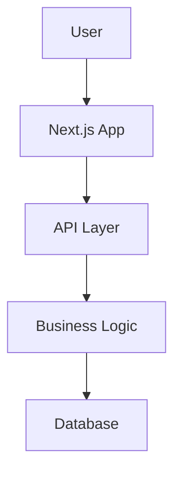

# ARCHITECTURE.md — AI Act Compliance Platform

**Status:** 🚧 TODO — Marcus должен создать в Phase 0
**Version:** 0.1.0 (placeholder)

## Цель документа
Описание архитектуры системы: DDD/Onion Architecture, bounded contexts, dependencies.

## Архитектурные принципы
- DDD (Domain-Driven Design)
- Onion Architecture (Domain → Use Cases → Adapters → Frameworks)
- SOLID принципы
- Dependency Injection

## Bounded Contexts
TODO: Marcus заполнит в Phase 0

## High-Level Architecture Diagram

## Technology Stack
См. TECH-STACK.md

---

**⛔ APPROVAL GATE:** Product Owner должен утвердить этот документ перед Sprint 001.

**Last updated:** 2026-02-04 (placeholder)
**Author:** Marcus (TBD)
