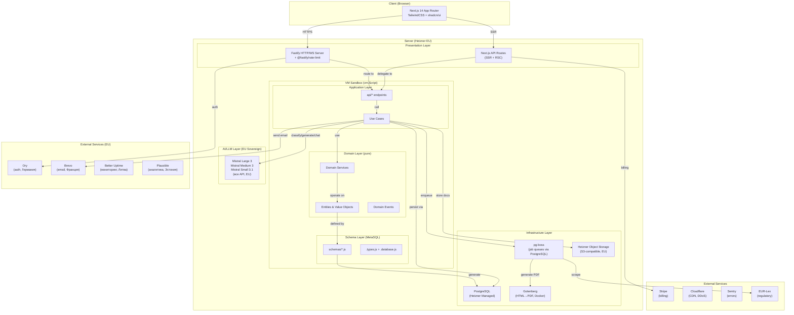
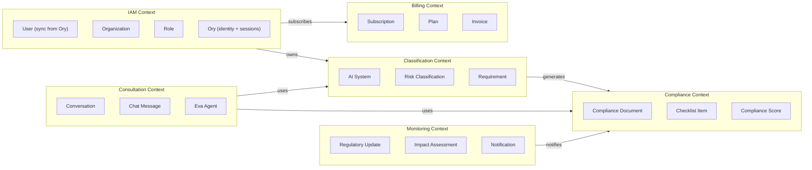
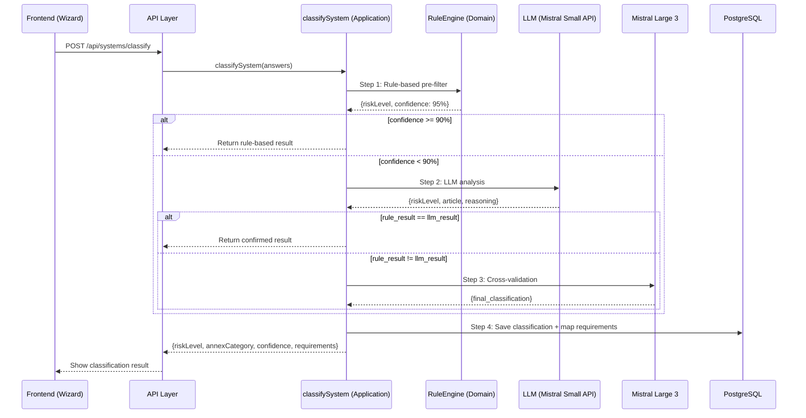
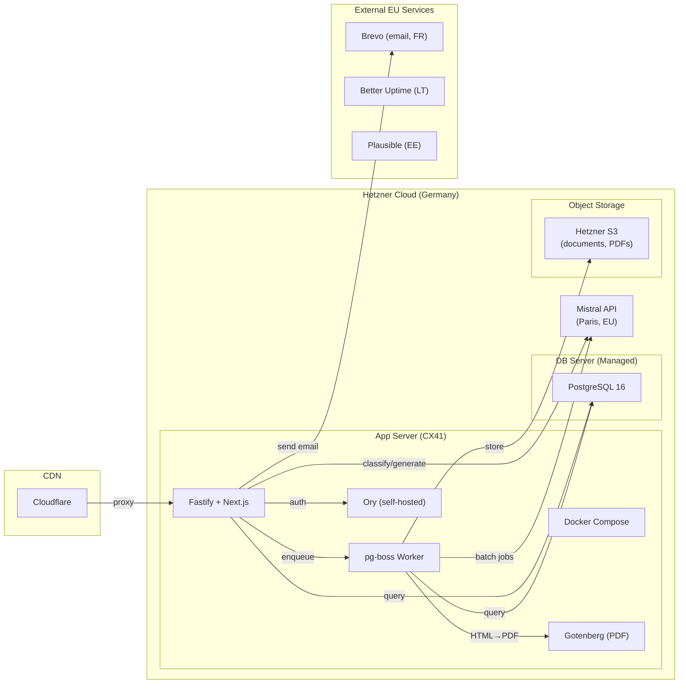

# ARCHITECTURE.md — AI Act Compliance Platform

**Версия:** 1.1.0
**Дата:** 2026-02-07
**Автор:** Marcus (CTO) via Claude Code
**Статус:** ✅ Утверждён Product Owner (2026-02-07)

> **v1.1.0 (2026-02-07):** Интеграция 7 EU-сервисов вместо custom-кода: Ory (auth, Германия), Brevo (email, Франция), Gotenberg (PDF, self-hosted), Hetzner Object Storage (S3), @fastify/rate-limit, Better Uptime (мониторинг, Литва), Plausible (аналитика, Эстония).

---

## 1. Архитектурные принципы

1. **DDD (Domain-Driven Design)** — бизнес-логика в центре, инфраструктура на периферии
2. **Onion Architecture** — зависимости направлены строго внутрь
3. **Framework-agnostic** — Application не знает про Fastify (существующий паттерн)
4. **VM Sandbox Isolation** — модули изолированы через vm.Script с frozen context (существующий паттерн)
5. **MetaSQL as Single Source of Truth** — JavaScript schema → SQL DDL + TypeScript types
6. **EU Sovereign AI** — данные клиентов только через EU-модели (Mistral) и EU-хостинг (Hetzner)
7. **Modular Monolith** — один deployable, но чёткие Bounded Contexts
8. **EU-first Services** — внешние сервисы только от EU-компаний (Ory — Германия, Brevo — Франция, Plausible — Эстония, Better Uptime — Литва)

---

## 2. High-Level Architecture



---

## 3. Onion Architecture Layers

```
┌──────────────────────────────────────────────────────────────┐
│  Presentation Layer (Fastify + Next.js API Routes)           │
│  - HTTP/WS routing, request parsing, response formatting     │
│  - Static file serving, SSR                                  │
├──────────────────────────────────────────────────────────────┤
│  Application Layer (api/* endpoints, Use Cases)              │
│  - Orchestrates domain logic for specific use cases          │
│  - Input validation (Zod), authorization checks              │
│  - Transaction management, event dispatching                 │
├──────────────────────────────────────────────────────────────┤
│  Domain Services Layer                                       │
│  - Cross-entity business operations                          │
│  - Classification logic, compliance scoring                  │
│  - Document generation orchestration                         │
├──────────────────────────────────────────────────────────────┤
│  Domain Model Layer (центр — ЧИСТАЯ бизнес-логика)           │
│  - Entities: AISystem, Organization, User, ComplianceDoc     │
│  - Value Objects: RiskLevel, AnnexCategory, ComplianceScore  │
│  - Domain Events: SystemClassified, DocumentGenerated        │
│  - NO dependencies on frameworks, DB, or external services   │
├──────────────────────────────────────────────────────────────┤
│  Schema Layer (MetaSQL)                                      │
│  - schemas/*.js → SQL DDL + TypeScript types                 │
│  - Single source of truth for data structure                 │
├──────────────────────────────────────────────────────────────┤
│  Infrastructure Layer                                        │
│  - PostgreSQL (via pg pool + pg-boss для job queues)          │
│  - Hetzner Object Storage (S3-compatible, EU)                │
│  - Ory client (auth, identity, sessions — Германия)          │
│  - Brevo client (transactional email — Франция)              │
│  - Gotenberg client (HTML→PDF, self-hosted Docker)           │
│  - Mistral API client (Large/Medium/Small)                    │
│  - Stripe client, EUR-Lex scraper                            │
│  - Logger, error tracking (Sentry)                           │
└──────────────────────────────────────────────────────────────┘

Dependency Direction: Infrastructure → Schema → Domain → Domain Services → Application → Presentation
                      (outer depends on inner, NEVER reverse)
```

### Dependency Rules

| Layer | Может зависеть от | НЕ может зависеть от |
|-------|-------------------|---------------------|
| Domain Model | Ничего (pure) | Всего остального |
| Domain Services | Domain Model | Application, Infrastructure, Presentation |
| Schema (MetaSQL) | Domain Model (types) | Application, Infrastructure |
| Application | Domain, Domain Services, Schema | Presentation |
| Infrastructure | Все inner layers | Presentation |
| Presentation | Application, Domain | — |

---

## 4. Bounded Contexts (DDD)



### 4.1 IAM Context (Identity & Access Management)
- **Identity & Auth:** Ory (self-hosted, Hetzner) — регистрация, login, magic links, sessions, MFA
- **Наша БД:** User (sync от Ory через webhook), Organization, Role, Permission
- **Ответственный:** Max (backend Ory integration) + Nina (frontend auth UI)
- **Паттерн:** Ory управляет identity lifecycle → webhook → наш API синхронизирует User + создаёт Organization

### 4.2 Classification Context (ядро продукта)
- **Entities:** AISystem, RiskClassification, AnnexCategory, Requirement
- **Domain Services:** RuleEngine (pure rule-based: Art.5, Annex III, GPAI detection)
- **Application:** classifySystem (orchestrates RuleEngine + LLM via port + cross-validation)
- **Ответственный:** Max (backend engine) + Elena (AI Act rules) + Nina (wizard UI)

### 4.3 Compliance Context
- **Entities:** ComplianceDocument, ChecklistItem, ComplianceScore, DocumentSection
- **Domain Services:** DocumentGenerator, GapAnalyzer, ScoreCalculator
- **Ответственный:** Max (backend) + Nina (dashboard + editor UI)

### 4.4 Consultation Context (Ева)
- **Entities:** Conversation, ChatMessage, QuickAction
- **Domain Services:** EvaOrchestrator (context injection + tool calling)
- **Ответственный:** Max (backend) + Nina (chat UI)
- **Существующий код:** Chat, Message, ChatMember schemas — адаптируем

### 4.5 Monitoring Context (post-MVP)
- **Entities:** RegulatoryUpdate, ImpactAssessment, Notification
- **Domain Services:** EURLexScraper, ChangeDetector, NotificationSender
- **Ответственный:** Max (background jobs)

### 4.6 Billing Context
- **Entities:** Subscription, Plan, Invoice
- **External:** Stripe API (webhooks → internal events)
- **Ответственный:** Max (Stripe integration)

---

## 5. Module Structure

```
src/
├── domain/                          # Domain Model (pure, no deps)
│   ├── iam/
│   │   ├── entities/
│   │   │   ├── User.js
│   │   │   ├── Organization.js
│   │   │   └── Role.js
│   │   └── value-objects/
│   │       └── Email.js
│   ├── classification/
│   │   ├── entities/
│   │   │   ├── AISystem.js
│   │   │   └── RiskClassification.js
│   │   ├── value-objects/
│   │   │   ├── RiskLevel.js         # enum: prohibited|high|gpai|limited|minimal
│   │   │   ├── AnnexCategory.js     # enum: III_1a, III_4a, etc.
│   │   │   └── ComplianceScore.js   # 0-100
│   │   └── services/
│   │       └── RuleEngine.js            # PURE: rule-based classification (Art.5, Annex III, GPAI)
│   ├── compliance/
│   │   ├── entities/
│   │   │   ├── ComplianceDocument.js
│   │   │   └── ChecklistItem.js
│   │   └── services/
│   │       ├── DocumentGenerator.js
│   │       └── GapAnalyzer.js
│   ├── consultation/
│   │   ├── entities/
│   │   │   ├── Conversation.js
│   │   │   └── ChatMessage.js
│   │   └── services/
│   │       └── EvaOrchestrator.js
│   └── events/
│       ├── SystemClassified.js
│       ├── DocumentGenerated.js
│       └── ComplianceScoreChanged.js
│
├── application/                     # Use Cases (orchestration)
│   ├── iam/
│   │   ├── syncUserFromOry.js       # Ory webhook → create/update User in our DB
│   │   ├── createOrganization.js
│   │   └── manageOrganization.js
│   ├── classification/
│   │   ├── classifySystem.js        # Orchestrates: RuleEngine (domain) + LLM (infra) + cross-validation
│   │   ├── registerSystem.js
│   │   └── mapRequirements.js
│   ├── compliance/
│   │   ├── generateDocument.js
│   │   ├── analyzeGaps.js
│   │   └── calculateScore.js
│   └── consultation/
│       ├── sendMessage.js
│       └── executeToolCall.js
│
├── schemas/                         # MetaSQL (schema → SQL + types)
│   ├── .database.js                 # DB metadata
│   ├── .types.js                    # Custom types
│   ├── Organization.js
│   ├── User.js
│   ├── AISystem.js
│   ├── RiskClassification.js
│   ├── Requirement.js
│   ├── SystemRequirement.js
│   ├── ComplianceDocument.js
│   ├── DocumentSection.js
│   ├── Conversation.js
│   ├── ChatMessage.js
│   ├── Subscription.js
│   └── ...
│
├── api/                             # API Endpoints (presentation)
│   ├── auth/
│   │   ├── callback.js              # Ory → redirect callback после login
│   │   └── webhook.js               # Ory → webhook (user created/updated/deleted)
│   ├── systems/
│   │   ├── create.js
│   │   ├── classify.js
│   │   ├── list.js
│   │   └── get.js
│   ├── compliance/
│   │   ├── documents.js
│   │   ├── checklist.js
│   │   └── score.js
│   ├── chat/
│   │   ├── message.js
│   │   └── history.js
│   └── dashboard/
│       └── overview.js
│
├── infrastructure/                  # External adapters
│   ├── auth/
│   │   └── ory-client.js            # Ory SDK (identity, sessions, webhooks)
│   ├── email/
│   │   └── brevo-client.js          # Brevo SDK (transactional email, EU)
│   ├── pdf/
│   │   └── gotenberg-client.js      # Gotenberg API (HTML→PDF, self-hosted)
│   ├── llm/
│   │   ├── mistral-client.js        # Mistral Large/Medium/Small API (EU)
│   │   └── llm-adapter.js           # Unified interface (Strategy pattern)
│   ├── storage/
│   │   └── s3-client.js             # Hetzner Object Storage (S3-compatible, EU)
│   ├── billing/
│   │   └── stripe-client.js
│   ├── monitoring/
│   │   └── eurlex-scraper.js
│   └── jobs/
│       ├── job-queue.js              # JobQueue port (pg-boss adapter, → BullMQ later)
│       ├── classify-system.job.js
│       ├── generate-document.job.js
│       └── scrape-eurlex.job.js
│
├── config/                          # Configuration
│   ├── database.js
│   ├── server.js
│   ├── ory.js                      # Ory SDK endpoint, API key
│   ├── brevo.js                    # Brevo API key, templates
│   ├── llm.js                      # Mistral API keys, endpoints
│   ├── stripe.js
│   └── log.js
│
└── lib/                             # Shared utilities
    ├── db.js                        # CRUD builder (existing)
    ├── errors.js                    # Custom error hierarchy
    └── validators.js                # Zod schemas
```

---

## 6. Key Design Patterns

### 6.1 VM Sandbox Isolation (существующий, СОХРАНЯЕМ)

```javascript
// Каждый модуль загружается в изолированном контексте
const context = vm.createContext(Object.freeze({
  console,        // Logger (injected)
  config,         // Configuration (frozen)
  db,             // Database pool (frozen)
  domain,         // Domain layer (frozen)
  auth,           // Ory client (frozen) — verify session, get user identity
  email,          // Brevo client (frozen) — send transactional emails
}));

const script = new vm.Script(code, { timeout: 5000 });
const exported = script.runInContext(context);
```

**Плюсы:** Безопасность, изоляция, предотвращение cross-module pollution
**Новое:** Добавляем в sandbox доступ к infrastructure adapters (llm, storage, auth, email)

### 6.2 Adapter Pattern (LLM Providers)

```javascript
// infrastructure/llm/llm-adapter.js
// Единый интерфейс для всех LLM провайдеров
const createLLMAdapter = (config) => ({
  async classify(systemDescription) { ... },
  async generateSection(template, context) { ... },
  async chat(messages, tools) { ... },
});

// Strategy: выбор модели по задаче (все через Mistral API, EU)
// classify → Mistral Small 3.1 API (speed, pre-filter + LLM analysis)
// generateSection → Mistral Medium 3 API (quality, document generation)
// chat → Mistral Large 3 API (accuracy, Eva consultant)
```

### 6.3 Repository Pattern

```javascript
// Domain НЕ знает про PostgreSQL
// Application использует repository для persistence

// application/classification/classifySystem.js
async ({ systemId, answers }) => {
  const system = await db.AISystem.read(systemId);
  const classification = domain.classification.classify(system, answers);
  await db.RiskClassification.create(classification);
  domain.events.emit('SystemClassified', { systemId, classification });
  return classification;
};
```

### 6.4 Domain Events (Observer/EventEmitter)

```javascript
// domain/events/ — decoupling между контекстами
// Когда система классифицирована:
//   → Compliance Context создаёт checklist
//   → Consultation Context обновляет контекст Евы
//   → Dashboard обновляет compliance score
```

### 6.5 Factory Pattern

```javascript
// Создание LLM clients, compliance documents, classification results
const createClassificationResult = (ruleResult, llmResult, confidence) => ({
  riskLevel: resolveRiskLevel(ruleResult, llmResult),
  annexCategory: resolveAnnex(ruleResult, llmResult),
  confidence,
  reasoning: generateReasoning(ruleResult, llmResult),
  requirements: mapRequirements(riskLevel),
});
```

### 6.6 CQS (Command Query Separation) для API Design

Принцип из лекции Тимура Шемсединова: метод либо **изменяет состояние** (command), либо **возвращает данные** (query), но никогда оба одновременно.

Применение к нашим API endpoints:

| Тип | Endpoints | Характеристика |
|-----|-----------|----------------|
| **Commands** (write) | `POST /api/systems/classify`, `POST /api/auth/register`, `PATCH /api/systems/:id` | Изменяют состояние, возвращают только статус/id |
| **Queries** (read) | `GET /api/dashboard/overview`, `GET /api/systems/:id`, `GET /api/compliance/score` | Только читают, никогда не изменяют |

Это упрощает кэширование (queries кэшируются), тестирование и аудит.

### 6.7 Audit Trail (Event Sourcing Lite)

Для AI Act compliance каждая классификация и изменение compliance-документов должны быть прослеживаемы. Вместо полного Event Sourcing (который избыточен для нашего масштаба) применяем **Event Sourcing Lite**:

- Каждая операция записывается как **Command-объект** (анемичная структура) в `ClassificationLog` / `AuditLog`
- Command содержит: `action`, `oldValue`, `newValue`, `userId`, `timestamp`
- Текущее состояние хранится в основных таблицах (не пересчитывается из событий)
- История позволяет: аудит для регулятора, undo ошибочной классификации, отладку

При масштабировании (>1000 клиентов) можно перейти к полному CQRS с отдельными Read/Write API.

### 6.8 MQ vs PubSub Strategy

Два паттерна передачи сообщений, применяемые в нашей системе:

| Паттерн | Реализация | Использование | Характеристика |
|---------|-----------|---------------|----------------|
| **Message Queue** | pg-boss (PostgreSQL) | Document generation, PDF export, EUR-Lex scraping, batch classification | Many→One, FIFO, persistent, exactly-once |
| **Pub/Sub** | WebSocket (Fastify ws) | Eva chat streaming, dashboard real-time, section ready notifications | One→Many, не persistent, at-least-once |

**Правила:**
- **pg-boss** — для задач, где порядок критичен и потеря недопустима (генерация документов, классификация)
- **WebSocket** — для уведомлений в реальном времени, где потеря одного сообщения не критична (UI обновления)
- **Idempotency:** каждое MQ-сообщение содержит GUID, получатель проверяет дубликаты
- **Error handling:** системные ошибки (DB down) → retry; бизнес-ошибки (невалидные данные) → обработать и завершить
- **Миграция:** при масштабировании pg-boss → BullMQ через JobQueue adapter (см. 6.10)

### 6.9 Анемичная доменная модель — обоснование

Наша Domain Model (MetaSQL schemas) является **анемичной** — содержит данные без поведения. Это осознанное решение:

- Мы моделируем **информационный слой** (AI-система, классификация, документ), а не реальные объекты с поведением
- Вся бизнес-логика — в Domain Services (RuleEngine, DocumentGenerator, GapAnalyzer). LLM-интеграция — в Application layer через infrastructure ports
- MetaSQL schemas описывают структуру данных и генерируют SQL + типы — это **schema-based contracts**, единый инструмент для всех слоёв
- Схемы обеспечивают runtime-валидацию (в отличие от TypeScript, который проверяет только в compile-time)

Это соответствует подходу Тимура Шемсединова: «Анемичная модель — это нормально, когда мы моделируем не реальный объект, а набор документов и записей о нём».

### 6.10 JobQueue Port — Adapter для миграции pg-boss → BullMQ

Все обращения к очередям проходят через единый порт (интерфейс). Это обеспечивает замену pg-boss → BullMQ без изменения бизнес-логики:

```javascript
// domain/ports/JobQueue.js — порт (контракт)
// Все use cases работают ТОЛЬКО с этим интерфейсом
({
  enqueue: async (name, data, opts) => {},    // Поставить задачу в очередь
  schedule: async (name, cron, data) => {},   // Cron-задача
  work: (name, handler) => {},                // Зарегистрировать обработчик
});
```

```javascript
// infrastructure/jobs/pg-boss-adapter.js — MVP
const createPgBossQueue = (boss) => ({
  async enqueue(name, data, opts = {}) {
    const jobId = data.jobId || crypto.randomUUID();
    return boss.send(name, { ...data, jobId }, opts);
  },
  async schedule(name, cron, data) {
    return boss.schedule(name, cron, data);
  },
  work(name, handler) {
    boss.work(name, handler);
  },
});

// infrastructure/jobs/bullmq-adapter.js — при масштабировании
// Тот же интерфейс, другая реализация → ни один use case не меняется
```

**Когда мигрировать на BullMQ + Redis:**
- >100 concurrent пользователей
- Горизонтальное масштабирование (несколько серверов — нужен shared queue)
- PostgreSQL polling создаёт ощутимую нагрузку

**Шаги миграции:**
1. Добавить Redis в инфраструктуру
2. Написать `bullmq-adapter.js` (тот же интерфейс)
3. Заменить adapter в DI-конфигурации (одна строка)
4. Zero изменений в application/domain слоях

---

## 7. Classification Engine Architecture



---

## 8. Migration from Existing Code

### Что переиспользуем (as-is или с минимальным рефакторингом)

| Существующий код | Новое использование |
|-----------------|---------------------|
| `NodeJS-Fastify/main.js` | Entry point — сохраняем структуру |
| `src/loader.js` (VM sandbox) | Core pattern — сохраняем полностью |
| `src/http.js` (HTTP routing) | Адаптируем для новых API endpoints |
| `src/ws.js` (WebSocket) | Используем для Eva chat streaming |
| `lib/db.js` (CRUD builder) | Расширяем (fix delete bug, добавляем transactions) |
| `schemas/.database.js` | Обновляем metadata для новых entities |
| `schemas/.types.js` | Расширяем custom types |
| `config/*.js` | Дополняем (llm.js, stripe.js) |
| `schemas/Account.js` | → User.js (rename + extend, add oryId, remove password) |
| `schemas/Role.js, Permission.js` | Сохраняем RBAC модель (поверх Ory identity) |
| `schemas/Division.js` | → Organization.js (rename + extend) |
| `schemas/Chat.js, Message.js` | → Conversation.js, ChatMessage.js (adapt for Eva) |

### Что добавляем

| Новый компонент | Описание |
|----------------|----------|
| `schemas/AISystem.js` | Ключевая entity — AI-система клиента |
| `schemas/RiskClassification.js` | Результат классификации |
| `schemas/Requirement.js` | Справочник требований AI Act |
| `schemas/SystemRequirement.js` | Связь система ↔ требование |
| `schemas/ComplianceDocument.js` | Документы compliance |
| `schemas/DocumentSection.js` | Секции документов |
| `schemas/Subscription.js` | Подписки (billing) |
| `domain/classification/` | Classification Engine (rules + LLM) |
| `domain/compliance/` | Document generation, gap analysis |
| `domain/consultation/` | Eva orchestrator |
| `infrastructure/auth/` | Ory SDK client (identity, sessions, webhooks) |
| `infrastructure/email/` | Brevo SDK client (transactional email) |
| `infrastructure/pdf/` | Gotenberg client (HTML→PDF) |
| `infrastructure/llm/` | Mistral API adapters (Large/Medium/Small) |
| `infrastructure/jobs/` | Background jobs (pg-boss → BullMQ при масштабировании) |

### Что рефакторим

| Существующий код | Проблема | Решение |
|-----------------|----------|---------|
| `lib/db.js` delete() | Template string bug | Fix backticks |
| `config/database.js` | Hardcoded credentials | Env variables |
| Custom auth (Account, Session) | Самописная аутентификация | Заменяем на Ory (self-hosted, EU) |
| `lib/common.js` password hashing | Самописный scrypt | Удаляем — Ory управляет паролями и magic links |
| API error handling | Inconsistent format | Custom AppError hierarchy |
| No input validation | Security risk | Zod schemas на каждый endpoint |
| No transactions | Data integrity | Add transaction support to db.js |
| No audit logging | Compliance requirement | Add audit log to all data access |

---

## 9. Security Architecture

### Data Flow & Boundaries

```
┌──────────────────────────────────────────────────────────────┐
│  EU BOUNDARY                                                  │
│                                                                │
│  Hetzner Cloud, Germany:                                       │
│  ┌──────────────────┐  ┌───────────┐  ┌──────────────────┐   │
│  │ App Server        │  │ PostgreSQL│  │ Hetzner Object   │   │
│  │ (Fastify + Next)  │  │ (managed) │  │ Storage (S3)     │   │
│  │ + Ory (self-host) │  └───────────┘  └──────────────────┘   │
│  │ + Gotenberg (PDF) │                                        │
│  └─────┬─────────────┘                                        │
│        │                                                       │
│  EU Services:                                                  │
│  ┌─────┴─────────────────────────────────────────────────┐    │
│  │ Mistral API (Paris, France — LLM)                      │    │
│  │ Brevo (Paris, France — email)                          │    │
│  │ Better Uptime (Vilnius, Lithuania — monitoring)         │    │
│  │ Plausible (Tallinn, Estonia — analytics)               │    │
│  └────────────────────────────────────────────────────────┘    │
│                                                                │
│  ⛔ Client data NEVER leaves EU                               │
└──────────────────────────────────────────────────────────────┘
         │
    ┌────┴────┐
    │Cloudflare│  ← CDN/DDoS (edge, no data storage)
    └────┬────┘
         │
    ┌────┴────┐
    │ Browser │
    └─────────┘
```

### Security Measures

- **Auth:** Ory (self-hosted, Hetzner EU) — magic links, password, MFA, session management
- **Sessions:** Ory session cookies (httpOnly, Secure, SameSite) — не самописное решение
- **RBAC:** Permission(role, resource, action) — наша таблица поверх Ory identity
- **Input validation:** Zod schemas on every API endpoint
- **SQL injection:** Parameterized queries (existing CRUD builder)
- **XSS:** React auto-escaping + CSP headers
- **CSRF:** Ory CSRF protection + SameSite cookies
- **Rate limiting:** @fastify/rate-limit (plugin, in-process с поддержкой distributed stores при масштабировании)
- **Encryption:** TLS 1.3 in transit, AES-256 at rest
- **Secrets:** Environment variables (no hardcoded credentials)
- **Audit trail:** Log all data access for compliance
- **Email:** Brevo (Франция) — transactional email для magic links и уведомлений
- **Monitoring:** Better Uptime (Литва) — uptime + status page

---

## 10. Deployment Architecture



### MVP Scaling Plan

| Phase | Users | Infrastructure |
|-------|-------|---------------|
| MVP (Month 1-3) | 0-50 | 1 app server (Docker Compose: app + Ory + Gotenberg) + managed PG + Mistral API + Brevo + Hetzner S3 |
| Beta (Month 4-6) | 50-200 | 2 app servers + managed PG + Ory HA + Mistral API |
| Growth (Month 7-12) | 200-1000 | Horizontal scaling + self-hosted LLM (cost optimization) |

---

## 11. Trade-offs & Decisions

| Решение | Альтернатива | Почему так |
|---------|-------------|-----------|
| Modular Monolith | Microservices | Быстрее для MVP, проще deploy, достаточно для 1000 users |
| MetaSQL | Prisma ORM | Уже есть, даёт VM sandbox + type generation, zero-dependency |
| Fastify | Express, Koa | Уже есть, быстрый, WebSocket support, plugin ecosystem |
| VM Sandbox | Direct imports | Безопасность, изоляция, hot-reload potential |
| Mistral (product) | Claude/GPT | EU sovereignty, DACH market trust, acceptable quality |
| PostgreSQL | MongoDB | Structured compliance data, ACID transactions, existing |
| pg-boss (MVP) | BullMQ, Temporal, Agenda | PostgreSQL-native: нет доп. инфраструктуры. Миграция на BullMQ через adapter при масштабировании |
| Next.js (frontend) | Remix, SvelteKit | Ecosystem, shadcn/ui compatibility, team expertise |
| **Ory** (auth) | Custom auth, Clerk, Auth0 | Self-hosted в EU (Hetzner), open-source (Apache 2.0), Германия. Clerk/Auth0 — US data only |
| **Brevo** (email) | Resend, SendGrid, custom SMTP | Французская компания, EU data residency, 300 emails/day free, Node.js SDK |
| **Gotenberg** (PDF) | Puppeteer, wkhtmltopdf | Self-hosted Docker, API-based (POST HTML → PDF), zero data leaks |
| **Hetzner Object Storage** | AWS S3, MinIO | Native Hetzner, S3-compatible, EUR 5.27/TB, EU data residency |
| **@fastify/rate-limit** | Custom Map+sliding window | Official plugin, configurable, supports distributed stores при масштабировании |
| **Better Uptime** (monitoring) | Uptime Robot, Pingdom | Литва (EU), free tier, status page included |
| **Plausible** (analytics) | Google Analytics, Matomo | Эстония (EU), no cookies, GDPR by design, EUR 9/month |

---

## 12. Risks & Mitigations

| Риск | Митигация |
|------|-----------|
| VM Sandbox performance overhead | Negligible for our scale; modules loaded once at startup |
| MetaSQL learning curve | Existing code as reference; well-documented schema format |
| Monolith scaling limits | Design with Bounded Contexts now; extract to services later if needed |
| Single point of failure (1 server) | Hetzner load balancer + auto-restart; managed PG with backups |
| GPU server cost | Start with API-only (Mistral); add self-hosted when >100 clients |

---

✅ **APPROVED:** Product Owner утвердил документ 2026-02-07. Дополнение: стартуем на API-моделях, self-hosted разворачиваем при масштабировании (>100 клиентов).

**v1.1.0 (2026-02-07):** Интегрированы 7 EU-сервисов: Ory (auth), Brevo (email), Gotenberg (PDF), Hetzner Object Storage, @fastify/rate-limit, Better Uptime, Plausible.
