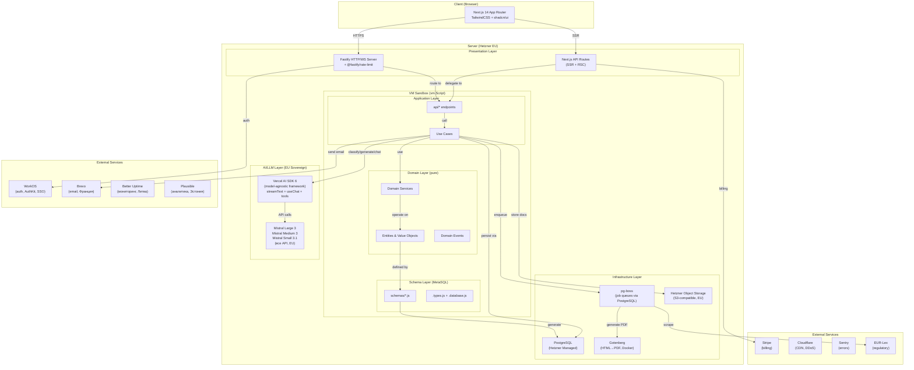
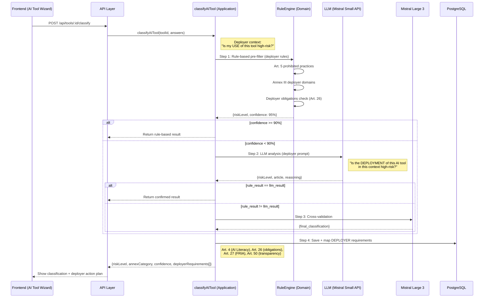
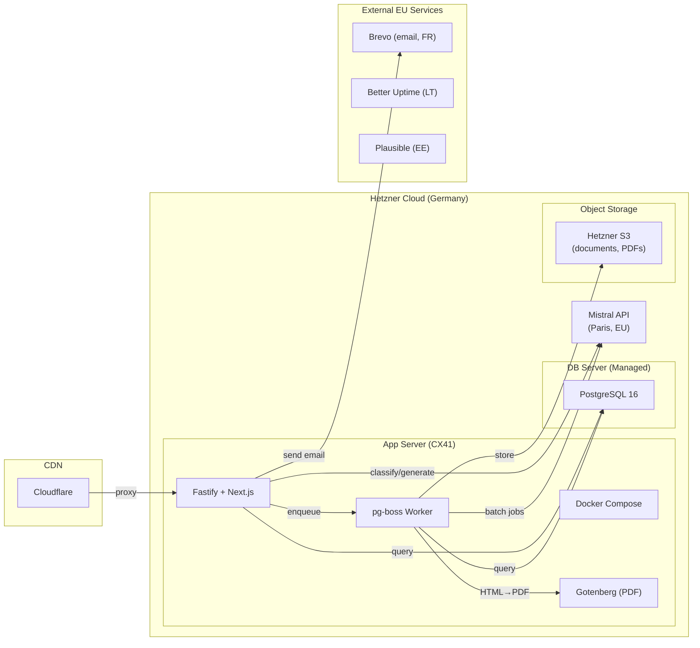

# ARCHITECTURE.md — AI Act Compliance Platform

**Версия:** 3.2.0
**Дата:** 2026-02-24
**Автор:** Marcus (CTO) via Claude Code
**Статус:** Phase 0 — Утверждено

> **v3.2.0 (2026-02-24):** Audit — Implementation Status Matrix added to all Bounded Contexts. Schema counter corrected to 41 (ScanResult not yet created). Tree listing fixed. Code: refresh-service.js bug fix (tools.rows) + FP refactor (IIFE closures). Moved seed-detection-patterns.js from app/ to scripts/. Deleted pre-migration .backup files.
>
> **v3.0.0 (2026-02-21):** TUI+SaaS Dual-Product Model.
> - **Auth:** Ory Kratos → **WorkOS** (managed auth, AuthKit, SSO free до 1M MAU, org management native). Supersedes ADR-006, см. ADR-007.
> - **Новый BC "Registry API":** Публичные эндпоинты для TUI DataProvider: `/v1/registry/tools`, `/v1/regulations/obligations`. API Key auth, rate limits per plan, ETag caching.
> - **Новый BC "TUI Data Collection":** Приём compliance данных от TUI (scan results + discovered AI systems). Основа Cross-System Map на Dashboard. Только для платных планов.
> - **Dashboard v2:** Cross-System Map (данные от TUI + GitHub/GitLab scan + ручная регистрация), Score Trends, Monitoring.
> - **8 → 10 Bounded Contexts** (+ Registry API, + TUI Data Collection).
> - **Новые таблицы:** ~6 (registry_tool, obligation, scoring_rule, api_key, api_usage, scan_result).
> - **Убрано:** Ory Kratos service из docker-compose, Caddy `.ory/*` routes. Без heartbeat, без TUINode, без license endpoint.
> - **Добавлено:** WorkOS env vars, Registry API rate limiting.
>
> **v2.1.0 (2026-02-09):** AI SDK интеграция — Vercel AI SDK 6 как framework для Eva и LLM-интеграций (ADR-005). Claude Agent SDK для автономных агентов Features 16-17. Nango (self-hosted EU) как planned agent integration platform вместо Composio. Multi-user tool registration (employee self-service). Подтверждение Ory Kratos vs WorkOS (ADR-006).
>
> **v2.0.0 (2026-02-07):** Deployer-first pivot — архитектура перестроена под компании, которые ИСПОЛЬЗУЮТ AI (deployers), а не строят. Новые Bounded Contexts: AI Literacy (Art. 4), Inventory (каталог AI-инструментов). Classification Engine переориентирован на deployer-требования (Art. 4, 26-27, 50). Compliance → Deployer Compliance (FRIA, Monitoring Plan, AI Usage Policy вместо Art. 11 Annex IV).
>
> **v1.1.0 (2026-02-07):** Интеграция 7 EU-сервисов: Ory, Brevo, Gotenberg, Hetzner Object Storage, @fastify/rate-limit, Better Uptime, Plausible.

---

## 1. Архитектурные принципы

1. **DDD (Domain-Driven Design)** — бизнес-логика в центре, инфраструктура на периферии
2. **Onion Architecture** — зависимости направлены строго внутрь
3. **Framework-agnostic** — Application не знает про Fastify (существующий паттерн)
4. **VM Sandbox Isolation** — модули изолированы через vm.Script с frozen context (существующий паттерн)
5. **MetaSQL as Single Source of Truth** — JavaScript schema → SQL DDL + TypeScript types
6. **EU Sovereign AI** — данные клиентов только через EU-модели (Mistral) и EU-хостинг (Hetzner)
7. **Modular Monolith** — один deployable, но чёткие Bounded Contexts
8. **EU-first Services** — внешние сервисы приоритетно от EU-компаний (WorkOS — managed auth с SCC, Brevo — Франция, Plausible — Эстония, Better Uptime — Литва)
9. **TUI+SaaS Dual-Product** — SaaS = облачная часть двухкомпонентной системы Complior. TUI (open-source) → Paid Dashboard (SaaS). Shared contracts: Registry API types, obligation IDs

---

## 2. High-Level Architecture



---

## 3. Onion Architecture Layers

```
┌──────────────────────────────────────────────────────────────┐
│  Presentation Layer (Fastify + Next.js API Routes)           │
│  - HTTP/WS routing, request parsing, response formatting     │
│  - Static file serving, SSR                                  │
├──────────────────────────────────────────────────────────────┤
│  Application Layer (api/* endpoints, Use Cases)              │
│  - Orchestrates domain logic for specific use cases          │
│  - Input validation (Zod), authorization checks              │
│  - Transaction management, event dispatching                 │
├──────────────────────────────────────────────────────────────┤
│  Domain Services Layer                                       │
│  - Cross-entity business operations                          │
│  - Classification logic (deployer), compliance scoring       │
│  - Document generation (FRIA, Monitoring Plan, Policies)     │
│  - LiteracyManager, CertificateGenerator, CatalogMatcher    │
├──────────────────────────────────────────────────────────────┤
│  Domain Model Layer (центр — ЧИСТАЯ бизнес-логика)           │
│  - Entities: AITool, Organization, User, TrainingCourse,     │
│    ComplianceDoc, FRIAAssessment, AIToolCatalog               │
│  - Value Objects: RiskLevel, AnnexCategory, ComplianceScore  │
│  - Domain Events: AIToolClassified, LiteracyCompleted,       │
│    DocumentGenerated, AIToolDiscovered                        │
│  - NO dependencies on frameworks, DB, or external services   │
├──────────────────────────────────────────────────────────────┤
│  Schema Layer (MetaSQL)                                      │
│  - schemas/*.js → SQL DDL + TypeScript types                 │
│  - Single source of truth for data structure                 │
├──────────────────────────────────────────────────────────────┤
│  Infrastructure Layer                                        │
│  - PostgreSQL (via pg pool + pg-boss для job queues)          │
│  - Hetzner Object Storage (S3-compatible, EU)                │
│  - WorkOS SDK (AuthKit, SSO, org management — managed)       │
│  - Brevo client (transactional email — Франция)              │
│  - Gotenberg client (HTML→PDF, self-hosted Docker)           │
│  - Vercel AI SDK (model-agnostic LLM framework, ADR-005)      │
│  - Mistral API client via @ai-sdk/mistral (Large/Medium/Small)│
│  - Stripe client, EUR-Lex scraper                            │
│  - Logger, error tracking (Sentry)                           │
└──────────────────────────────────────────────────────────────┘

Dependency Direction: Infrastructure → Schema → Domain → Domain Services → Application → Presentation
                      (outer depends on inner, NEVER reverse)
```

### Dependency Rules

| Layer | Может зависеть от | НЕ может зависеть от |
|-------|-------------------|---------------------|
| Domain Model | Ничего (pure) | Всего остального |
| Domain Services | Domain Model | Application, Infrastructure, Presentation |
| Schema (MetaSQL) | Domain Model (types) | Application, Infrastructure |
| Application | Domain, Domain Services, Schema | Presentation |
| Infrastructure | Все inner layers | Presentation |
| Presentation | Application, Domain | — |

---

## 4. Bounded Contexts (DDD)

```mermaid
graph LR
    subgraph IAM["IAM Context"]
        User["User (sync from WorkOS)"]
        Organization["Organization"]
        Role["Role"]
        Invitation_["Invitation"]
        WorkOSAuth["WorkOS (AuthKit + SSO)"]
    end

    subgraph Inventory["Inventory Context"]
        AITool["AI Tool"]
        AIToolCatalog["AI Tool Catalog"]
        AIToolDiscovery["Discovery Log"]
    end

    subgraph Classification["Classification Context"]
        RiskClassification["Risk Classification"]
        Requirement["Requirement (deployer)"]
    end

    subgraph Literacy["AI Literacy Context"]
        TrainingCourse["Training Course"]
        LiteracyCompletion["Completion Tracking"]
        Certificate["Certificate (PDF)"]
    end

    subgraph DeployerCompliance["Deployer Compliance Context"]
        ComplianceDoc["FRIA / Monitoring Plan /<br/>AI Usage Policy"]
        ChecklistItem["Checklist Item"]
        ComplianceScore["Compliance Score"]
    end

    subgraph Consultation["Consultation Context"]
        Conversation["Conversation"]
        ChatMessage["Chat Message"]
        EvaAgent["Eva Agent (deployer)"]
    end

    subgraph Monitoring["Monitoring Context"]
        RegulatoryUpdate["Regulatory Update"]
        ImpactAssessment["Impact Assessment"]
        Notification["Notification"]
    end

    subgraph Billing["Billing Context"]
        Subscription["Subscription"]
        Plan["Plan"]
        Invoice["Invoice"]
    end

    subgraph RegistryAPI["Registry API Context"]
        RegistryTool["Registry Tool (2477+)"]
        Obligation["Obligation"]
        ScoringRule["Scoring Rule"]
        APIKey["API Key"]
        APIUsage["API Usage"]
    end

    subgraph TUIData["TUI Data Collection Context"]
        ScanResult["Scan Result"]
    end

    IAM -->|"owns"| Inventory
    Inventory -->|"classifies"| Classification
    Classification -->|"generates"| DeployerCompliance
    Inventory -->|"trains"| Literacy
    Consultation -->|"uses"| Classification
    Consultation -->|"uses"| DeployerCompliance
    Monitoring -->|"notifies"| DeployerCompliance
    IAM -->|"subscribes"| Billing
    Literacy -->|"tracks"| DeployerCompliance
    RegistryAPI -->|"enriches"| Inventory
    TUIData -->|"feeds"| Monitoring
    IAM -->|"authorizes"| TUIData
```



### Implementation Status Matrix

| # | Bounded Context | Status | Endpoints | Sprint |
|---|----------------|--------|-----------|--------|
| 4.1 | IAM | **IMPLEMENTED** | 13 auth + 4 team + 2 user | S1–S7 |
| 4.2 | Inventory | **IMPLEMENTED** | 9 endpoints | S2 |
| 4.3 | Classification | **IMPLEMENTED** | 2 endpoints | S2–S3 |
| 4.4 | AI Literacy | SCHEMA ONLY | 0 endpoints | Planned S10 |
| 4.5 | Deployer Compliance | SCHEMA ONLY | 0 endpoints | Planned S8–S9 |
| 4.6 | Consultation (Eva) | SCHEMA ONLY | 0 endpoints | Planned S8 |
| 4.7 | Monitoring | SCHEMA ONLY | 0 endpoints | Planned S9 |
| 4.8 | Billing | **IMPLEMENTED** | 3 endpoints | S3.5–S6 |
| 4.9 | Registry API | **IMPLEMENTED** | 7 endpoints (3 registry + 3 regulations + 1 data) | S7 |
| 4.10 | TUI Data Collection | NOT STARTED | 0 endpoints, ScanResult schema not created | Planned S8 |
| 4.11 | Data Migration | **IMPLEMENTED** | scripts + pg-boss jobs | S7 |

> **Legend:** **IMPLEMENTED** = endpoints + business logic live in production. SCHEMA ONLY = MetaSQL schema exists, no API/application code. NOT STARTED = neither schema nor code exists yet.

### 4.1 IAM Context (Identity & Access Management) — IMPLEMENTED
- **Identity & Auth:** WorkOS (managed) — AuthKit (hosted login/registration), SSO (SAML/OIDC бесплатно до 1M MAU), MFA, magic links. Supersedes Ory Kratos ([ADR-007](ADR-007-workos-migration.md))
- **Наша БД:** User (sync от WorkOS через SDK callback), Organization (workosOrgId), Role, Permission, Invitation
- **Ответственный:** Max (backend WorkOS integration) + Nina (frontend AuthKit UI)
- **Паттерн:** WorkOS управляет identity lifecycle → AuthKit callback → наш API синхронизирует User + создаёт/связывает Organization. SSO — через WorkOS native org management
- **Invite Flow:** Owner/Admin создаёт Invitation → email через Brevo → invitee регистрируется через WorkOS AuthKit → callback проверяет pending invitation → присоединяется к существующей org (не создаёт новую)
- **Subscription Enforcement (Sprint 2.5):** SubscriptionLimitChecker (чистый domain service) проверяет maxUsers/maxTools перед созданием invitation и регистрацией инструмента. PlanLimitError (403) при превышении лимита
- **Enterprise SSO:** WorkOS Organizations + SSO connections (SAML/OIDC). Настройка через Dashboard → Org Settings

### 4.2 Inventory Context (точка входа для deployer) — IMPLEMENTED
- **Entities:** AITool, AIToolCatalog (200+ pre-populated tools), AIToolDiscovery
- **Domain Services:** CatalogMatcher (поиск по каталогу), DiscoveryLogger
- **Application:** registerAITool (wizard 5 шагов для deployer), importTools (CSV import)
- **Ответственный:** Max (backend) + Nina (wizard UI)
- **Описание:** Deployer регистрирует AI-инструменты, которые компания ИСПОЛЬЗУЕТ (ChatGPT, HireVue, Copilot и т.д.). Каталог помогает быстро найти и добавить инструмент с pre-fill данных.

### 4.3 Classification Context (ядро продукта) — IMPLEMENTED
- **Entities:** RiskClassification, AnnexCategory, Requirement (deployer: Art. 4, 26-27, 50)
- **Domain Services:** RuleEngine (pure rule-based: Art.5 prohibited, Annex III deployer domains)
- **Application:** classifyAITool (orchestrates RuleEngine + LLM via port + cross-validation)
- **Фокус:** "Является ли моё ИСПОЛЬЗОВАНИЕ этого AI high-risk?" (не "является ли мой AI high-risk?")
- **Output:** deployer-требования (Art. 4 AI Literacy, Art. 26 обязанности, Art. 27 FRIA, Art. 50 прозрачность)
- **Ответственный:** Max (backend engine) + Elena (AI Act rules) + Nina (wizard UI)

### 4.4 AI Literacy Context (wedge product, Art. 4) — SCHEMA ONLY
- **Entities:** TrainingCourse, TrainingModule, LiteracyCompletion, LiteracyRequirement
- **Domain Services:** LiteracyManager, CertificateGenerator
- **Application:** enrollEmployee, trackCompletion, generateCertificate (PDF via Gotenberg)
- **Ответственный:** Max (backend) + Nina (learning UI) + Elena (контент курсов)
- **Описание:** Art. 4 AI Literacy обязателен с 02.02.2025. 70% сотрудников не обучены. 4 role-based курса на немецком: CEO, HR, Developer, General. Standalone продукт за €49/мес.

### 4.5 Deployer Compliance Context — SCHEMA ONLY
- **Entities:** ComplianceDocument (FRIA, Monitoring Plan, AI Usage Policy, Employee Notification), ChecklistItem, ComplianceScore, DocumentSection, FRIAAssessment, FRIASection
- **Domain Services:** DocumentGenerator (deployer docs), GapAnalyzer, ScoreCalculator, FRIAWizard
- **Типы документов:** FRIA (Art. 27), Monitoring Plan, AI Usage Policy, Employee Notification, Incident Report
- **НЕ генерирует:** Art. 11 Annex IV Technical Documentation, Conformity Assessment (Art. 43) → P3 Future
- **Ответственный:** Max (backend) + Nina (dashboard + editor UI)

### 4.6 Consultation Context (Ева — deployer focus) — SCHEMA ONLY
- **Entities:** Conversation, ChatMessage, QuickAction
- **Domain Services:** EvaOrchestrator (context injection + tool calling)
- **AI Framework:** Vercel AI SDK 6 — `streamText` (Fastify) + `useChat` (Next.js), Zod-typed tools с `needsApproval` ([ADR-005](ADR-005-vercel-ai-sdk.md))
- **Фокус:** Deployer-вопросы: "Bin ich Betreiber?", "Ist Slack AI high-risk?", "Was muss ich als Betreiber tun?"
- **Tools:** classify_ai_tool, create_fria, setup_monitoring, search_regulation
- **Ответственный:** Max (backend) + Nina (chat UI)
- **Существующий код:** Chat, Message, ChatMember schemas — адаптируем

### 4.7 Monitoring Context (post-MVP) — SCHEMA ONLY
- **Entities:** RegulatoryUpdate, ImpactAssessment, Notification
- **Domain Services:** EURLexScraper, ChangeDetector, NotificationSender
- **Notification types:** ai_tool_discovered, literacy_overdue, fria_required, risk_threshold_exceeded, regulatory_update, compliance_change
- **Ответственный:** Max (background jobs)

### 4.8 Billing Context — IMPLEMENTED
- **Entities:** Subscription, Plan, Invoice
- **External:** Stripe API (webhooks → internal events)
- **Планы:** Free (Quick Check) → €49 (AI Literacy) → €149 (Full Compliance) → €399 (Scale) → Enterprise
- **Ответственный:** Max (Stripe integration)

### 4.9 Registry API Context (новое — v3.0.0) — IMPLEMENTED
- **Entities:** RegistryTool (2,477+ AI tools), Obligation (108 per regulation/risk), ScoringRule, APIKey, APIUsage
- **Публичные эндпоинты:**
  - `GET /v1/registry/tools` — поиск/фильтрация AI tools (для TUI DataProvider)
  - `GET /v1/registry/tools/:id` — полная запись tool с evidence/assessments
  - `GET /v1/registry/search` — полнотекстовый поиск (provider, capability, jurisdiction)
  - `GET /v1/regulations/obligations` — compliance obligations per regulation/risk level
  - `GET /v1/data/bundle` — offline data bundle для TUI (~530KB, ETag caching)
- **Auth:** API Key (HMAC-SHA256), rate limits per plan:
  - Free: 100 req/day, 200 tools (bundled offline)
  - Starter: 1K req/day, 2,477 tools
  - Growth: 10K req/day, evidence + assessments
  - Scale/Enterprise: 100K req/day, full API
- **Кеширование:** ETag + If-None-Match для TUI DataProvider, 304 Not Modified
- **Версионирование:** `/v1/` prefix, backward-compatible additions only
- **Ответственный:** Max (backend API) + Infra (rate limiting, monitoring)
- **Кросс-зависимость:** Engine (open-source) DataProvider потребляет этот API

### 4.10 TUI Data Collection Context (новое — v3.0.0) — NOT STARTED
- **Назначение:** Приём compliance данных от TUI-инсталляций для агрегации на Dashboard. Работает только при наличии платного плана (авторизация через API Key).
- **Единственный эндпоинт:**
  - `POST /v1/tui/scans` — idempotent upload результата скана: `{ projectPath, score, findings[], toolsDetected[], regulation, scannedAt }`. TUI вызывает после каждого скана при наличии ключа.
- **Таблица:** ScanResult — `{ organizationId, projectPath, score, findings, toolsDetected, regulation, scannedAt, idempotencyKey }`
- **Idempotency:** `idempotencyKey = HMAC(orgId + projectPath + scannedAt)` — повторные загрузки игнорируются
- **Данные в Dashboard:**
  - Cross-System Map: агрегация score по всем проектам организации
  - AI Systems inventory: все toolsDetected из scan results
  - Score Trends: история compliance по времени
- **Auth:** API Key (тот же ключ из Registry API Context)
- **Нет:** heartbeat, node management, license validation — это не нужно
- **Ответственный:** Max (backend ingest) + Nina (Dashboard v2 UI)
- **Кросс-зависимость:** TUI Engine (open-source) отправляет данные если пользователь настроил API key в `~/.complior/credentials`

### 4.11 Data Migration Context (v3.1.0 — 2026-02-23) — IMPLEMENTED

**Назначение:** Миграция AI Registry (4,983 инструментов) и Regulation DB (108 обязательств) из open-source Engine (`~/complior`) в SaaS PostgreSQL — единственный источник истины.

**Новые таблицы (6 шт):**

| Таблица | Записей | Описание |
|---------|---------|----------|
| `RegulationMeta` | 1 | Метаданные регуляции (jurisdictionId, officialName, status, enacted/force dates, riskLevels, keyDefinitions) |
| `TechnicalRequirement` | 89 | CLI-реализация требований (featureType, sdkImplementation, cliCheck) |
| `TimelineEvent` | 18 | Регуляторные дедлайны (phase, date, whatApplies, status) |
| `CrossMapping` | — | Кросс-юрисдикционные маппинги (equivalent/stricter/subset/superset) |
| `LocalizationTerm` | — | Мультиязычные переводы терминов (7 языков) |
| `ApplicabilityNode` | — | Decision tree для Quick Check (7 вопросов) |

**Расширенные существующие таблицы:**
- `Obligation` — добавлено 10 полей: `whatNotToDo`, `automatable`, `automationApproach`, `cliCheckPossible`, `cliCheckDescription`, `documentTemplateNeeded`, `documentTemplateType`, `sdkFeatureNeeded`, `parentObligation`, `appliesToRiskLevel`
- `RegistryTool` — добавлено: `slug` (unique business key), `evidence` (JSON), `assessments` (JSON), `seo` (JSON), `priorityScore`

**Данные (текущее состояние):**
- `Obligation`: 108 (critical=37, high=57, medium=12, low=2) — 100% `whatNotToDo` coverage
- `RegistryTool`: 4,983 (verified=85, scanned=2,380, classified=2,518) — 99.98% evidence coverage
- Источник: `~/complior/engine/data/` (JSON) → PostgreSQL через `scripts/run-migration.js`

**Фоновые задачи (pg-boss):**
- `registry-refresh` — еженедельно (понедельник 03:00 UTC) — обогащение CLASSIFIED → SCANNED через passive scan
- `export-json` — еженедельно (понедельник 04:00 UTC) — генерация JSON резервных копий в `data/`

**API эндпоинты:**
- `GET /v1/registry/tools` — поиск + фильтрация (public, API key auth)
- `GET /v1/registry/tools/:id` — полная запись инструмента
- `GET /v1/regulations/obligations` — обязательства EU AI Act
- `GET /v1/regulations/meta` — метаданные регуляции
- `GET /v1/regulations/timeline` — регуляторный timeline

**JSON экспорты (`npm run export:all`):**
- `data/registry/all_tools.json` (~21MB) — полный дамп Registry
- `data/regulations/obligations.json` (~200KB) — дамп Obligation DB
- `data/regulations/regulation-meta.json` — метаданные
- `data/regulations/technical-requirements.json` — технические требования
- `data/regulations/timeline.json` — timeline events

**TUI DataProvider (~/complior):**
- `EngineDataProvider` (primary) — HTTP клиент к `/v1/registry/stats` + `/v1/registry/tools`, 30s кеш, фоновый refresh thread
- `MockDataProvider` (fallback) — score=47, offline
- Логика выбора: `OFFLINE_MODE=1` → Mock; `api_key` present → Engine; иначе → Mock
- Credentials: `COMPLIOR_API_KEY` в `~/.config/complior/credentials`

---

## 5. Module Structure

```
server/                              # HTTP runtime (require-based)
├── main.js                          # Entry: loadApplication() pattern
├── src/
│   ├── loader.js                    # load, loadDir, loadDeepDir, loadApplication
│   ├── http.js                      # registerSandboxRoutes + middleware
│   ├── ws.js                        # WebSocket adapter
│   └── logger.js                    # Logger wrapping pino (console in sandbox)
├── lib/
│   ├── errors.js                    # AppError hierarchy
│   ├── schemas.js                   # Zod validators
│   └── db.js                        # CRUD builder (future)
└── infrastructure/                  # External clients (lazy-loaded)
    ├── auth/workos-client.js
    ├── email/brevo-client.js
    ├── pdf/gotenberg-client.js
    └── storage/s3-client.js

app/                                 # Business logic (VM-sandboxed, NO require)
├── setup.js                         # DB init (schemas + seeds)
├── config/                          # Loaded by server via require()
├── api/                             # Sandbox: { access, httpMethod, path, method }
│   ├── auth/
│   │   ├── callback.js              # WorkOS AuthKit → callback (user authenticated)
│   │   ├── me.js                    # Session → user lookup with sync fallback
│   │   ├── updateOrganization.js    # PATCH org profile
│   │   └── audit.js                 # Paginated audit log
│   └── tools/
│       └── catalog.js               # Search pre-populated catalog
├── application/                     # Sandbox: use-case objects
│   ├── iam/
│   │   ├── syncUserFromWorkOS.js    # WorkOS callback → create/update User in our DB
│   │   └── resolveSession.js        # WorkOS session → User record
│   └── inventory/
│       └── searchCatalog.js         # ILIKE search, filters, pagination
├── lib/                             # Sandbox: IIFE closures (permissions, audit, tenant)
│   ├── permissions.js               # checkPermission with wildcard 'manage'
│   ├── audit.js                     # createAuditEntry + query helpers
│   └── tenant.js                    # createTenantQuery + CRUD helpers
├── domain/                          # DDD stubs (future)
│   ├── iam/
│   │   ├── entities/
│   │   └── value-objects/
│   ├── inventory/
│   │   ├── entities/
│   │   └── services/
│   ├── classification/
│   │   ├── entities/
│   │   ├── services/
│   │   └── value-objects/
│   ├── literacy/
│   │   ├── entities/
│   │   └── services/
│   ├── compliance/
│   │   ├── entities/
│   │   └── services/
│   ├── consultation/
│   │   ├── entities/
│   │   └── services/
│   ├── registry/
│   │   ├── entities/
│   │   └── services/
│   ├── tui-integration/
│   │   ├── entities/
│   │   └── services/
│   └── events/
├── schemas/                         # MetaSQL definitions (41 active files)
│   ├── Organization.js, User.js, Role.js, Permission.js, UserRole.js, Invitation.js
│   ├── AITool.js, AIToolCatalog.js, AIToolDiscovery.js
│   ├── RiskClassification.js, Requirement.js, ToolRequirement.js, ClassificationLog.js
│   ├── TrainingCourse.js, TrainingModule.js, LiteracyCompletion.js, LiteracyRequirement.js
│   ├── ComplianceDocument.js, DocumentSection.js, ChecklistItem.js
│   ├── FRIAAssessment.js, FRIASection.js, ImpactAssessment.js
│   ├── Conversation.js, ChatMessage.js
│   ├── Subscription.js, Plan.js, Notification.js, RegulatoryUpdate.js
│   ├── AuditLog.js
│   ├── RegistryTool.js, Obligation.js, ScoringRule.js          # Registry API (v3.0)
│   ├── APIKey.js, APIUsage.js                                   # Registry API auth (v3.0)
│   └── ScanResult.js                                            # TUI Data Collection (PLANNED, not created)
└── seeds/                           # Seed data (5+ files)
    ├── catalog.js, courses.js, plans.js, requirements.js, roles.js
```

---

## 6. Key Design Patterns

### 6.1 VM Sandbox Isolation (существующий, СОХРАНЯЕМ)

```javascript
// Каждый модуль загружается в изолированном контексте
const context = vm.createContext(Object.freeze({
  console,        // Logger (injected)
  config,         // Configuration (frozen)
  db,             // Database pool (frozen)
  domain,         // Domain layer (frozen)
  auth,           // WorkOS client (frozen) — verify session, get user identity
  email,          // Brevo client (frozen) — send transactional emails
}));

const script = new vm.Script(code, { timeout: 5000 });
const exported = script.runInContext(context);
```

**Плюсы:** Безопасность, изоляция, предотвращение cross-module pollution
**Новое:** Добавляем в sandbox доступ к infrastructure adapters (llm, storage, auth, email)

### 6.2 Vercel AI SDK — Model-Agnostic LLM Framework ([ADR-005](ADR-005-vercel-ai-sdk.md))

```javascript
// infrastructure/llm/ — uses Vercel AI SDK 6 (replaces custom adapter)
import { streamText, generateText } from '@ai-sdk/core';
import { mistral } from '@ai-sdk/mistral';

// Eva chat streaming (Fastify backend → Next.js frontend via SSE)
const result = streamText({
  model: mistral('mistral-large-latest'),
  system: 'Du bist Eva, KI-Act Compliance-Beraterin für Betreiber...',
  messages: conversationHistory,
  tools: { classifyAITool, searchRegulation, createFRIA },
  maxSteps: 5,
});

// Classification (non-streaming)
const classification = await generateText({
  model: mistral('mistral-small-latest'),
  system: 'You are an EU AI Act classifier for DEPLOYERS...',
  prompt: `Is the DEPLOYMENT of ${tool} in ${context} high-risk?`,
});

// Strategy: выбор модели по задаче (все через Vercel AI SDK, EU-sovereign)
// classify → mistral('mistral-small-latest') (speed)
// generateSection → mistral('mistral-medium-latest') (quality)
// chat → mistral('mistral-large-latest') (accuracy, Eva)
// A/B testing → swap to anthropic('claude-sonnet-4.5') without code changes
```

### 6.3 Repository Pattern

```javascript
// Domain НЕ знает про PostgreSQL
// Application использует repository для persistence

// application/classification/classifyAITool.js
async ({ toolId, answers }) => {
  const tool = await db.AITool.read(toolId);
  const classification = domain.classification.classify(tool, answers);
  await db.RiskClassification.create(classification);
  domain.events.emit('AIToolClassified', { toolId, classification });
  return classification;
};
```

### 6.4 Domain Events (Observer/EventEmitter)

```javascript
// domain/events/ — decoupling между контекстами
// Когда AI-инструмент классифицирован (AIToolClassified):
//   → Deployer Compliance Context создаёт checklist (Art. 26-27 requirements)
//   → Consultation Context обновляет контекст Евы
//   → Dashboard обновляет compliance score
// Когда сотрудник завершил курс (LiteracyCompleted):
//   → Dashboard обновляет AI Literacy progress
//   → Compliance Score пересчитывается (Art. 4 compliance)
// Когда обнаружен новый AI-инструмент (AIToolDiscovered):
//   → Notification: "Обнаружен новый AI-инструмент, требуется классификация"
```

### 6.5 Factory Pattern

```javascript
// Создание LLM clients, compliance documents, classification results
const createClassificationResult = (ruleResult, llmResult, confidence) => ({
  riskLevel: resolveRiskLevel(ruleResult, llmResult),
  annexCategory: resolveAnnex(ruleResult, llmResult),
  confidence,
  reasoning: generateReasoning(ruleResult, llmResult),
  requirements: mapRequirements(riskLevel),
});
```

### 6.6 CQS (Command Query Separation) для API Design

Принцип из лекции Тимура Шемсединова: метод либо **изменяет состояние** (command), либо **возвращает данные** (query), но никогда оба одновременно.

Применение к нашим API endpoints:

| Тип | Endpoints | Характеристика |
|-----|-----------|----------------|
| **Commands** (write) | `POST /api/tools/:id/classify`, `POST /api/literacy/enroll`, `POST /api/compliance/fria` | Изменяют состояние, возвращают только статус/id |
| **Queries** (read) | `GET /api/dashboard/overview`, `GET /api/tools/:id`, `GET /api/literacy/progress` | Только читают, никогда не изменяют |

Это упрощает кэширование (queries кэшируются), тестирование и аудит.

### 6.7 Audit Trail (Event Sourcing Lite)

Для AI Act compliance каждая классификация и изменение compliance-документов должны быть прослеживаемы. Вместо полного Event Sourcing (который избыточен для нашего масштаба) применяем **Event Sourcing Lite**:

- Каждая операция записывается как **Command-объект** (анемичная структура) в `ClassificationLog` / `AuditLog`
- Command содержит: `action`, `oldValue`, `newValue`, `userId`, `timestamp`
- Текущее состояние хранится в основных таблицах (не пересчитывается из событий)
- История позволяет: аудит для регулятора, undo ошибочной классификации, отладку

При масштабировании (>1000 клиентов) можно перейти к полному CQRS с отдельными Read/Write API.

### 6.8 MQ vs PubSub Strategy

Два паттерна передачи сообщений, применяемые в нашей системе:

| Паттерн | Реализация | Использование | Характеристика |
|---------|-----------|---------------|----------------|
| **Message Queue** | pg-boss (PostgreSQL) | Document generation, PDF export, EUR-Lex scraping, batch classification | Many→One, FIFO, persistent, exactly-once |
| **Pub/Sub** | WebSocket (Fastify ws) | Eva chat streaming, dashboard real-time, section ready notifications | One→Many, не persistent, at-least-once |

**Правила:**
- **pg-boss** — для задач, где порядок критичен и потеря недопустима (генерация документов, классификация)
- **WebSocket** — для уведомлений в реальном времени, где потеря одного сообщения не критична (UI обновления)
- **Idempotency:** каждое MQ-сообщение содержит GUID, получатель проверяет дубликаты
- **Error handling:** системные ошибки (DB down) → retry; бизнес-ошибки (невалидные данные) → обработать и завершить
- **Миграция:** при масштабировании pg-boss → BullMQ через JobQueue adapter (см. 6.10)

### 6.9 Анемичная доменная модель — обоснование

Наша Domain Model (MetaSQL schemas) является **анемичной** — содержит данные без поведения. Это осознанное решение:

- Мы моделируем **информационный слой** (AI-инструмент, классификация, FRIA, курс AI Literacy), а не реальные объекты с поведением
- Вся бизнес-логика — в Domain Services (RuleEngine, DocumentGenerator, GapAnalyzer, LiteracyManager, CatalogMatcher, FRIAWizard). LLM-интеграция — в Application layer через infrastructure ports
- MetaSQL schemas описывают структуру данных и генерируют SQL + типы — это **schema-based contracts**, единый инструмент для всех слоёв
- Схемы обеспечивают runtime-валидацию (в отличие от TypeScript, который проверяет только в compile-time)

Это соответствует подходу Тимура Шемсединова: «Анемичная модель — это нормально, когда мы моделируем не реальный объект, а набор документов и записей о нём».

### 6.10 JobQueue Port — Adapter для миграции pg-boss → BullMQ

Все обращения к очередям проходят через единый порт (интерфейс). Это обеспечивает замену pg-boss → BullMQ без изменения бизнес-логики:

```javascript
// domain/ports/JobQueue.js — порт (контракт)
// Все use cases работают ТОЛЬКО с этим интерфейсом
({
  enqueue: async (name, data, opts) => {},    // Поставить задачу в очередь
  schedule: async (name, cron, data) => {},   // Cron-задача
  work: (name, handler) => {},                // Зарегистрировать обработчик
});
```

```javascript
// infrastructure/jobs/pg-boss-adapter.js — MVP
const createPgBossQueue = (boss) => ({
  async enqueue(name, data, opts = {}) {
    const jobId = data.jobId || crypto.randomUUID();
    return boss.send(name, { ...data, jobId }, opts);
  },
  async schedule(name, cron, data) {
    return boss.schedule(name, cron, data);
  },
  work(name, handler) {
    boss.work(name, handler);
  },
});

// infrastructure/jobs/bullmq-adapter.js — при масштабировании
// Тот же интерфейс, другая реализация → ни один use case не меняется
```

**Когда мигрировать на BullMQ + Redis:**
- >100 concurrent пользователей
- Горизонтальное масштабирование (несколько серверов — нужен shared queue)
- PostgreSQL polling создаёт ощутимую нагрузку

**Шаги миграции:**
1. Добавить Redis в инфраструктуру
2. Написать `bullmq-adapter.js` (тот же интерфейс)
3. Заменить adapter в DI-конфигурации (одна строка)
4. Zero изменений в application/domain слоях

---

## 7. Classification Engine Architecture (Deployer Context)



---

## 8. Migration from Existing Code

### Что переиспользуем (as-is или с минимальным рефакторингом)

| Существующий код | Новое использование |
|-----------------|---------------------|
| `NodeJS-Fastify/main.js` | `server/main.js` — Entry point, loadApplication() pattern |
| `src/loader.js` (VM sandbox) | `server/src/loader.js` — Core pattern, сохраняем полностью |
| `src/http.js` (HTTP routing) | `server/src/http.js` — registerSandboxRoutes (walkApiTree pattern) |
| `src/ws.js` (WebSocket) | `server/src/ws.js` — Используем для Eva chat streaming |
| `lib/db.js` (CRUD builder) | Расширяем (fix delete bug, добавляем transactions) |
| `schemas/.database.js` | Обновляем metadata для новых entities |
| `schemas/.types.js` | Расширяем custom types |
| `config/*.js` | Дополняем (llm.js, stripe.js) |
| `schemas/Account.js` | → User.js (rename + extend, add workosUserId, remove password) |
| `schemas/Role.js, Permission.js` | Сохраняем RBAC модель (поверх WorkOS identity) |
| `schemas/Division.js` | → Organization.js (rename + extend) |
| `schemas/Chat.js, Message.js` | → Conversation.js, ChatMessage.js (adapt for Eva, deployer focus) |

> **Deployer-first pivot (v2.0.0):** AISystem → AITool (переименование), SystemRequirement → ToolRequirement. Добавлены 8 новых таблиц: AIToolCatalog, AIToolDiscovery, TrainingCourse, TrainingModule, LiteracyCompletion, LiteracyRequirement, FRIAAssessment, FRIASection.
>
> **TUI+SaaS Dual-Product (v3.0.0):** Добавлены 6 таблиц: RegistryTool, Obligation, ScoringRule, APIKey, APIUsage, ScanResult. Ory → WorkOS. Всего: **~36 таблиц** в 10 Bounded Contexts.
>
> **Architecture split (Sprint 1):** `src/` split into `server/` (HTTP runtime, require-based) + `app/` (VM-sandboxed business logic, NO require). API handlers now use VM sandbox expression format (`{ access, httpMethod, path, method }`). `initRoutes` replaced by `registerSandboxRoutes` (walkApiTree pattern).

### Что добавляем

| Новый компонент | Описание |
|----------------|----------|
| `schemas/AITool.js` | Ключевая entity — AI-инструмент, который компания ИСПОЛЬЗУЕТ |
| `schemas/AIToolCatalog.js` | Pre-populated каталог 200+ AI-инструментов (seed data) |
| `schemas/AIToolDiscovery.js` | Лог обнаружения AI-инструментов (manual/import/scan) |
| `schemas/RiskClassification.js` | Результат классификации (deployer context) |
| `schemas/Requirement.js` | Справочник deployer-требований (Art. 4, 26-27, 50) |
| `schemas/ToolRequirement.js` | Связь инструмент ↔ требование |
| `schemas/TrainingCourse.js` | AI Literacy: курсы (CEO, HR, Developer, General) |
| `schemas/TrainingModule.js` | AI Literacy: модули внутри курса |
| `schemas/LiteracyCompletion.js` | AI Literacy: прогресс сотрудника |
| `schemas/LiteracyRequirement.js` | AI Literacy: какие роли какие курсы проходят |
| `schemas/ComplianceDocument.js` | Deployer документы (FRIA, Monitoring Plan, AI Usage Policy) |
| `schemas/DocumentSection.js` | Секции документов |
| `schemas/FRIAAssessment.js` | FRIA per AI tool (Art. 27) |
| `schemas/FRIASection.js` | Секции FRIA |
| `schemas/Subscription.js` | Подписки (billing) |
| `domain/inventory/` | AI Tool Inventory (каталог, wizard, import) |
| `domain/classification/` | Classification Engine (rules + LLM, deployer context) |
| `domain/literacy/` | AI Literacy (курсы, tracking, сертификаты) |
| `domain/compliance/` | Deployer Compliance (FRIA, docs, gap analysis) |
| `domain/consultation/` | Eva orchestrator (deployer focus) |
| `infrastructure/auth/` | WorkOS SDK client (AuthKit, sessions, SSO, org management) |
| `infrastructure/email/` | Brevo SDK client (transactional email) |
| `infrastructure/pdf/` | Gotenberg client (HTML→PDF, сертификаты AI Literacy) |
| `infrastructure/llm/` | Mistral API adapters (Large/Medium/Small) |
| `infrastructure/jobs/` | Background jobs (pg-boss → BullMQ при масштабировании) |

### Что рефакторим

| Существующий код | Проблема | Решение |
|-----------------|----------|---------|
| `lib/db.js` delete() | Template string bug | Fix backticks |
| `config/database.js` | Hardcoded credentials | Env variables |
| Custom auth (Account, Session) | Самописная аутентификация | Заменяем на WorkOS (managed, AuthKit) |
| `lib/common.js` password hashing | Самописный scrypt | Удаляем — WorkOS управляет паролями и magic links |
| API error handling | Inconsistent format | Custom AppError hierarchy |
| No input validation | Security risk | Zod schemas на каждый endpoint |
| No transactions | Data integrity | Add transaction support to db.js |
| No audit logging | Compliance requirement | Add audit log to all data access |

---

## 9. Security Architecture

### Data Flow & Boundaries

```
┌──────────────────────────────────────────────────────────────┐
│  EU BOUNDARY                                                  │
│                                                                │
│  Hetzner Cloud, Germany:                                       │
│  ┌──────────────────┐  ┌───────────┐  ┌──────────────────┐   │
│  │ App Server        │  │ PostgreSQL│  │ Hetzner Object   │   │
│  │ (Fastify + Next)  │  │ (managed) │  │ Storage (S3)     │   │
│  │ + Gotenberg (PDF) │  └───────────┘  └──────────────────┘   │
│  │                    │                                        │
│  └─────┬─────────────┘                                        │
│        │                                                       │
│  EU Services:                                                  │
│  ┌─────┴─────────────────────────────────────────────────┐    │
│  │ Mistral API (Paris, France — LLM)                      │    │
│  │ Brevo (Paris, France — email)                          │    │
│  │ Better Uptime (Vilnius, Lithuania — monitoring)         │    │
│  │ Plausible (Tallinn, Estonia — analytics)               │    │
│  └────────────────────────────────────────────────────────┘    │
│                                                                │
│  ⛔ Client data NEVER leaves EU                               │
└──────────────────────────────────────────────────────────────┘
         │
    ┌────┴────┐
    │Cloudflare│  ← CDN/DDoS (edge, no data storage)
    └────┬────┘
         │
    ┌────┴────┐
    │ Browser │
    └─────────┘
```

### Security Measures

- **Auth:** WorkOS (managed) — AuthKit (hosted login), SSO (SAML/OIDC), MFA, magic links ([ADR-007](ADR-007-workos-migration.md))
- **Sessions:** WorkOS session tokens + httpOnly cookies — managed, не самописное решение
- **RBAC:** Permission(role, resource, action) — наша таблица поверх WorkOS identity
- **Input validation:** Zod schemas on every API endpoint
- **SQL injection:** Parameterized queries (existing CRUD builder)
- **XSS:** React auto-escaping + CSP headers
- **CSRF:** SameSite cookies + Origin header validation
- **Rate limiting:** @fastify/rate-limit (plugin, in-process с поддержкой distributed stores при масштабировании)
- **API Key security:** HMAC-SHA256 hashing, per-plan rate limits, usage tracking (Registry API)
- **TUI ↔ SaaS:** TLS 1.3, API key auth, request signing, PII stripping в telemetry
- **Encryption:** TLS 1.3 in transit, AES-256 at rest
- **Secrets:** Environment variables (no hardcoded credentials)
- **Audit trail:** Log all data access for compliance
- **Email:** Brevo (Франция) — transactional email для magic links и уведомлений
- **Monitoring:** Better Uptime (Литва) — uptime + status page

---

## 10. Deployment Architecture



### MVP Scaling Plan

| Phase | Users | Infrastructure |
|-------|-------|---------------|
| MVP (Month 1-3) | 0-50 | 1 app server (Docker Compose: app + Gotenberg) + managed PG + WorkOS (managed) + Mistral API + Brevo + Hetzner S3 |
| Beta (Month 4-6) | 50-200 | 2 app servers + managed PG + WorkOS + Mistral API + Registry API |
| Growth (Month 7-12) | 200-1000 | Horizontal scaling + self-hosted LLM (cost optimization) |

---

## 11. Trade-offs & Decisions

| Решение | Альтернатива | Почему так |
|---------|-------------|-----------|
| Modular Monolith | Microservices | Быстрее для MVP, проще deploy, достаточно для 1000 users |
| MetaSQL | Prisma ORM | Уже есть, даёт VM sandbox + type generation, zero-dependency |
| Fastify | Express, Koa | Уже есть, быстрый, WebSocket support, plugin ecosystem |
| VM Sandbox | Direct imports | Безопасность, изоляция, hot-reload potential |
| Mistral (product) | Claude/GPT | EU sovereignty, EU data residency trust, acceptable quality |
| **Vercel AI SDK** (LLM framework) | Raw API, LangChain | Model-agnostic, `streamText`+`useChat` for Eva, Zod tools, Apache 2.0 ([ADR-005](ADR-005-vercel-ai-sdk.md)) |
| **Claude Agent SDK** (autonomous) | Custom agent loop | Built-in tools, subagents, session persistence — for Features 16-17 (Sprint 5+) |
| **WorkOS** (auth) | Ory Kratos (self-hosted) | Managed service, SSO free до 1M MAU, AuthKit hosted login, no self-hosting burden. Supersedes ADR-006 ([ADR-007](ADR-007-workos-migration.md)) |
| **Nango** (agent integrations) | Composio | Self-hosted EU vs Composio US data — planned for Sprint 5+ |
| PostgreSQL | MongoDB | Structured compliance data, ACID transactions, existing |
| pg-boss (MVP) | BullMQ, Temporal, Agenda | PostgreSQL-native: нет доп. инфраструктуры. Миграция на BullMQ через adapter при масштабировании |
| Next.js (frontend) | Remix, SvelteKit | Ecosystem, shadcn/ui compatibility, team expertise |
| **WorkOS** (auth) | Clerk, Auth0, Firebase Auth | Managed, SSO (SAML/OIDC) бесплатно до 1M MAU, org management native, AuthKit. SCC для EU compliance |
| **Brevo** (email) | Resend, SendGrid, custom SMTP | Французская компания, EU data residency, 300 emails/day free, Node.js SDK |
| **Gotenberg** (PDF) | Puppeteer, wkhtmltopdf | Self-hosted Docker, API-based (POST HTML → PDF), zero data leaks |
| **Hetzner Object Storage** | AWS S3, MinIO | Native Hetzner, S3-compatible, EUR 5.27/TB, EU data residency |
| **@fastify/rate-limit** | Custom Map+sliding window | Official plugin, configurable, supports distributed stores при масштабировании |
| **Better Uptime** (monitoring) | Uptime Robot, Pingdom | Литва (EU), free tier, status page included |
| **Plausible** (analytics) | Google Analytics, Matomo | Эстония (EU), no cookies, GDPR by design, EUR 9/month |

---

## 12. Risks & Mitigations

| Риск | Митигация |
|------|-----------|
| VM Sandbox performance overhead | Negligible for our scale; modules loaded once at startup |
| MetaSQL learning curve | Existing code as reference; well-documented schema format |
| Monolith scaling limits | Design with Bounded Contexts now; extract to services later if needed |
| Single point of failure (1 server) | Hetzner load balancer + auto-restart; managed PG with backups |
| GPU server cost | Start with API-only (Mistral); add self-hosted when >100 clients |

---

✅ **Утверждено PO** (2026-02-21). TUI+SaaS Dual-Product v3.0.0.

**v3.0.0 (2026-02-21):** TUI+SaaS Dual-Product — 10 Bounded Contexts (+Registry API, +TUI Data Collection), ~36 таблиц (+6), Ory → WorkOS (ADR-007), Registry API (SaaS→TUI), TUI Data Collection (TUI→SaaS scan results, без heartbeat/TUINode).

**v2.1.0 (2026-02-12):** Sprint 2.5 — Invitation entity в IAM Context, Subscription Enforcement pattern (SubscriptionLimitChecker domain service), 30 таблиц.

**v2.0.0 (2026-02-07):** Deployer-first pivot — 8 Bounded Contexts (добавлены AI Literacy + Inventory), 29 таблиц, Classification Engine переориентирован на deployer (Art. 4, 26-27, 50), Deployer Compliance вместо provider Tech Docs.

**v1.1.0 (2026-02-07):** Интегрированы 7 EU-сервисов: Ory (auth), Brevo (email), Gotenberg (PDF), Hetzner Object Storage, @fastify/rate-limit, Better Uptime, Plausible.
