# DATA-FLOWS.md — AI Act Compliance Platform

**Версия:** 2.3.0
**Дата:** 2026-02-12
**Автор:** Marcus (CTO) via Claude Code
**Статус:** Информационный (PO approval не требуется)
**Зависимости:** ARCHITECTURE.md v2.1.0, DATABASE.md v2.1.0

> **v2.3.0 (2026-02-12):** Sprint 3.5 — Modified Flow 1 (Registration): conditional branch — free plan→dashboard, paid plan→Stripe Checkout→success page→dashboard. NEW Flow 21: Stripe Checkout sequence diagram (checkout session creation → Stripe hosted page → webhook → success page polling).
>
> **v2.2.0 (2026-02-12):** Sprint 3 Additions — 2 новых flow: Lead Gen Public (Flow 19), Eva Guard Pipeline (Flow 20). Модифицирован Flow 4 (Eva Chat) — добавлены Eva Guard pre-filter (Mistral Small 3.1) и message quota check per plan.
>
> **v2.1.0 (2026-02-12):** Sprint 2.5 — 2 новых flow: Employee Invite Flow (Owner → API → Brevo → Invitee → Ory → API), Accept Invitation (existing user). Модифицирован flow 1 (User Registration) — проверка pending invitation перед созданием организации.
>
> **v2.0.0 (2026-02-07):** Deployer-first pivot — все flows перестроены под deployer context. AI System Registration → AI Tool Registration (deployer wizard). Classification → "Is my USE of this tool high-risk?". Document Generation → FRIA + Monitoring Plan + AI Usage Policy. 4 новых flow: AI Literacy, AI Tool Discovery, FRIA Assessment, KI-Siegel.

---

## 1. User Registration & Onboarding (Deployer) — Plan-Aware (Sprint 3.5)

> **v2.3.0 (Sprint 3.5):** Registration is now plan-aware. URL params `?plan=` and `?period=` determine the flow. Free plan → dashboard. Paid plans → Stripe Checkout → success page → dashboard.

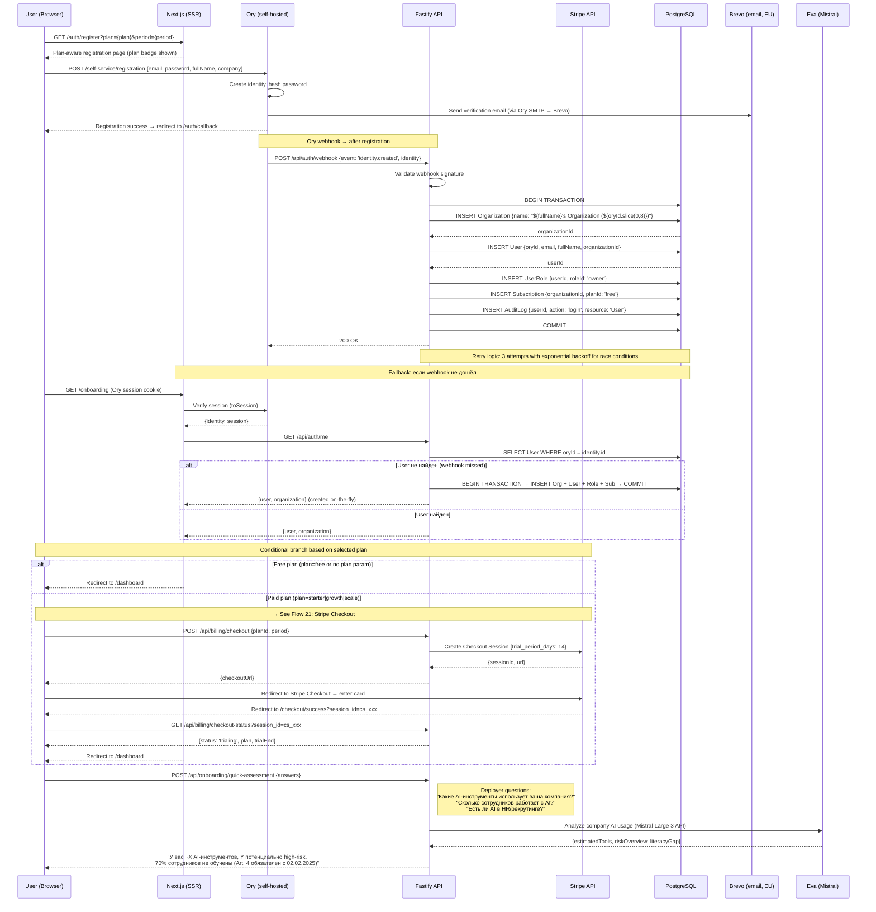
```mermaid
sequenceDiagram
    participant User as User (Browser)
    participant Next as Next.js (SSR)
    participant Ory as Ory (self-hosted)
    participant API as Fastify API
    participant Stripe as Stripe API
    participant DB as PostgreSQL
    participant Brevo as Brevo (email, EU)
    participant Eva as Eva (Mistral)

    User->>Next: GET /auth/register?plan={plan}&period={period}
    Next-->>User: Plan-aware registration page (plan badge shown)

    User->>Ory: POST /self-service/registration {email, password, fullName, company}
    Ory->>Ory: Create identity, hash password
    Ory->>Brevo: Send verification email (via Ory SMTP → Brevo)
    Ory-->>User: Registration success → redirect to /auth/callback

    Note over Ory,API: Ory webhook → after registration
    Ory->>API: POST /api/auth/webhook {event: 'identity.created', identity}
    API->>API: Validate webhook signature
    API->>DB: BEGIN TRANSACTION
    API->>DB: INSERT Organization {name: "${fullName}'s Organization (${oryId.slice(0,8)})"}
    DB-->>API: organizationId
    API->>DB: INSERT User {oryId, email, fullName, organizationId}
    DB-->>API: userId
    API->>DB: INSERT UserRole {userId, roleId: 'owner'}
    API->>DB: INSERT Subscription {organizationId, planId: 'free'}
    API->>DB: INSERT AuditLog {userId, action: 'login', resource: 'User'}
    API->>DB: COMMIT
    API-->>Ory: 200 OK

    Note over API,DB: Retry logic: 3 attempts with exponential backoff for race conditions

    Note over Next,DB: Fallback: если webhook не дошёл
    User->>Next: GET /onboarding (Ory session cookie)
    Next->>Ory: Verify session (toSession)
    Ory-->>Next: {identity, session}
    Next->>API: GET /api/auth/me
    API->>DB: SELECT User WHERE oryId = identity.id
    alt User не найден (webhook missed)
        API->>DB: BEGIN TRANSACTION → INSERT Org + User + Role + Sub → COMMIT
        API-->>Next: {user, organization} (created on-the-fly)
    else User найден
        API-->>Next: {user, organization}
    end

    Note over User,Stripe: Conditional branch based on selected plan

    alt Free plan (plan=free or no plan param)
        Next-->>User: Redirect to /dashboard
    else Paid plan (plan=starter|growth|scale)
        Note over User,Stripe: → See Flow 21: Stripe Checkout
        User->>API: POST /api/billing/checkout {planId, period}
        API->>Stripe: Create Checkout Session {trial_period_days: 14}
        Stripe-->>API: {sessionId, url}
        API-->>User: {checkoutUrl}
        User->>Stripe: Redirect to Stripe Checkout → enter card
        Stripe-->>User: Redirect to /checkout/success?session_id=cs_xxx
        User->>API: GET /api/billing/checkout-status?session_id=cs_xxx
        API-->>User: {status: 'trialing', plan, trialEnd}
        Next-->>User: Redirect to /dashboard
    end

    User->>API: POST /api/onboarding/quick-assessment {answers}
    Note right of API: Deployer questions:<br/>"Какие AI-инструменты использует ваша компания?"<br/>"Сколько сотрудников работает с AI?"<br/>"Есть ли AI в HR/рекрутинге?"
    API->>Eva: Analyze company AI usage (Mistral Large 3 API)
    Eva-->>API: {estimatedTools, riskOverview, literacyGap}
    API-->>User: "У вас ~X AI-инструментов, Y потенциально high-risk.<br/>70% сотрудников не обучены (Art. 4 обязателен с 02.02.2025)"
```

---

## 2. AI Tool Registration (5-step Deployer Wizard)

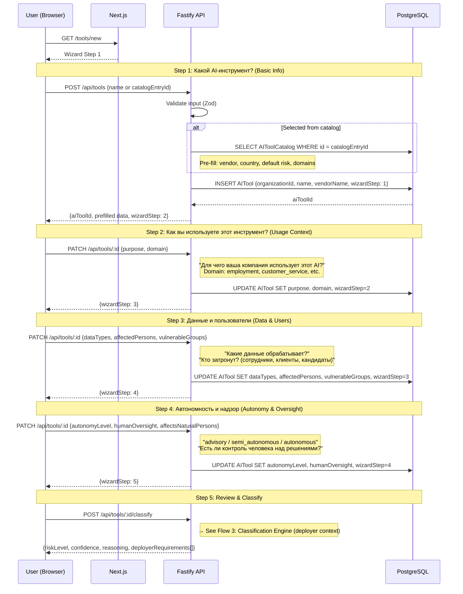
```mermaid
sequenceDiagram
    participant User as User (Browser)
    participant Next as Next.js
    participant API as Fastify API
    participant DB as PostgreSQL

    User->>Next: GET /tools/new
    Next-->>User: Wizard Step 1

    Note over User,DB: Step 1: Какой AI-инструмент? (Basic Info)
    User->>API: POST /api/tools {name or catalogEntryId}
    API->>API: Validate input (Zod)
    alt Selected from catalog
        API->>DB: SELECT AIToolCatalog WHERE id = catalogEntryId
        Note right of API: Pre-fill: vendor, country, default risk, domains
    end
    API->>DB: INSERT AITool {organizationId, name, vendorName, wizardStep: 1}
    DB-->>API: aiToolId
    API-->>User: {aiToolId, prefilled data, wizardStep: 2}

    Note over User,DB: Step 2: Как вы используете этот инструмент? (Usage Context)
    User->>API: PATCH /api/tools/:id {purpose, domain}
    Note right of API: "Для чего ваша компания использует этот AI?"<br/>Domain: employment, customer_service, etc.
    API->>DB: UPDATE AITool SET purpose, domain, wizardStep=2
    API-->>User: {wizardStep: 3}

    Note over User,DB: Step 3: Данные и пользователи (Data & Users)
    User->>API: PATCH /api/tools/:id {dataTypes, affectedPersons, vulnerableGroups}
    Note right of API: "Какие данные обрабатывает?"<br/>"Кто затронут? (сотрудники, клиенты, кандидаты)"
    API->>DB: UPDATE AITool SET dataTypes, affectedPersons, vulnerableGroups, wizardStep=3
    API-->>User: {wizardStep: 4}

    Note over User,DB: Step 4: Автономность и надзор (Autonomy & Oversight)
    User->>API: PATCH /api/tools/:id {autonomyLevel, humanOversight, affectsNaturalPersons}
    Note right of API: "advisory / semi_autonomous / autonomous"<br/>"Есть ли контроль человека над решениями?"
    API->>DB: UPDATE AITool SET autonomyLevel, humanOversight, wizardStep=4
    API-->>User: {wizardStep: 5}

    Note over User,DB: Step 5: Review & Classify
    User->>API: POST /api/tools/:id/classify
    Note right of API: → See Flow 3: Classification Engine (deployer context)
    API-->>User: {riskLevel, confidence, reasoning, deployerRequirements[]}
```

---

## 3. Classification Engine (deployer context, гибридный 4-шаговый)

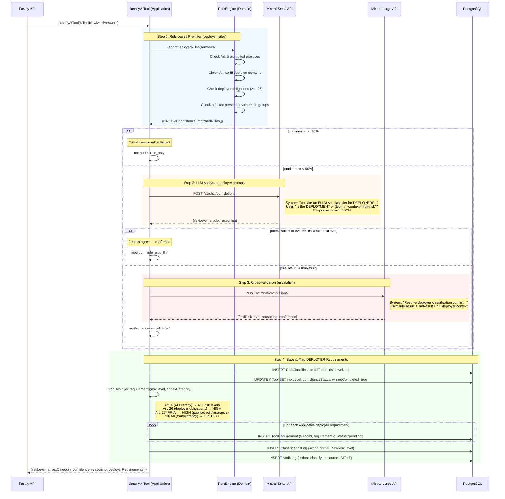
```mermaid
sequenceDiagram
    participant API as Fastify API
    participant CE as classifyAITool (Application)
    participant Rules as RuleEngine (Domain)
    participant LLM as Mistral Small API
    participant Escalation as Mistral Large API
    participant DB as PostgreSQL

    API->>CE: classifyAITool(aiToolId, wizardAnswers)

    rect rgb(240, 248, 255)
        Note over CE,Rules: Step 1: Rule-based Pre-filter (deployer rules)
        CE->>Rules: applyDeployerRules(answers)
        Rules->>Rules: Check Art. 5 prohibited practices
        Rules->>Rules: Check Annex III deployer domains
        Rules->>Rules: Check deployer obligations (Art. 26)
        Rules->>Rules: Check affected persons + vulnerable groups
        Rules-->>CE: {riskLevel, confidence, matchedRules[]}
    end

    alt confidence >= 90%
        Note over CE: Rule-based result sufficient
        CE->>CE: method = 'rule_only'
    else confidence < 90%
        rect rgb(255, 248, 240)
            Note over CE,LLM: Step 2: LLM Analysis (deployer prompt)
            CE->>LLM: POST /v1/chat/completions
            Note right of LLM: System: "You are an EU AI Act classifier for DEPLOYERS..."<br/>User: "Is the DEPLOYMENT of {tool} in {context} high-risk?"<br/>Response format: JSON
            LLM-->>CE: {riskLevel, article, reasoning}
        end

        alt ruleResult.riskLevel == llmResult.riskLevel
            Note over CE: Results agree — confirmed
            CE->>CE: method = 'rule_plus_llm'
        else ruleResult != llmResult
            rect rgb(255, 240, 240)
                Note over CE,Escalation: Step 3: Cross-validation (escalation)
                CE->>Escalation: POST /v1/chat/completions
                Note right of Escalation: System: "Resolve deployer classification conflict..."<br/>User: ruleResult + llmResult + full deployer context
                Escalation-->>CE: {finalRiskLevel, reasoning, confidence}
            end
            CE->>CE: method = 'cross_validated'
        end
    end

    rect rgb(240, 255, 240)
        Note over CE,DB: Step 4: Save & Map DEPLOYER Requirements
        CE->>DB: INSERT RiskClassification {aiToolId, riskLevel, ...}
        CE->>DB: UPDATE AITool SET riskLevel, complianceStatus, wizardCompleted=true

        CE->>CE: mapDeployerRequirements(riskLevel, annexCategory)
        Note right of CE: Art. 4 (AI Literacy) → ALL risk levels<br/>Art. 26 (deployer obligations) → HIGH<br/>Art. 27 (FRIA) → HIGH (public/credit/insurance)<br/>Art. 50 (transparency) → LIMITED+
        loop For each applicable deployer requirement
            CE->>DB: INSERT ToolRequirement {aiToolId, requirementId, status: 'pending'}
        end

        CE->>DB: INSERT ClassificationLog {action: 'initial', newRiskLevel}
        CE->>DB: INSERT AuditLog {action: 'classify', resource: 'AITool'}
    end

    CE-->>API: {riskLevel, annexCategory, confidence, reasoning, deployerRequirements[]}
```

---

## 4. Eva Consultant Chat (via Vercel AI SDK 6 + Eva Guard)

> **Framework:** Vercel AI SDK 6 — `streamText` (Fastify backend) + `useChat` (Next.js frontend) — SSE streaming, Zod-typed tools, `needsApproval` ([ADR-005](ADR-005-vercel-ai-sdk.md))
>
> **Eva Guard:** 3-level protection — system prompt scope + Mistral Small 3.1 pre-filter + output monitoring. See Flow 20 for detailed pipeline.

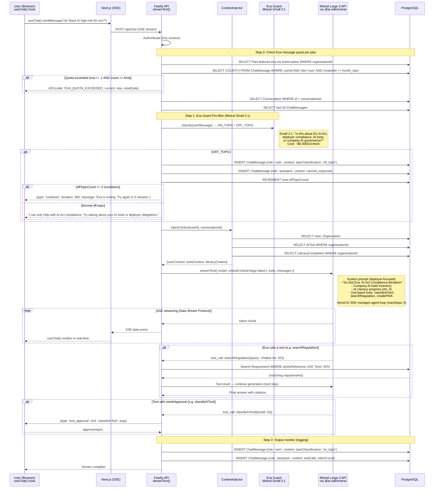
```mermaid
sequenceDiagram
    participant User as User (Browser)<br/>useChat() hook
    participant Next as Next.js (SSE)
    participant API as Fastify API<br/>streamText()
    participant Context as ContextInjector
    participant Guard as Eva Guard<br/>Mistral Small 3.1
    participant LLM as Mistral Large 3 API<br/>via @ai-sdk/mistral
    participant DB as PostgreSQL

    User->>Next: useChat().sendMessage("Ist Slack AI high-risk für uns?")
    Next->>API: POST /api/chat (SSE stream)
    API->>API: Authenticate (Ory session)

    Note over API,DB: Step 0: Check Eva message quota per plan
    API->>DB: SELECT Plan.features.eva via Subscription WHERE organizationId
    API->>DB: SELECT COUNT(*) FROM ChatMessage WHERE userId AND role='user' AND createdAt >= month_start
    alt Quota exceeded (eva != -1 AND count >= limit)
        API-->>User: 429 {code: 'EVA_QUOTA_EXCEEDED', current, max, resetDate}
    end

    API->>DB: SELECT Conversation WHERE id = conversationId
    API->>DB: SELECT last 20 ChatMessages

    Note over API,Guard: Step 1: Eva Guard Pre-filter (Mistral Small 3.1)
    API->>Guard: classify(userMessage) → ON_TOPIC / OFF_TOPIC
    Note right of Guard: Small 3.1: "Is this about EU AI Act,<br/>deployer compliance, AI tools,<br/>or company AI governance?"<br/>Cost: ~$0.00001/check
    alt OFF_TOPIC
        API->>DB: INSERT ChatMessage {role: 'user', content, topicClassification: 'off_topic'}
        API->>DB: INSERT ChatMessage {role: 'assistant', content: canned_response}
        API->>DB: INCREMENT User.offTopicCount
        alt offTopicCount >= 3 (cooldown)
            API-->>User: {type: 'cooldown', duration: 300, message: 'Eva is resting. Try again in 5 minutes.'}
        else Normal off-topic
            API-->>User: "I can only help with AI Act compliance. Try asking about your AI tools or deployer obligations."
        end
    end

    API->>Context: injectContext(userId, conversationId)
    Context->>DB: SELECT User, Organization
    Context->>DB: SELECT AITool WHERE organizationId
    Context->>DB: SELECT LiteracyCompletion WHERE organizationId
    Context-->>API: {userContext, toolsContext, literacyContext}

    API->>LLM: streamText({ model: mistral('mistral-large-latest'), tools, messages })
    Note right of LLM: System prompt (deployer-focused):<br/>- "Du bist Eva, KI-Act Compliance-Beraterin"<br/>- Company AI tools inventory<br/>- AI Literacy progress (Art. 4)<br/>- Zod-typed tools: classifyAITool,<br/>  searchRegulation, createFRIA<br/><br/>Vercel AI SDK manages agent loop (maxSteps: 5)

    loop SSE streaming (Data Stream Protocol)
        LLM-->>API: token chunk
        API-->>Next: SSE data event
        Next-->>User: useChat() renders in real-time
    end

    alt Eva calls a tool (e.g. searchRegulation)
        LLM-->>API: tool_call: searchRegulation({query: 'chatbot Art. 50'})
        API->>DB: Search Requirement WHERE articleReference LIKE '%Art. 50%'
        DB-->>API: {matching requirements}
        API->>LLM: Tool result → continue generation (next step)
        LLM-->>API: Final answer with citations
    end

    alt Tool with needsApproval (e.g. classifyAITool)
        LLM-->>API: tool_call: classifyAITool({toolId: 42})
        API-->>User: {type: 'tool_approval', tool: 'classifyAITool', args}
        User-->>API: approve/reject
    end

    Note over API,DB: Step 3: Output monitor (logging)
    API->>DB: INSERT ChatMessage {role: 'user', content, topicClassification: 'on_topic'}
    API->>DB: INSERT ChatMessage {role: 'assistant', content, toolCalls, tokenCount}
    API-->>User: Stream complete
```

---

## 5. Deployer Document Generation (FRIA, Monitoring Plan, AI Usage Policy)

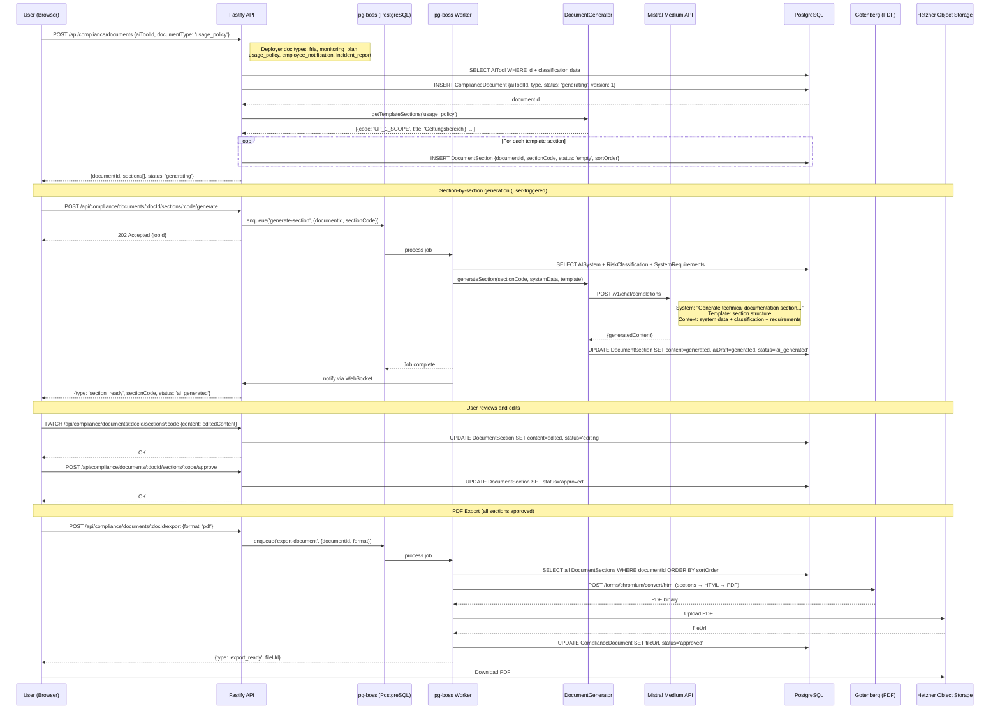
```mermaid
sequenceDiagram
    participant User as User (Browser)
    participant API as Fastify API
    participant Queue as pg-boss (PostgreSQL)
    participant Worker as pg-boss Worker
    participant DocGen as DocumentGenerator
    participant LLM as Mistral Medium API
    participant DB as PostgreSQL
    participant Gotenberg as Gotenberg (PDF)
    participant S3 as Hetzner Object Storage

    User->>API: POST /api/compliance/documents {aiToolId, documentType: 'usage_policy'}
    Note right of API: Deployer doc types: fria, monitoring_plan,<br/>usage_policy, employee_notification, incident_report
    API->>DB: SELECT AITool WHERE id + classification data
    API->>DB: INSERT ComplianceDocument {aiToolId, type, status: 'generating', version: 1}
    DB-->>API: documentId

    API->>DocGen: getTemplateSections('usage_policy')
    DocGen-->>API: [{code: 'UP_1_SCOPE', title: 'Geltungsbereich'}, ...]

    loop For each template section
        API->>DB: INSERT DocumentSection {documentId, sectionCode, status: 'empty', sortOrder}
    end

    API-->>User: {documentId, sections[], status: 'generating'}

    Note over User,S3: Section-by-section generation (user-triggered)

    User->>API: POST /api/compliance/documents/:docId/sections/:code/generate
    API->>Queue: enqueue('generate-section', {documentId, sectionCode})
    API-->>User: 202 Accepted {jobId}

    Queue->>Worker: process job
    Worker->>DB: SELECT AISystem + RiskClassification + SystemRequirements
    Worker->>DocGen: generateSection(sectionCode, systemData, template)

    DocGen->>LLM: POST /v1/chat/completions
    Note right of LLM: System: "Generate technical documentation section..."<br/>Template: section structure<br/>Context: system data + classification + requirements
    LLM-->>DocGen: {generatedContent}

    DocGen->>DB: UPDATE DocumentSection SET content=generated, aiDraft=generated, status='ai_generated'
    Worker-->>Queue: Job complete

    Worker->>API: notify via WebSocket
    API-->>User: {type: 'section_ready', sectionCode, status: 'ai_generated'}

    Note over User,S3: User reviews and edits

    User->>API: PATCH /api/compliance/documents/:docId/sections/:code {content: editedContent}
    API->>DB: UPDATE DocumentSection SET content=edited, status='editing'
    API-->>User: OK

    User->>API: POST /api/compliance/documents/:docId/sections/:code/approve
    API->>DB: UPDATE DocumentSection SET status='approved'
    API-->>User: OK

    Note over User,S3: PDF Export (all sections approved)

    User->>API: POST /api/compliance/documents/:docId/export {format: 'pdf'}
    API->>Queue: enqueue('export-document', {documentId, format})
    Queue->>Worker: process job
    Worker->>DB: SELECT all DocumentSections WHERE documentId ORDER BY sortOrder
    Worker->>Gotenberg: POST /forms/chromium/convert/html (sections → HTML → PDF)
    Gotenberg-->>Worker: PDF binary
    Worker->>S3: Upload PDF
    S3-->>Worker: fileUrl
    Worker->>DB: UPDATE ComplianceDocument SET fileUrl, status='approved'

    Worker-->>User: {type: 'export_ready', fileUrl}
    User->>S3: Download PDF
```

---

## 6. Deployer Dashboard Data Flow

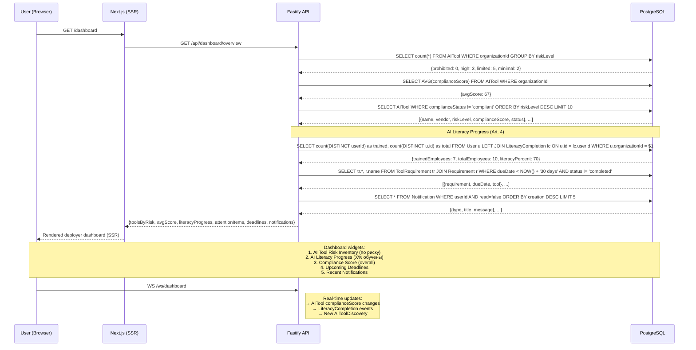
```mermaid
sequenceDiagram
    participant User as User (Browser)
    participant Next as Next.js (SSR)
    participant API as Fastify API
    participant DB as PostgreSQL

    User->>Next: GET /dashboard
    Next->>API: GET /api/dashboard/overview

    API->>DB: SELECT count(*) FROM AITool WHERE organizationId GROUP BY riskLevel
    DB-->>API: {prohibited: 0, high: 3, limited: 5, minimal: 2}

    API->>DB: SELECT AVG(complianceScore) FROM AITool WHERE organizationId
    DB-->>API: {avgScore: 67}

    API->>DB: SELECT AITool WHERE complianceStatus != 'compliant' ORDER BY riskLevel DESC LIMIT 10
    DB-->>API: [{name, vendor, riskLevel, complianceScore, status}, ...]

    Note over API,DB: AI Literacy Progress (Art. 4)
    API->>DB: SELECT count(DISTINCT userId) as trained, count(DISTINCT u.id) as total FROM User u LEFT JOIN LiteracyCompletion lc ON u.id = lc.userId WHERE u.organizationId = $1
    DB-->>API: {trainedEmployees: 7, totalEmployees: 10, literacyPercent: 70}

    API->>DB: SELECT tr.*, r.name FROM ToolRequirement tr JOIN Requirement r WHERE dueDate < NOW() + '30 days' AND status != 'completed'
    DB-->>API: [{requirement, dueDate, tool}, ...]

    API->>DB: SELECT * FROM Notification WHERE userId AND read=false ORDER BY creation DESC LIMIT 5
    DB-->>API: [{type, title, message}, ...]

    API-->>Next: {toolsByRisk, avgScore, literacyProgress, attentionItems, deadlines, notifications}
    Next-->>User: Rendered deployer dashboard (SSR)

    Note over User,DB: Dashboard widgets:<br/>1. AI Tool Risk Inventory (по риску)<br/>2. AI Literacy Progress (X% обучены)<br/>3. Compliance Score (overall)<br/>4. Upcoming Deadlines<br/>5. Recent Notifications

    User->>API: WS /ws/dashboard
    Note right of API: Real-time updates:<br/>→ AITool complianceScore changes<br/>→ LiteracyCompletion events<br/>→ New AIToolDiscovery
```

---

## 7. Gap Analysis (Deployer Requirements)

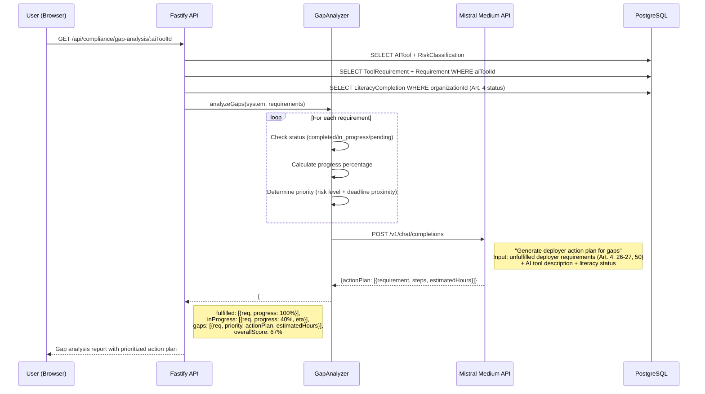
```mermaid
sequenceDiagram
    participant User as User (Browser)
    participant API as Fastify API
    participant Gap as GapAnalyzer
    participant LLM as Mistral Medium API
    participant DB as PostgreSQL

    User->>API: GET /api/compliance/gap-analysis/:aiToolId
    API->>DB: SELECT AITool + RiskClassification
    API->>DB: SELECT ToolRequirement + Requirement WHERE aiToolId
    API->>DB: SELECT LiteracyCompletion WHERE organizationId (Art. 4 status)

    API->>Gap: analyzeGaps(system, requirements)

    loop For each requirement
        Gap->>Gap: Check status (completed/in_progress/pending)
        Gap->>Gap: Calculate progress percentage
        Gap->>Gap: Determine priority (risk level + deadline proximity)
    end

    Gap->>LLM: POST /v1/chat/completions
    Note right of LLM: "Generate deployer action plan for gaps"<br/>Input: unfulfilled deployer requirements (Art. 4, 26-27, 50)<br/>+ AI tool description + literacy status
    LLM-->>Gap: {actionPlan: [{requirement, steps, estimatedHours}]}

    Gap-->>API: {
    Note right of API: fulfilled: [{req, progress: 100%}],<br/>inProgress: [{req, progress: 40%, eta}],<br/>gaps: [{req, priority, actionPlan, estimatedHours}],<br/>overallScore: 67%

    API-->>User: Gap analysis report with prioritized action plan
```

---

## 8. Authentication Flow (Ory Magic Link)

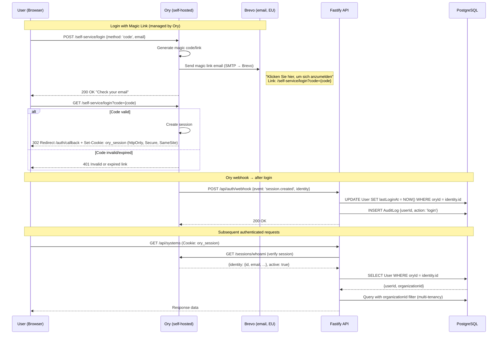
```mermaid
sequenceDiagram
    participant User as User (Browser)
    participant Ory as Ory (self-hosted)
    participant Brevo as Brevo (email, EU)
    participant API as Fastify API
    participant DB as PostgreSQL

    Note over User,Brevo: Login with Magic Link (managed by Ory)

    User->>Ory: POST /self-service/login {method: 'code', email}
    Ory->>Ory: Generate magic code/link
    Ory->>Brevo: Send magic link email (SMTP → Brevo)
    Note right of Brevo: "Klicken Sie hier, um sich anzumelden"<br/>Link: /self-service/login?code={code}
    Ory-->>User: 200 OK "Check your email"

    User->>Ory: GET /self-service/login?code={code}
    alt Code valid
        Ory->>Ory: Create session
        Ory-->>User: 302 Redirect /auth/callback + Set-Cookie: ory_session (httpOnly, Secure, SameSite)
    else Code invalid/expired
        Ory-->>User: 401 Invalid or expired link
    end

    Note over User,DB: Ory webhook → after login
    Ory->>API: POST /api/auth/webhook {event: 'session.created', identity}
    API->>DB: UPDATE User SET lastLoginAt = NOW() WHERE oryId = identity.id
    API->>DB: INSERT AuditLog {userId, action: 'login'}
    API-->>Ory: 200 OK

    Note over User,DB: Subsequent authenticated requests
    User->>API: GET /api/systems (Cookie: ory_session)
    API->>Ory: GET /sessions/whoami (verify session)
    Ory-->>API: {identity: {id, email, ...}, active: true}
    API->>DB: SELECT User WHERE oryId = identity.id
    DB-->>API: {userId, organizationId}
    API->>DB: Query with organizationId filter (multi-tenancy)
    API-->>User: Response data
```

---

## 9. Regulatory Monitor (post-MVP)


```mermaid
sequenceDiagram
    participant Cron as pg-boss Scheduler
    participant Worker as Scraper Worker
    participant EURLex as EUR-Lex API
    participant LLM as Mistral Small API
    participant DB as PostgreSQL

    Note over Cron,DB: Daily scheduled job (02:00 UTC)

    Cron->>Worker: trigger('scrape-eurlex')

    Worker->>EURLex: GET /search?query=AI+Act&since=yesterday
    EURLex-->>Worker: {results: [{title, url, date, text}]}

    loop For each new result
        Worker->>DB: SELECT RegulatoryUpdate WHERE url = result.url
        alt Already scraped
            Worker->>Worker: Skip
        else New update
            Worker->>DB: INSERT RegulatoryUpdate {source: 'eur_lex', title, summary, url}
            DB-->>Worker: updateId

            Worker->>LLM: POST /v1/chat/completions
            Note right of LLM: "Analyze this AI Act update.<br/>Which articles are affected?<br/>What is the impact level?"
            LLM-->>Worker: {affectedArticles[], impactLevel}

            Worker->>DB: SELECT AISystem WHERE riskLevel IN (affected risk levels)
            DB-->>Worker: [{aiSystemId, name, riskLevel}]

            loop For each affected system
                Worker->>DB: INSERT ImpactAssessment {updateId, aiSystemId, impactLevel}
                Worker->>DB: INSERT Notification {userId: system.owner, type: 'regulatory_update', title, message}
            end

            Worker->>DB: UPDATE RegulatoryUpdate SET processed = true
        end
    end
```

---

## 10. Billing & Subscription (Stripe)

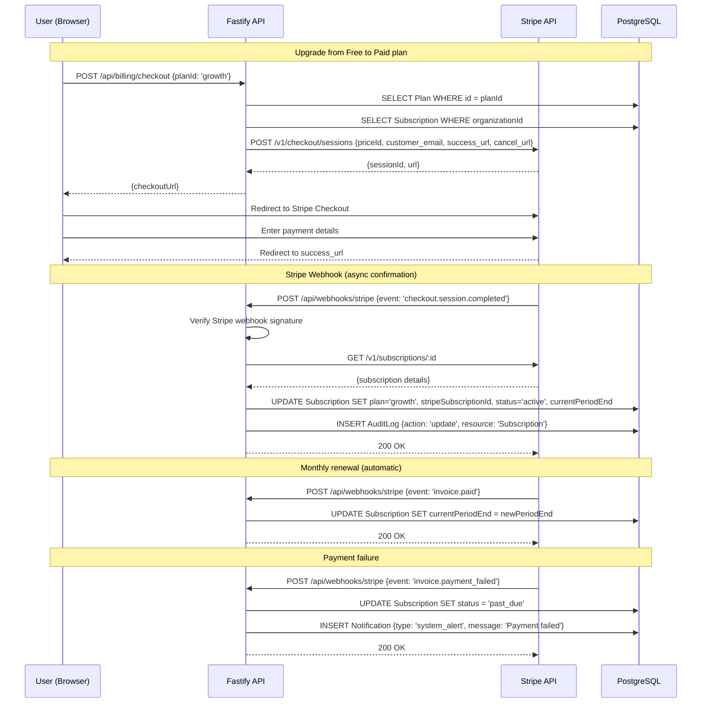
```mermaid
sequenceDiagram
    participant User as User (Browser)
    participant API as Fastify API
    participant Stripe as Stripe API
    participant DB as PostgreSQL

    Note over User,DB: Upgrade from Free to Paid plan

    User->>API: POST /api/billing/checkout {planId: 'growth'}
    API->>DB: SELECT Plan WHERE id = planId
    API->>DB: SELECT Subscription WHERE organizationId
    API->>Stripe: POST /v1/checkout/sessions {priceId, customer_email, success_url, cancel_url}
    Stripe-->>API: {sessionId, url}
    API-->>User: {checkoutUrl}
    User->>Stripe: Redirect to Stripe Checkout
    User->>Stripe: Enter payment details
    Stripe-->>User: Redirect to success_url

    Note over User,DB: Stripe Webhook (async confirmation)

    Stripe->>API: POST /api/webhooks/stripe {event: 'checkout.session.completed'}
    API->>API: Verify Stripe webhook signature
    API->>Stripe: GET /v1/subscriptions/:id
    Stripe-->>API: {subscription details}

    API->>DB: UPDATE Subscription SET plan='growth', stripeSubscriptionId, status='active', currentPeriodEnd
    API->>DB: INSERT AuditLog {action: 'update', resource: 'Subscription'}
    API-->>Stripe: 200 OK

    Note over User,DB: Monthly renewal (automatic)

    Stripe->>API: POST /api/webhooks/stripe {event: 'invoice.paid'}
    API->>DB: UPDATE Subscription SET currentPeriodEnd = newPeriodEnd
    API-->>Stripe: 200 OK

    Note over User,DB: Payment failure

    Stripe->>API: POST /api/webhooks/stripe {event: 'invoice.payment_failed'}
    API->>DB: UPDATE Subscription SET status = 'past_due'
    API->>DB: INSERT Notification {type: 'system_alert', message: 'Payment failed'}
    API-->>Stripe: 200 OK
```

---

## 11. AI Literacy Enrollment & Completion (NEW — Art. 4)

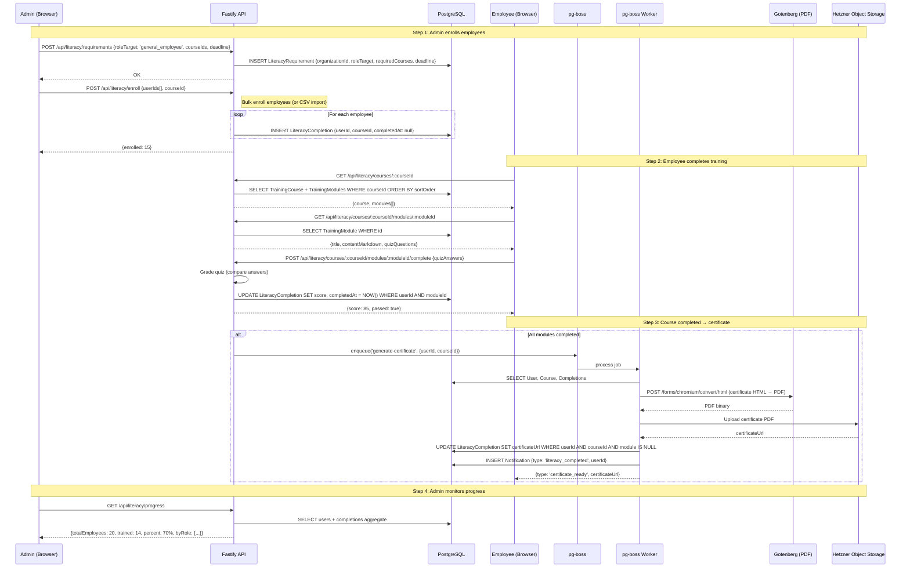
```mermaid
sequenceDiagram
    participant Admin as Admin (Browser)
    participant API as Fastify API
    participant DB as PostgreSQL
    participant Employee as Employee (Browser)
    participant Queue as pg-boss
    participant Worker as pg-boss Worker
    participant Gotenberg as Gotenberg (PDF)
    participant S3 as Hetzner Object Storage

    Note over Admin,S3: Step 1: Admin enrolls employees
    Admin->>API: POST /api/literacy/requirements {roleTarget: 'general_employee', courseIds, deadline}
    API->>DB: INSERT LiteracyRequirement {organizationId, roleTarget, requiredCourses, deadline}
    API-->>Admin: OK

    Admin->>API: POST /api/literacy/enroll {userIds[], courseId}
    Note right of API: Bulk enroll employees (or CSV import)
    loop For each employee
        API->>DB: INSERT LiteracyCompletion {userId, courseId, completedAt: null}
    end
    API-->>Admin: {enrolled: 15}

    Note over Employee,S3: Step 2: Employee completes training
    Employee->>API: GET /api/literacy/courses/:courseId
    API->>DB: SELECT TrainingCourse + TrainingModules WHERE courseId ORDER BY sortOrder
    API-->>Employee: {course, modules[]}

    Employee->>API: GET /api/literacy/courses/:courseId/modules/:moduleId
    API->>DB: SELECT TrainingModule WHERE id
    API-->>Employee: {title, contentMarkdown, quizQuestions}

    Employee->>API: POST /api/literacy/courses/:courseId/modules/:moduleId/complete {quizAnswers}
    API->>API: Grade quiz (compare answers)
    API->>DB: UPDATE LiteracyCompletion SET score, completedAt = NOW() WHERE userId AND moduleId
    API-->>Employee: {score: 85, passed: true}

    Note over Employee,S3: Step 3: Course completed → certificate
    alt All modules completed
        API->>Queue: enqueue('generate-certificate', {userId, courseId})
        Queue->>Worker: process job
        Worker->>DB: SELECT User, Course, Completions
        Worker->>Gotenberg: POST /forms/chromium/convert/html (certificate HTML → PDF)
        Gotenberg-->>Worker: PDF binary
        Worker->>S3: Upload certificate PDF
        S3-->>Worker: certificateUrl
        Worker->>DB: UPDATE LiteracyCompletion SET certificateUrl WHERE userId AND courseId AND module IS NULL
        Worker->>DB: INSERT Notification {type: 'literacy_completed', userId}
        Worker-->>Employee: {type: 'certificate_ready', certificateUrl}
    end

    Note over Admin,S3: Step 4: Admin monitors progress
    Admin->>API: GET /api/literacy/progress
    API->>DB: SELECT users + completions aggregate
    API-->>Admin: {totalEmployees: 20, trained: 14, percent: 70%, byRole: {...}}
```

---

## 12. AI Tool Discovery (Manual + CSV Import)

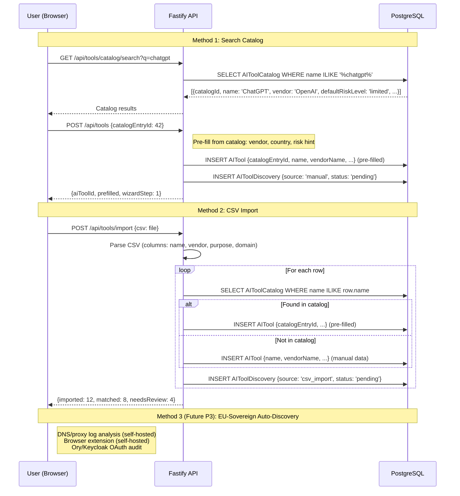
```mermaid
sequenceDiagram
    participant User as User (Browser)
    participant API as Fastify API
    participant DB as PostgreSQL

    Note over User,DB: Method 1: Search Catalog
    User->>API: GET /api/tools/catalog/search?q=chatgpt
    API->>DB: SELECT AIToolCatalog WHERE name ILIKE '%chatgpt%'
    DB-->>API: [{catalogId, name: 'ChatGPT', vendor: 'OpenAI', defaultRiskLevel: 'limited', ...}]
    API-->>User: Catalog results

    User->>API: POST /api/tools {catalogEntryId: 42}
    Note right of API: Pre-fill from catalog: vendor, country, risk hint
    API->>DB: INSERT AITool {catalogEntryId, name, vendorName, ...} (pre-filled)
    API->>DB: INSERT AIToolDiscovery {source: 'manual', status: 'pending'}
    API-->>User: {aiToolId, prefilled, wizardStep: 1}

    Note over User,DB: Method 2: CSV Import
    User->>API: POST /api/tools/import {csv: file}
    API->>API: Parse CSV (columns: name, vendor, purpose, domain)
    loop For each row
        API->>DB: SELECT AIToolCatalog WHERE name ILIKE row.name
        alt Found in catalog
            API->>DB: INSERT AITool {catalogEntryId, ...} (pre-filled)
        else Not in catalog
            API->>DB: INSERT AITool {name, vendorName, ...} (manual data)
        end
        API->>DB: INSERT AIToolDiscovery {source: 'csv_import', status: 'pending'}
    end
    API-->>User: {imported: 12, matched: 8, needsReview: 4}

    Note over User,DB: Method 3 (Future P3): EU-Sovereign Auto-Discovery
    Note right of User: DNS/proxy log analysis (self-hosted)<br/>Browser extension (self-hosted)<br/>Ory/Keycloak OAuth audit
```

---

## 13. FRIA Assessment (Art. 27 — Guided Wizard)

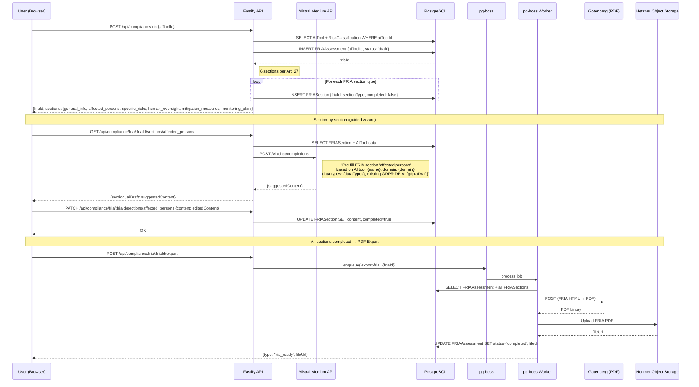
```mermaid
sequenceDiagram
    participant User as User (Browser)
    participant API as Fastify API
    participant LLM as Mistral Medium API
    participant DB as PostgreSQL
    participant Queue as pg-boss
    participant Worker as pg-boss Worker
    participant Gotenberg as Gotenberg (PDF)
    participant S3 as Hetzner Object Storage

    User->>API: POST /api/compliance/fria {aiToolId}
    API->>DB: SELECT AITool + RiskClassification WHERE aiToolId
    API->>DB: INSERT FRIAAssessment {aiToolId, status: 'draft'}
    DB-->>API: friaId

    Note right of API: 6 sections per Art. 27
    loop For each FRIA section type
        API->>DB: INSERT FRIASection {friaId, sectionType, completed: false}
    end
    API-->>User: {friaId, sections: [general_info, affected_persons, specific_risks, human_oversight, mitigation_measures, monitoring_plan]}

    Note over User,S3: Section-by-section (guided wizard)

    User->>API: GET /api/compliance/fria/:friaId/sections/affected_persons
    API->>DB: SELECT FRIASection + AITool data
    API->>LLM: POST /v1/chat/completions
    Note right of LLM: "Pre-fill FRIA section 'affected persons'<br/>based on AI tool: {name}, domain: {domain},<br/>data types: {dataTypes}, existing GDPR DPIA: {gdpiaDraft}"
    LLM-->>API: {suggestedContent}
    API-->>User: {section, aiDraft: suggestedContent}

    User->>API: PATCH /api/compliance/fria/:friaId/sections/affected_persons {content: editedContent}
    API->>DB: UPDATE FRIASection SET content, completed=true
    API-->>User: OK

    Note over User,S3: All sections completed → PDF Export
    User->>API: POST /api/compliance/fria/:friaId/export
    API->>Queue: enqueue('export-fria', {friaId})
    Queue->>Worker: process job
    Worker->>DB: SELECT FRIAAssessment + all FRIASections
    Worker->>Gotenberg: POST (FRIA HTML → PDF)
    Gotenberg-->>Worker: PDF binary
    Worker->>S3: Upload FRIA PDF
    S3-->>Worker: fileUrl
    Worker->>DB: UPDATE FRIAAssessment SET status='completed', fileUrl
    Worker-->>User: {type: 'fria_ready', fileUrl}
```

---

## 14. KI-Compliance Siegel Verification (P2)

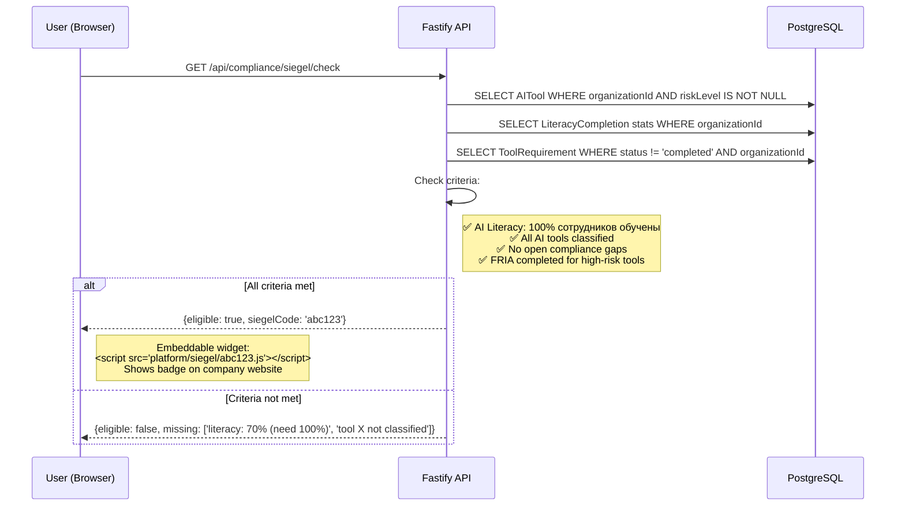
```mermaid
sequenceDiagram
    participant User as User (Browser)
    participant API as Fastify API
    participant DB as PostgreSQL

    User->>API: GET /api/compliance/siegel/check
    API->>DB: SELECT AITool WHERE organizationId AND riskLevel IS NOT NULL
    API->>DB: SELECT LiteracyCompletion stats WHERE organizationId
    API->>DB: SELECT ToolRequirement WHERE status != 'completed' AND organizationId

    API->>API: Check criteria:
    Note right of API: ✅ AI Literacy: 100% сотрудников обучены<br/>✅ All AI tools classified<br/>✅ No open compliance gaps<br/>✅ FRIA completed for high-risk tools

    alt All criteria met
        API-->>User: {eligible: true, siegelCode: 'abc123'}
        Note right of User: Embeddable widget:<br/><script src="platform/siegel/abc123.js"></script><br/>Shows badge on company website
    else Criteria not met
        API-->>User: {eligible: false, missing: ['literacy: 70% (need 100%)', 'tool X not classified']}
    end
```

---

## 15. Employee Invite Flow (Sprint 2.5)

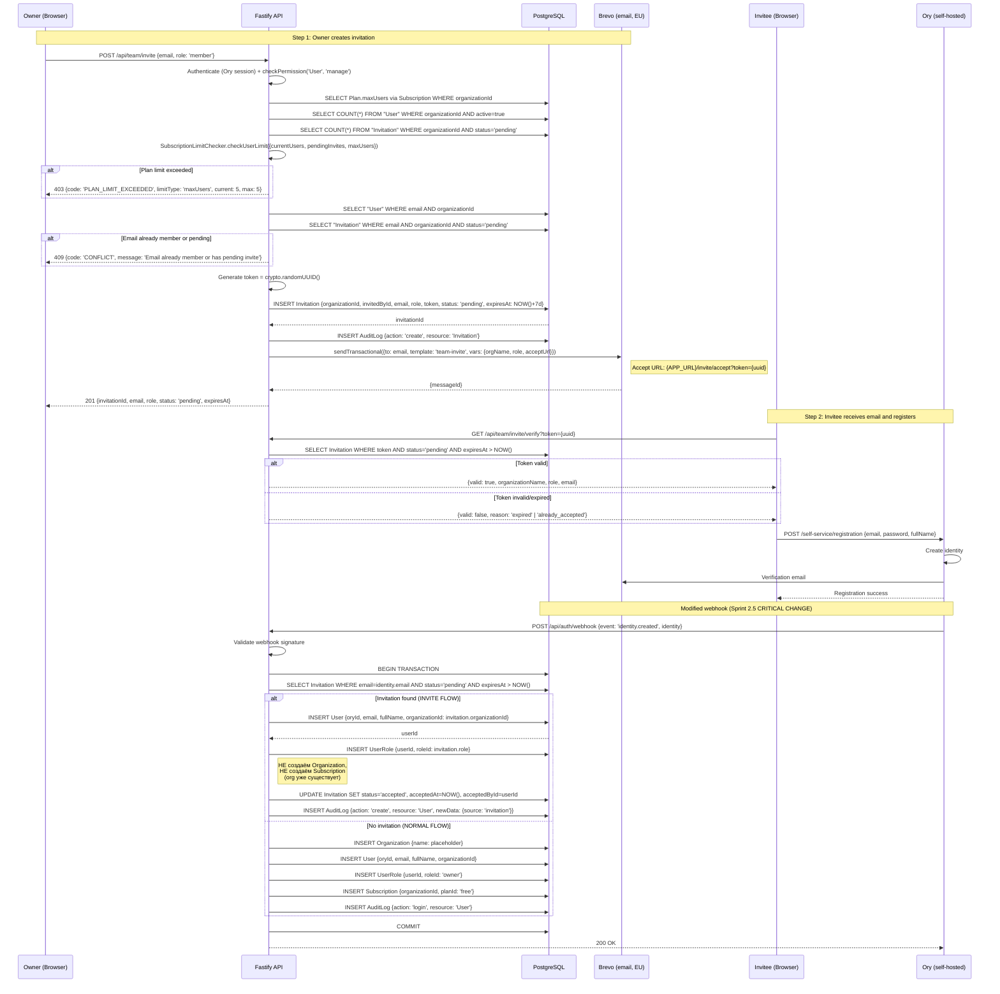
```mermaid
sequenceDiagram
    participant Owner as Owner (Browser)
    participant API as Fastify API
    participant DB as PostgreSQL
    participant Brevo as Brevo (email, EU)
    participant Invitee as Invitee (Browser)
    participant Ory as Ory (self-hosted)

    Note over Owner,Brevo: Step 1: Owner creates invitation
    Owner->>API: POST /api/team/invite {email, role: 'member'}
    API->>API: Authenticate (Ory session) + checkPermission('User', 'manage')

    API->>DB: SELECT Plan.maxUsers via Subscription WHERE organizationId
    API->>DB: SELECT COUNT(*) FROM "User" WHERE organizationId AND active=true
    API->>DB: SELECT COUNT(*) FROM "Invitation" WHERE organizationId AND status='pending'
    API->>API: SubscriptionLimitChecker.checkUserLimit({currentUsers, pendingInvites, maxUsers})

    alt Plan limit exceeded
        API-->>Owner: 403 {code: 'PLAN_LIMIT_EXCEEDED', limitType: 'maxUsers', current: 5, max: 5}
    end

    API->>DB: SELECT "User" WHERE email AND organizationId
    API->>DB: SELECT "Invitation" WHERE email AND organizationId AND status='pending'
    alt Email already member or pending
        API-->>Owner: 409 {code: 'CONFLICT', message: 'Email already member or has pending invite'}
    end

    API->>API: Generate token = crypto.randomUUID()
    API->>DB: INSERT Invitation {organizationId, invitedById, email, role, token, status: 'pending', expiresAt: NOW()+7d}
    DB-->>API: invitationId
    API->>DB: INSERT AuditLog {action: 'create', resource: 'Invitation'}

    API->>Brevo: sendTransactional({to: email, template: 'team-invite', vars: {orgName, role, acceptUrl}})
    Note right of Brevo: Accept URL: {APP_URL}/invite/accept?token={uuid}
    Brevo-->>API: {messageId}

    API-->>Owner: 201 {invitationId, email, role, status: 'pending', expiresAt}

    Note over Invitee,Ory: Step 2: Invitee receives email and registers
    Invitee->>API: GET /api/team/invite/verify?token={uuid}
    API->>DB: SELECT Invitation WHERE token AND status='pending' AND expiresAt > NOW()
    alt Token valid
        API-->>Invitee: {valid: true, organizationName, role, email}
    else Token invalid/expired
        API-->>Invitee: {valid: false, reason: 'expired' | 'already_accepted'}
    end

    Invitee->>Ory: POST /self-service/registration {email, password, fullName}
    Ory->>Ory: Create identity
    Ory->>Brevo: Verification email
    Ory-->>Invitee: Registration success

    Note over Ory,DB: Modified webhook (Sprint 2.5 CRITICAL CHANGE)
    Ory->>API: POST /api/auth/webhook {event: 'identity.created', identity}
    API->>API: Validate webhook signature
    API->>DB: BEGIN TRANSACTION
    API->>DB: SELECT Invitation WHERE email=identity.email AND status='pending' AND expiresAt > NOW()

    alt Invitation found (INVITE FLOW)
        API->>DB: INSERT User {oryId, email, fullName, organizationId: invitation.organizationId}
        DB-->>API: userId
        API->>DB: INSERT UserRole {userId, roleId: invitation.role}
        Note right of API: НЕ создаём Organization,<br/>НЕ создаём Subscription<br/>(org уже существует)
        API->>DB: UPDATE Invitation SET status='accepted', acceptedAt=NOW(), acceptedById=userId
        API->>DB: INSERT AuditLog {action: 'create', resource: 'User', newData: {source: 'invitation'}}
    else No invitation (NORMAL FLOW)
        API->>DB: INSERT Organization {name: placeholder}
        API->>DB: INSERT User {oryId, email, fullName, organizationId}
        API->>DB: INSERT UserRole {userId, roleId: 'owner'}
        API->>DB: INSERT Subscription {organizationId, planId: 'free'}
        API->>DB: INSERT AuditLog {action: 'login', resource: 'User'}
    end

    API->>DB: COMMIT
    API-->>Ory: 200 OK
```

---

## 16. Accept Invitation — Existing User (Sprint 2.5)

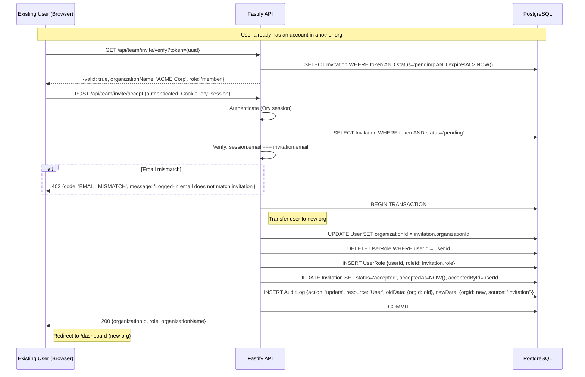
```mermaid
sequenceDiagram
    participant User as Existing User (Browser)
    participant API as Fastify API
    participant DB as PostgreSQL

    Note over User,DB: User already has an account in another org

    User->>API: GET /api/team/invite/verify?token={uuid}
    API->>DB: SELECT Invitation WHERE token AND status='pending' AND expiresAt > NOW()
    API-->>User: {valid: true, organizationName: 'ACME Corp', role: 'member'}

    User->>API: POST /api/team/invite/accept (authenticated, Cookie: ory_session)
    API->>API: Authenticate (Ory session)
    API->>DB: SELECT Invitation WHERE token AND status='pending'

    API->>API: Verify: session.email === invitation.email
    alt Email mismatch
        API-->>User: 403 {code: 'EMAIL_MISMATCH', message: 'Logged-in email does not match invitation'}
    end

    API->>DB: BEGIN TRANSACTION

    Note right of API: Transfer user to new org
    API->>DB: UPDATE User SET organizationId = invitation.organizationId
    API->>DB: DELETE UserRole WHERE userId = user.id
    API->>DB: INSERT UserRole {userId, roleId: invitation.role}
    API->>DB: UPDATE Invitation SET status='accepted', acceptedAt=NOW(), acceptedById=userId
    API->>DB: INSERT AuditLog {action: 'update', resource: 'User', oldData: {orgId: old}, newData: {orgId: new, source: 'invitation'}}

    API->>DB: COMMIT
    API-->>User: 200 {organizationId, role, organizationName}
    Note right of User: Redirect to /dashboard (new org)
```

---

## 17. Messaging Strategy: MQ vs PubSub

### Два паттерна передачи сообщений

| Характеристика | Message Queue (pg-boss) | Pub/Sub (WebSocket) |
|---------------|------------------------|---------------------|
| **Модель** | Many → One (много отправителей, один обработчик) | One → Many (один источник, все подписчики получают) |
| **Порядок** | FIFO, гарантирован | Не важен |
| **Персистентность** | Да (PostgreSQL таблицы) | Нет (при disconnect — потеря) |
| **Потеря сообщения** | Недопустима | Не критична (UI обновится при reconnect) |
| **Дублирование** | Недопустимо (GUID idempotency) | Допустимо |

### Маппинг на наши flows

| Flow | Паттерн | Реализация | Почему |
|------|---------|-----------|--------|
| Deployer doc generation | **MQ** | pg-boss job | Порядок секций, потеря недопустима |
| FRIA export | **MQ** | pg-boss job | Длительная операция, гарантия завершения |
| AI Tool classification (batch) | **MQ** | pg-boss job | GUID per job, retry при LLM timeout |
| Certificate generation | **MQ** | pg-boss job | AI Literacy PDF via Gotenberg |
| EUR-Lex scraping | **MQ** | pg-boss scheduled | FIFO, дедупликация по URL |
| Eva chat streaming | **PubSub** | WebSocket | Real-time, потеря chunk не критична |
| Dashboard updates | **PubSub** | WebSocket | Обновление UI, cache invalidation |
| Literacy progress | **PubSub** | WebSocket | Real-time progress bar update |
| Section ready notification | **PubSub** | WebSocket | Уведомление, при потере — пользователь обновит страницу |
| Compliance score changed | **Combined** | pg-boss → WebSocket | MQ для пересчёта → PubSub для уведомления UI |

### Idempotency (GUID)

Каждый pg-boss job содержит уникальный GUID, генерируемый **отправителем**:
- Worker проверяет: если job с таким GUID уже обработан → пропуск
- Защищает от дублирования при: retry после потери acknowledge, повторной отправке формы

### Error Handling в pg-boss Workers

| Тип ошибки | Пример | Действие worker'а |
|-----------|--------|------------------|
| **Системная** | PostgreSQL down, Mistral API 503 | Не перехватывать — pg-boss сделает retry (exponential backoff) |
| **Бизнес-ошибка** | Невалидные данные, система уже классифицирована, лимит плана превышен | Пометить job как completed с error result. Retry НЕ нужен |

> **Миграция:** pg-boss → BullMQ через JobQueue adapter (см. ARCHITECTURE.md §6.10). Код workers не меняется.

---

## 19. Lead Gen — Public Tools (No Auth)

> **Feature 23:** Quick Check, Penalty Calculator, Free Classification — public endpoints, email-gated, rate-limited.

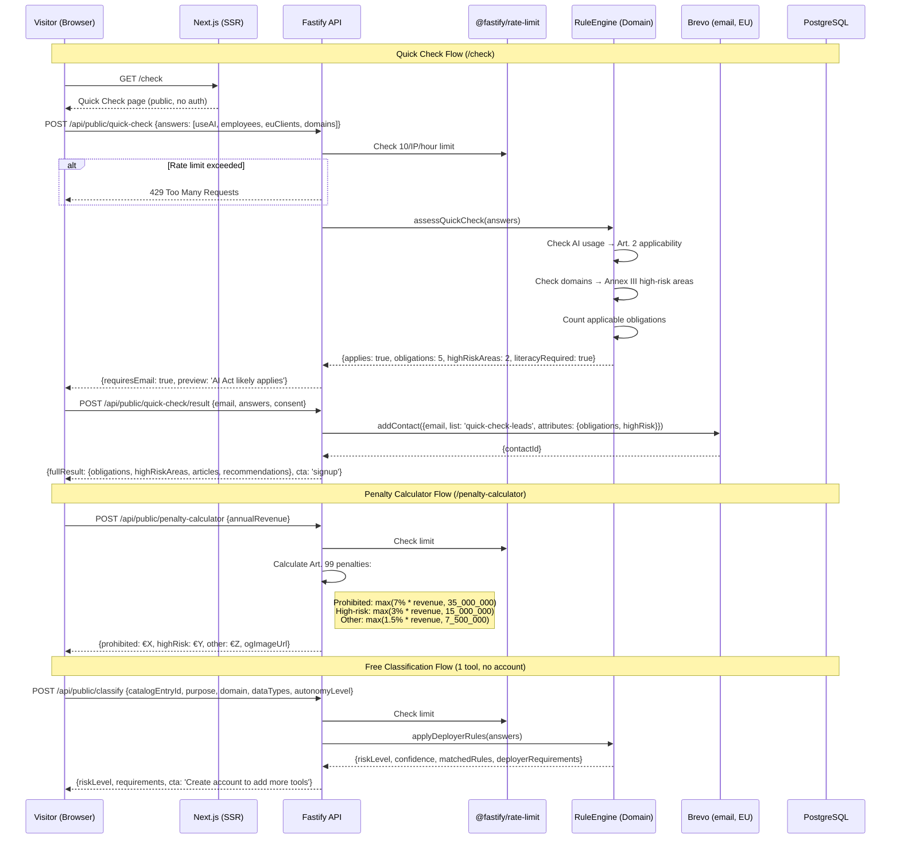
```mermaid
sequenceDiagram
    participant User as Visitor (Browser)
    participant Next as Next.js (SSR)
    participant API as Fastify API
    participant RateLimit as @fastify/rate-limit
    participant Rules as RuleEngine (Domain)
    participant Brevo as Brevo (email, EU)
    participant DB as PostgreSQL

    Note over User,DB: Quick Check Flow (/check)

    User->>Next: GET /check
    Next-->>User: Quick Check page (public, no auth)

    User->>API: POST /api/public/quick-check {answers: [useAI, employees, euClients, domains]}
    API->>RateLimit: Check 10/IP/hour limit
    alt Rate limit exceeded
        API-->>User: 429 Too Many Requests
    end

    API->>Rules: assessQuickCheck(answers)
    Rules->>Rules: Check AI usage → Art. 2 applicability
    Rules->>Rules: Check domains → Annex III high-risk areas
    Rules->>Rules: Count applicable obligations
    Rules-->>API: {applies: true, obligations: 5, highRiskAreas: 2, literacyRequired: true}

    API-->>User: {requiresEmail: true, preview: 'AI Act likely applies'}

    User->>API: POST /api/public/quick-check/result {email, answers, consent}
    API->>Brevo: addContact({email, list: 'quick-check-leads', attributes: {obligations, highRisk}})
    Brevo-->>API: {contactId}
    API-->>User: {fullResult: {obligations, highRiskAreas, articles, recommendations}, cta: 'signup'}

    Note over User,DB: Penalty Calculator Flow (/penalty-calculator)

    User->>API: POST /api/public/penalty-calculator {annualRevenue}
    API->>RateLimit: Check limit
    API->>API: Calculate Art. 99 penalties:
    Note right of API: Prohibited: max(7% * revenue, 35_000_000)<br/>High-risk: max(3% * revenue, 15_000_000)<br/>Other: max(1.5% * revenue, 7_500_000)
    API-->>User: {prohibited: €X, highRisk: €Y, other: €Z, ogImageUrl}

    Note over User,DB: Free Classification Flow (1 tool, no account)

    User->>API: POST /api/public/classify {catalogEntryId, purpose, domain, dataTypes, autonomyLevel}
    API->>RateLimit: Check limit
    API->>Rules: applyDeployerRules(answers)
    Rules-->>API: {riskLevel, confidence, matchedRules, deployerRequirements}
    API-->>User: {riskLevel, requirements, cta: 'Create account to add more tools'}
```

---

## 20. Eva Guard Pipeline (Detailed)

> **Feature 06:** 3-level Eva protection — system prompt + pre-filter + output monitoring. Cost-efficient topic boundary enforcement.

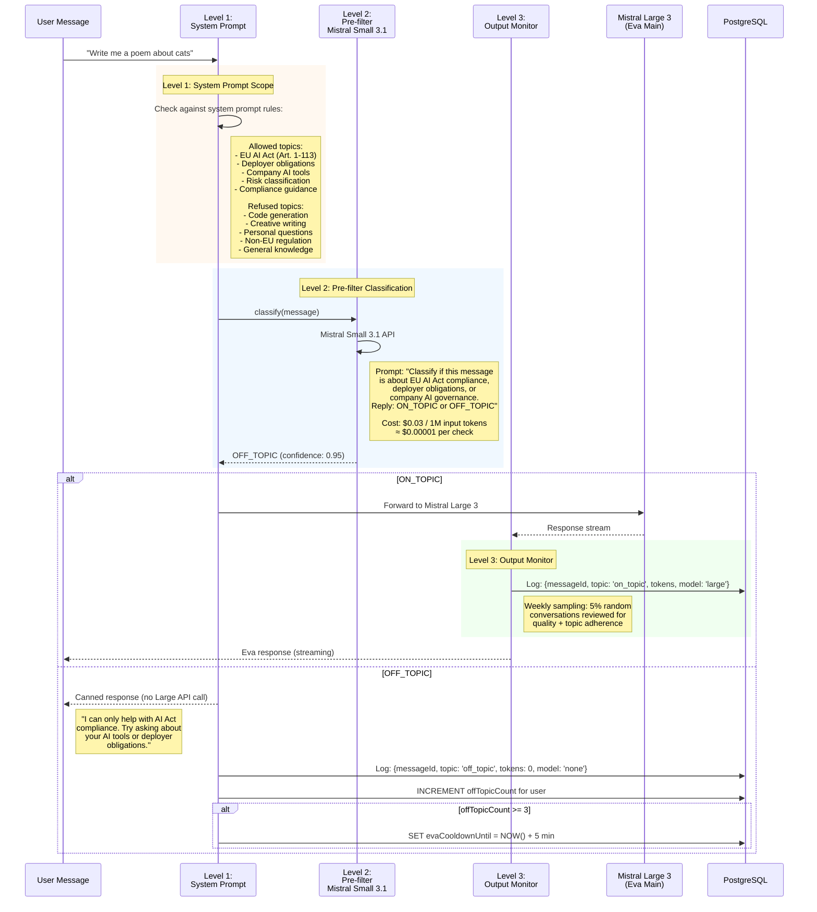
```mermaid
sequenceDiagram
    participant Msg as User Message
    participant L1 as Level 1:<br/>System Prompt
    participant L2 as Level 2:<br/>Pre-filter<br/>Mistral Small 3.1
    participant L3 as Level 3:<br/>Output Monitor
    participant Large as Mistral Large 3<br/>(Eva Main)
    participant DB as PostgreSQL

    Msg->>L1: "Write me a poem about cats"

    rect rgb(255, 248, 240)
        Note over L1: Level 1: System Prompt Scope
        L1->>L1: Check against system prompt rules:
        Note right of L1: Allowed topics:<br/>- EU AI Act (Art. 1-113)<br/>- Deployer obligations<br/>- Company AI tools<br/>- Risk classification<br/>- Compliance guidance<br/><br/>Refused topics:<br/>- Code generation<br/>- Creative writing<br/>- Personal questions<br/>- Non-EU regulation<br/>- General knowledge
    end

    rect rgb(240, 248, 255)
        Note over L2: Level 2: Pre-filter Classification
        L1->>L2: classify(message)
        L2->>L2: Mistral Small 3.1 API
        Note right of L2: Prompt: "Classify if this message<br/>is about EU AI Act compliance,<br/>deployer obligations, or<br/>company AI governance.<br/>Reply: ON_TOPIC or OFF_TOPIC"<br/><br/>Cost: $0.03 / 1M input tokens<br/>≈ $0.00001 per check
        L2-->>L1: OFF_TOPIC (confidence: 0.95)
    end

    alt ON_TOPIC
        L1->>Large: Forward to Mistral Large 3
        Large-->>L3: Response stream
        rect rgb(240, 255, 240)
            Note over L3: Level 3: Output Monitor
            L3->>DB: Log: {messageId, topic: 'on_topic', tokens, model: 'large'}
            Note right of L3: Weekly sampling: 5% random<br/>conversations reviewed for<br/>quality + topic adherence
        end
        L3-->>Msg: Eva response (streaming)
    else OFF_TOPIC
        L1-->>Msg: Canned response (no Large API call)
        Note right of Msg: "I can only help with AI Act<br/>compliance. Try asking about<br/>your AI tools or deployer<br/>obligations."
        L1->>DB: Log: {messageId, topic: 'off_topic', tokens: 0, model: 'none'}
        L1->>DB: INCREMENT offTopicCount for user
        alt offTopicCount >= 3
            L1->>DB: SET evaCooldownUntil = NOW() + 5 min
        end
    end
```

**Decision Tree:**

```
User Message
  │
  ├── Level 1: System Prompt → obvious refuse patterns → CANNED RESPONSE ($0)
  │
  ├── Level 2: Small 3.1 Pre-filter ($0.00001)
  │     ├── ON_TOPIC → Level 3 + Mistral Large ($0.005/msg avg)
  │     └── OFF_TOPIC → CANNED RESPONSE ($0.00001 total)
  │
  └── Level 3: Output Monitor (logging only, no cost)
```

**Cost Comparison (1000 clients, ~500 msgs/day):**

| Metric | Without Guard | With Guard |
|--------|:---:|:---:|
| Large API calls | 500/day | ~450/day (90% on-topic) |
| Small API calls | 0 | 500/day ($0.005/day) |
| Monthly Large cost | ~$75 | ~$67.50 |
| Monthly Small cost | $0 | ~$0.15 |
| **Total** | **$75/mo** | **$67.65/mo** |
| Quality | Uncontrolled | Topic-enforced |

---

## 21. Stripe Checkout Flow (Sprint 3.5)

> **Feature 09 (partial):** Stripe Checkout Session creation, hosted payment page, webhook confirmation, success page polling. Full billing management remains Sprint 5-6.

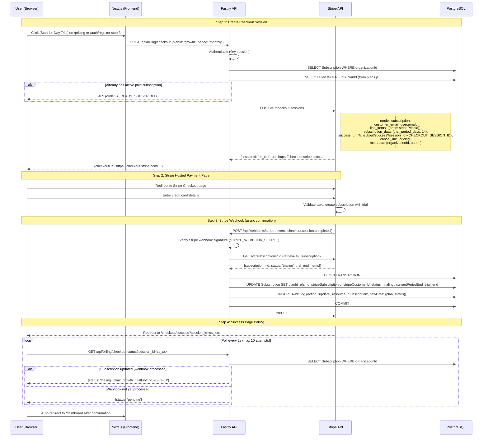
```mermaid
sequenceDiagram
    participant User as User (Browser)
    participant Next as Next.js (Frontend)
    participant API as Fastify API
    participant Stripe as Stripe API
    participant DB as PostgreSQL

    Note over User,DB: Step 1: Create Checkout Session

    User->>Next: Click [Start 14-Day Trial] on /pricing or /auth/register step 3
    Next->>API: POST /api/billing/checkout {planId: 'growth', period: 'monthly'}
    API->>API: Authenticate (Ory session)
    API->>DB: SELECT Subscription WHERE organizationId
    API->>DB: SELECT Plan WHERE id = planId (from plans.js)

    alt Already has active paid subscription
        API-->>User: 409 {code: 'ALREADY_SUBSCRIBED'}
    end

    API->>Stripe: POST /v1/checkout/sessions
    Note right of Stripe: {<br/>  mode: 'subscription',<br/>  customer_email: user.email,<br/>  line_items: [{price: stripePriceId}],<br/>  subscription_data: {trial_period_days: 14},<br/>  success_url: '/checkout/success?session_id={CHECKOUT_SESSION_ID}',<br/>  cancel_url: '/pricing',<br/>  metadata: {organizationId, userId}<br/>}
    Stripe-->>API: {sessionId: 'cs_xxx', url: 'https://checkout.stripe.com/...'}
    API-->>User: {checkoutUrl: 'https://checkout.stripe.com/...'}

    Note over User,Stripe: Step 2: Stripe Hosted Payment Page

    User->>Stripe: Redirect to Stripe Checkout page
    User->>Stripe: Enter credit card details
    Stripe->>Stripe: Validate card, create subscription with trial

    Note over User,DB: Step 3: Stripe Webhook (async confirmation)

    Stripe->>API: POST /api/webhooks/stripe {event: 'checkout.session.completed'}
    API->>API: Verify Stripe webhook signature (STRIPE_WEBHOOK_SECRET)
    API->>Stripe: GET /v1/subscriptions/:id (retrieve full subscription)
    Stripe-->>API: {subscription: {id, status: 'trialing', trial_end, items}}

    API->>DB: BEGIN TRANSACTION
    API->>DB: UPDATE Subscription SET planId=planId, stripeSubscriptionId, stripeCustomerId, status='trialing', currentPeriodEnd=trial_end
    API->>DB: INSERT AuditLog {action: 'update', resource: 'Subscription', newData: {plan, status}}
    API->>DB: COMMIT
    API-->>Stripe: 200 OK

    Note over User,DB: Step 4: Success Page Polling

    Stripe-->>User: Redirect to /checkout/success?session_id=cs_xxx

    loop Poll every 2s (max 10 attempts)
        User->>API: GET /api/billing/checkout-status?session_id=cs_xxx
        API->>DB: SELECT Subscription WHERE organizationId
        alt Subscription updated (webhook processed)
            API-->>User: {status: 'trialing', plan: 'growth', trialEnd: '2026-03-01'}
        else Webhook not yet processed
            API-->>User: {status: 'pending'}
        end
    end

    User->>Next: Auto-redirect to /dashboard after confirmation
```

---

## 18. Data Flow Summary

### Request → Response Latency Targets

| Flow | Target | Notes |
|------|--------|-------|
| Registration | < 3 sec | Includes org + user + role + subscription creation |
| Tool wizard step save | < 500 ms | Simple PATCH update |
| Classification (rule-only) | < 1 sec | No LLM call needed |
| Classification (with LLM) | < 10 sec | Mistral Small API call |
| Classification (cross-validated) | < 20 sec | Two sequential LLM calls |
| Eva chat (streaming) | First token < 2 sec | WebSocket streaming, Mistral Large API |
| Document section generation | < 30 sec | Async via pg-boss, Mistral Medium API |
| Literacy module load | < 1 sec | Static content from DB |
| FRIA section pre-fill | < 15 sec | LLM draft generation |
| Certificate generation | < 30 sec | Async via pg-boss + Gotenberg |
| Dashboard load | < 1 sec | Прямой SQL-запрос (50 юзеров — без кэша) |
| Gap analysis | < 5 sec | DB queries + Mistral Medium API |
| PDF export | < 60 sec | Async via pg-boss |
| Catalog search | < 500 ms | PostgreSQL ILIKE + index |

### Data Persistence Points

```
Browser → [HTTPS] → Cloudflare → [proxy] → Fastify → [auth]     → Ory (self-hosted, EU)
                                                    → [validate] → PostgreSQL
                                                    → [enqueue]  → pg-boss (PostgreSQL) → Worker
                                                    → [stream]   → WebSocket
                                                    → [classify] → Mistral API (EU)
                                                    → [email]    → Brevo (EU)
                                                    → [PDF]      → Gotenberg (self-hosted)
                                                    → [store]    → Hetzner Object Storage (EU)
```

### Cross-Context Events

| Event | Producer | Consumers | Action |
|-------|----------|-----------|--------|
| AIToolClassified | Classification | Deployer Compliance, Dashboard | Create deployer checklist (Art. 26-27), recalc score |
| AIToolDiscovered | Inventory | Notification, Dashboard | "Обнаружен новый AI-инструмент, требуется классификация" |
| LiteracyCompleted | AI Literacy | Dashboard, Compliance | Update Art. 4 progress, recalc compliance score |
| CertificateGenerated | AI Literacy | Notification | PDF ready for download |
| FRIACompleted | Compliance | Dashboard, Notification | Art. 27 FRIA ready, update compliance |
| DocumentGenerated | Compliance | Dashboard, Notification | Update progress, notify user |
| ComplianceScoreChanged | Compliance | Dashboard | Invalidate cache, push WS update |
| SiegelEligible | Compliance | Notification | "Ваша компания может получить KI-Siegel!" |
| RegulatoryUpdateFound | Monitoring | Compliance, Notification | Assess impact on deployer, notify affected |
| SubscriptionChanged | Billing | IAM | Update feature access |
| InvitationCreated | IAM | Notification (Brevo) | Send invite email to invitee |
| InvitationAccepted | IAM | Dashboard, Notification | New team member joined, update user count |
| PlanLimitExceeded | Billing | IAM | Block invitation/tool registration (403) |

---

**Последнее обновление:** 2026-02-12 (v2.3.0: Sprint 3.5 — Stripe Checkout Flow 21, modified Registration Flow 1 with plan-aware conditional branch)
**Следующий документ:** CODING-STANDARDS.md ✅ Утверждён
