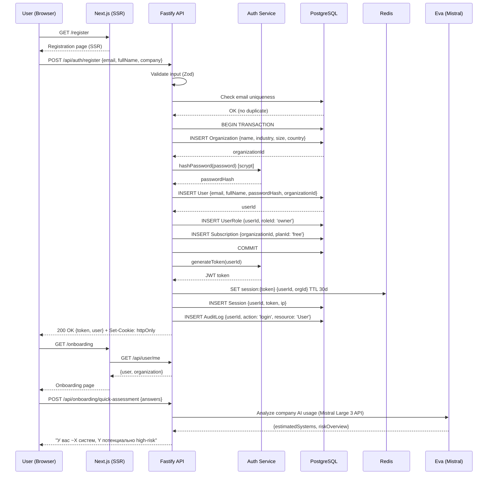
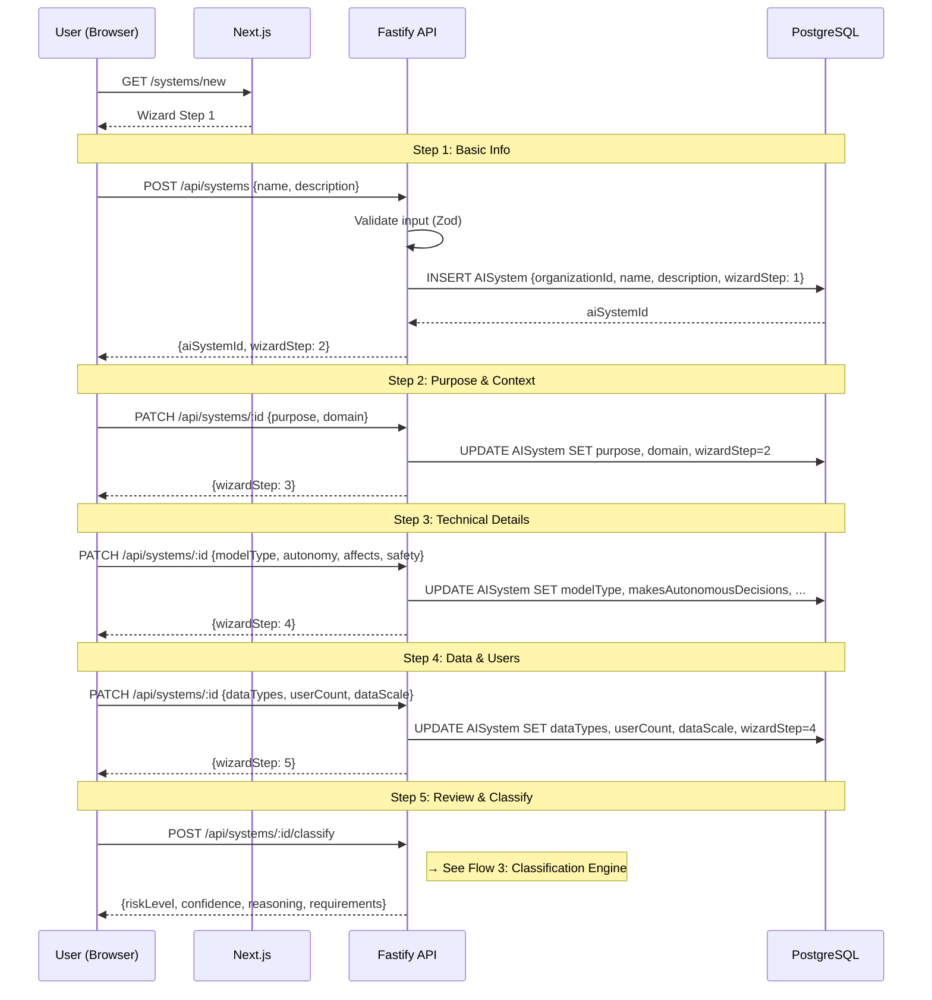
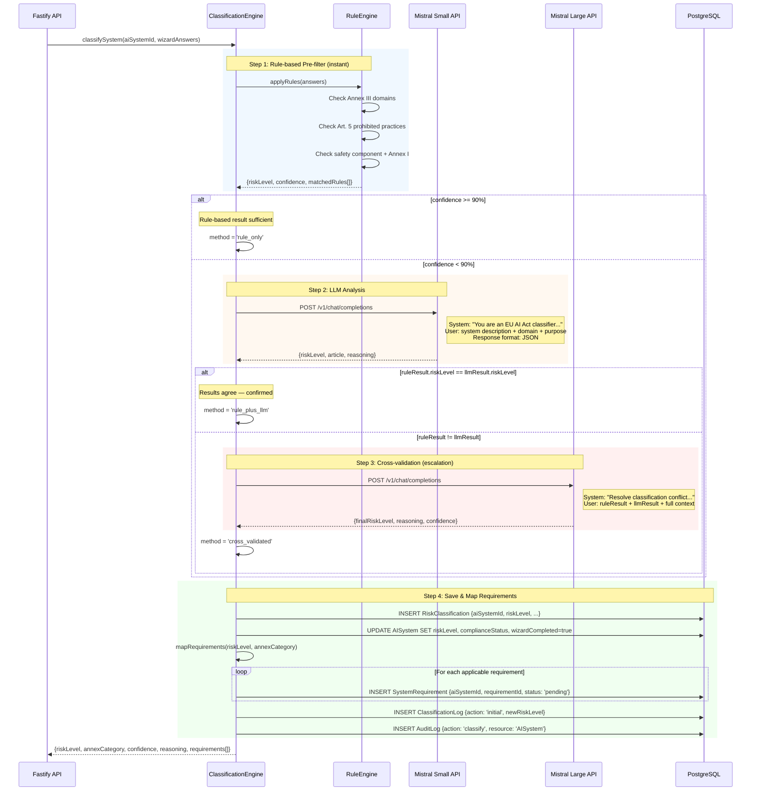
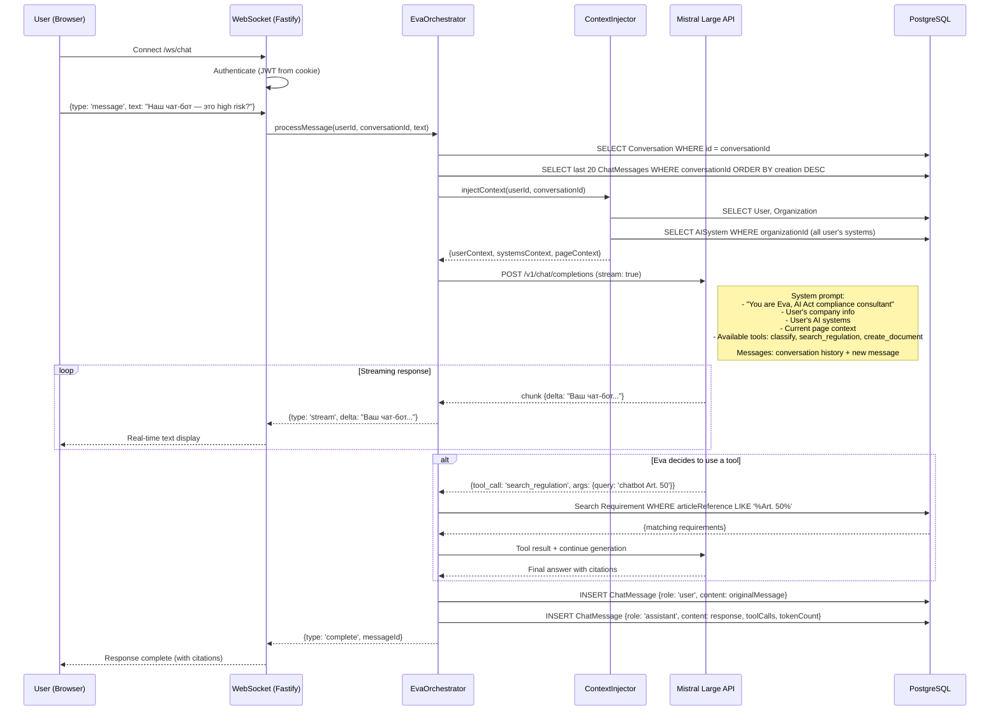
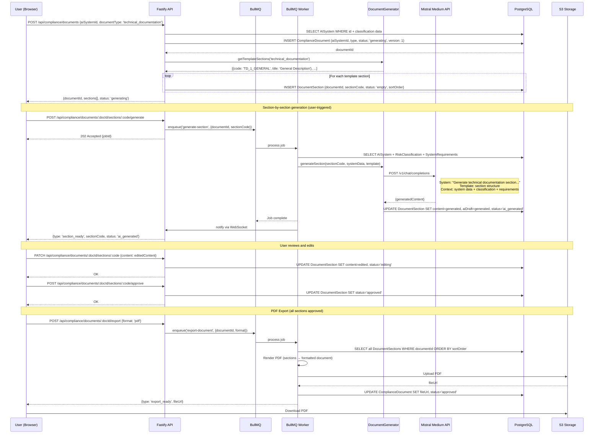
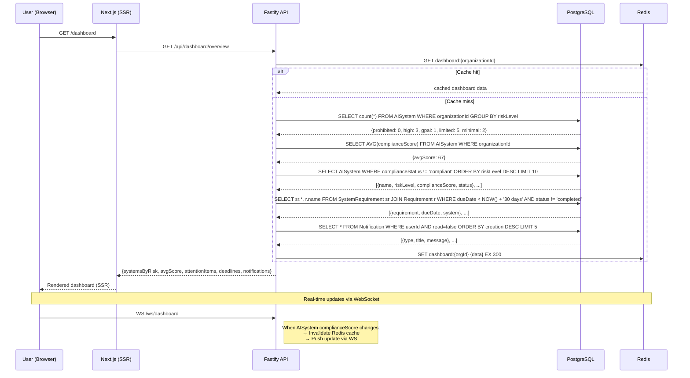
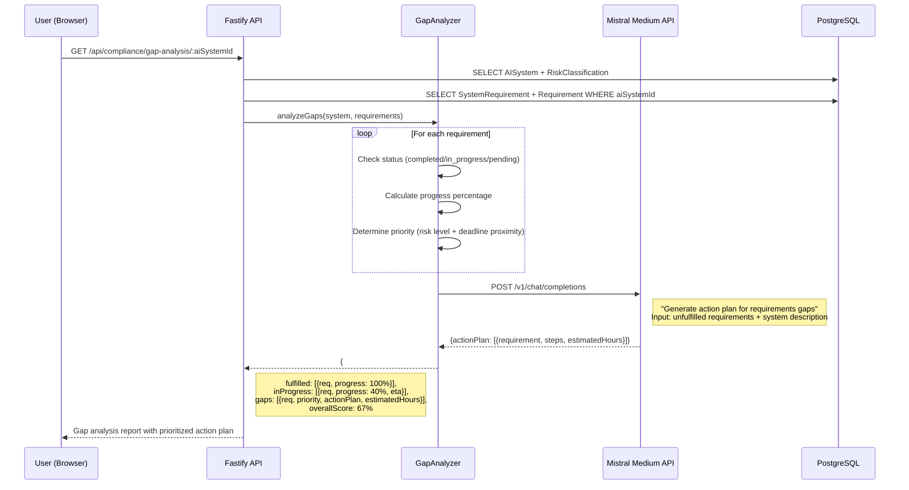
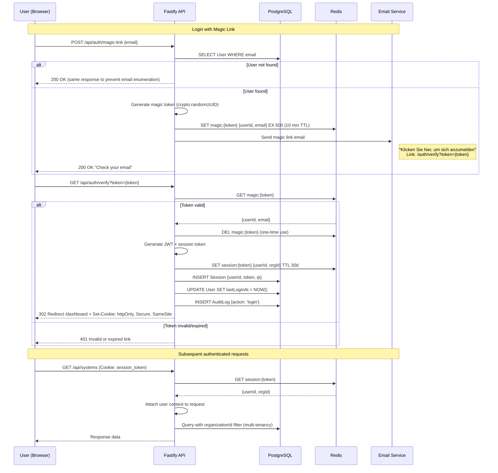
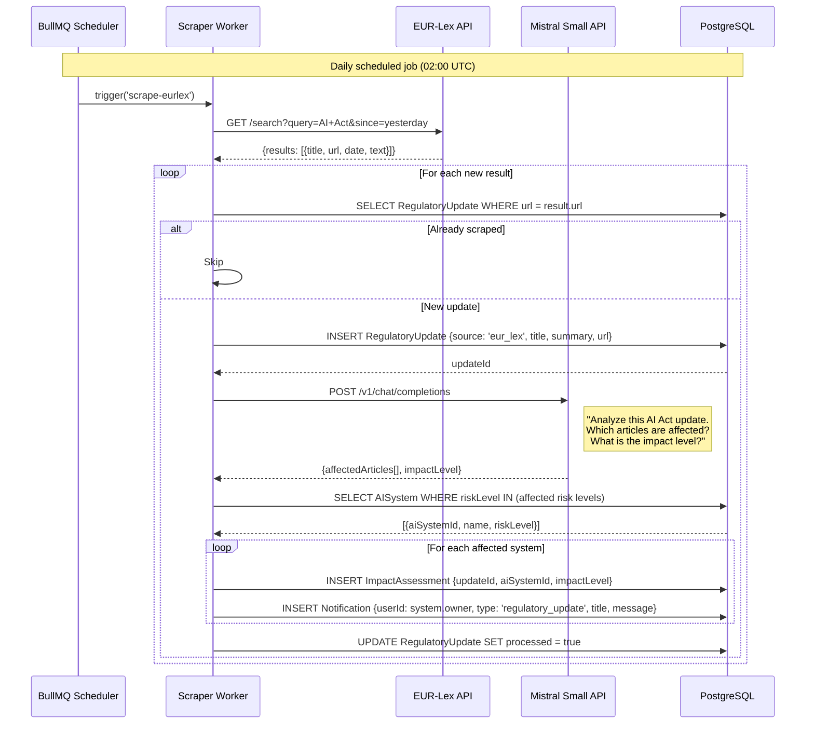
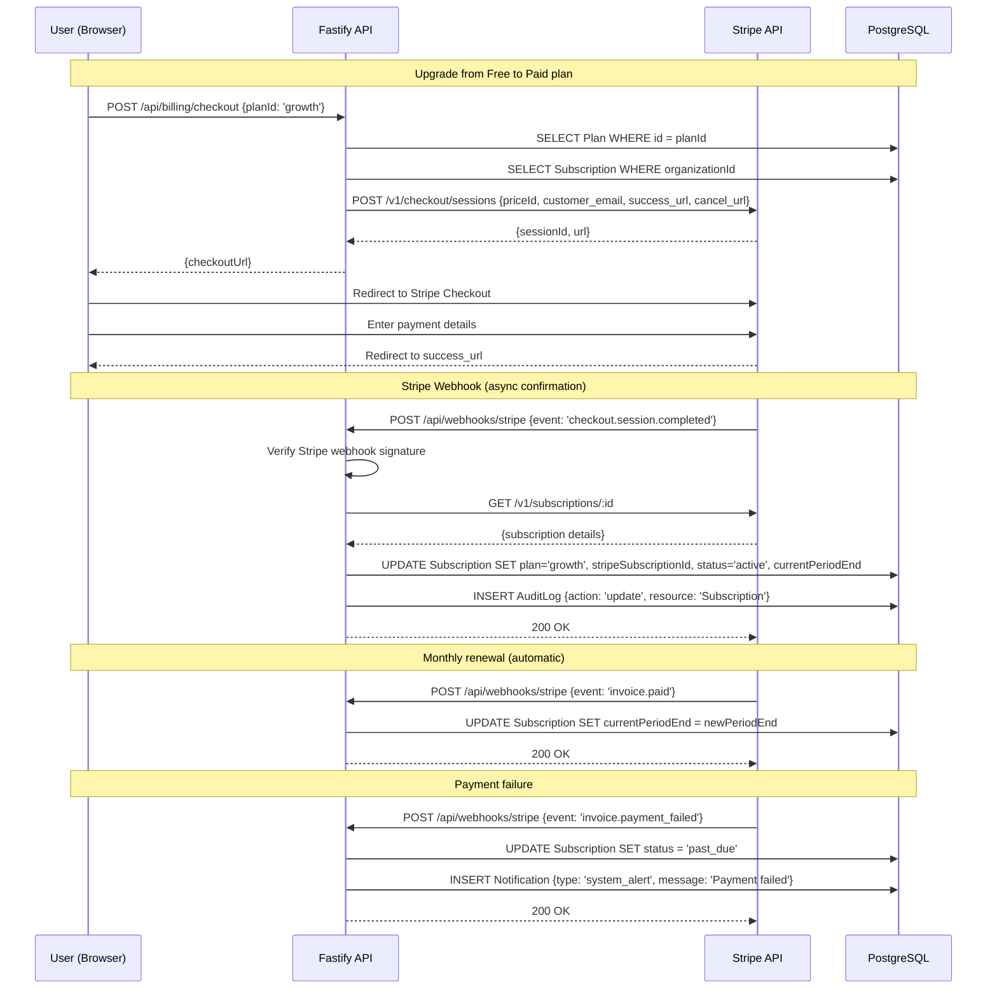

# DATA-FLOWS.md — AI Act Compliance Platform

**Версия:** 1.0.0
**Дата:** 2026-02-07
**Автор:** Marcus (CTO) via Claude Code
**Статус:** Информационный (PO approval не требуется)
**Зависимости:** ARCHITECTURE.md ✅, DATABASE.md ✅

---

## 1. User Registration & Onboarding



---

## 2. AI System Registration (5-step Wizard)



---

## 3. Classification Engine (гибридный 4-шаговый)



---

## 4. Eva Consultant Chat



---

## 5. Document Generation



---

## 6. Compliance Dashboard Data Flow



---

## 7. Gap Analysis



---

## 8. Authentication Flow (Magic Link)



---

## 9. Regulatory Monitor (post-MVP)



---

## 10. Billing & Subscription (Stripe)



---

## 11. Data Flow Summary

### Request → Response Latency Targets

| Flow | Target | Notes |
|------|--------|-------|
| Registration | < 3 sec | Includes org + user + role + subscription creation |
| Wizard step save | < 500 ms | Simple PATCH update |
| Classification (rule-only) | < 1 sec | No LLM call needed |
| Classification (with LLM) | < 10 sec | Mistral Small API call |
| Classification (cross-validated) | < 20 sec | Two sequential LLM calls |
| Eva chat (streaming) | First token < 2 sec | WebSocket streaming, Mistral Large API |
| Document section generation | < 30 sec | Async via BullMQ, Mistral Medium API |
| Dashboard load | < 1 sec | Redis cache (5 min TTL) |
| Gap analysis | < 5 sec | DB queries + Mistral Medium API |
| PDF export | < 60 sec | Async via BullMQ |

### Data Persistence Points

```
Browser → [HTTPS] → Cloudflare → [proxy] → Fastify → [validate] → PostgreSQL
                                                    → [cache]    → Redis
                                                    → [enqueue]  → BullMQ → Worker
                                                    → [stream]   → WebSocket
                                                    → [classify] → Mistral API (EU)
                                                    → [store]    → S3 (Hetzner)
```

### Cross-Context Events

| Event | Producer | Consumers | Action |
|-------|----------|-----------|--------|
| SystemClassified | Classification | Compliance, Dashboard | Create checklist, recalc score |
| DocumentGenerated | Compliance | Dashboard, Notification | Update progress, notify user |
| ComplianceScoreChanged | Compliance | Dashboard | Invalidate cache, push WS update |
| RegulatoryUpdateFound | Monitoring | Compliance, Notification | Assess impact, notify affected |
| SubscriptionChanged | Billing | IAM | Update feature access |

---

**Последнее обновление:** 2026-02-07
**Следующий документ:** CODING-STANDARDS.md (ЭТАП 5) ⛔ Требует PO approval
