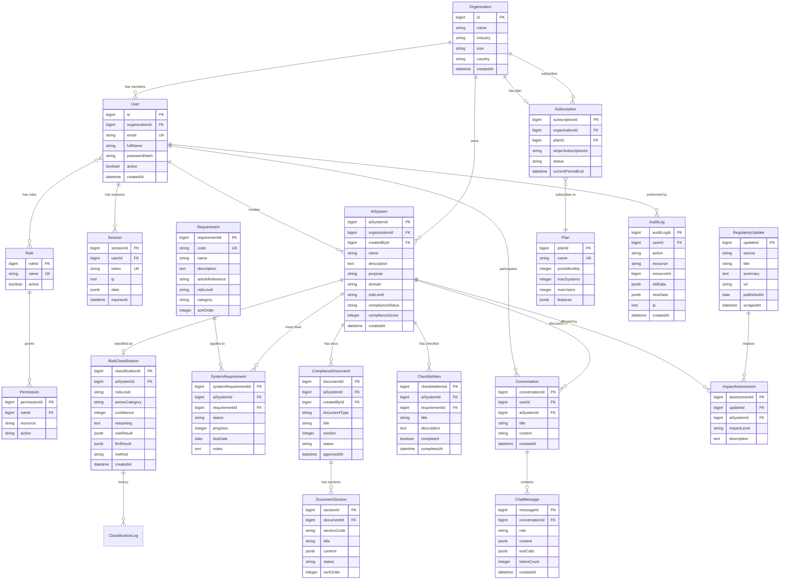

# DATABASE.md — AI Act Compliance Platform

**Версия:** 1.0.0
**Дата:** 2026-02-07
**Автор:** Marcus (CTO) via Claude Code
**Статус:** Информационный (PO approval не требуется)
**Зависимости:** ARCHITECTURE.md ✅

---

## 1. Обзор

### Database Technology
- **RDBMS:** PostgreSQL 16 (Hetzner Managed)
- **Schema Management:** MetaSQL (JavaScript schema → SQL DDL + TypeScript types)
- **Driver:** `pg` (node-postgres) pool
- **CRUD Layer:** `lib/db.js` (existing, with planned extensions)
- **Data Residency:** EU only (Hetzner, Германия) — GDPR/AI Act requirement

### MetaSQL Conventions (из существующего кода)

MetaSQL определяет 4 типа сущностей:

| Kind | PK Pattern | Описание |
|------|-----------|----------|
| **Registry** | `id` (inherits Identifier) | Коллекции с metadata (creation, change timestamps) |
| **Entity** | `{name}Id` (auto identity) | Стандартные объекты |
| **Details** | `{name}Id` (auto identity) | Связанные данные с cascade delete |
| **Relation** | `{name}Id` (auto identity) | Связи many-to-many |

### Custom Types

```javascript
// schemas/.types.js
({
  datetime: { js: 'string', metadata: { pg: 'timestamp with time zone' } },
  json: { metadata: { pg: 'jsonb' } },
  ip: { js: 'string', metadata: { pg: 'inet' } },
  // Новые типы для AI Act Compliance:
  riskLevel: {
    js: 'string',
    metadata: { pg: "varchar CHECK (value IN ('prohibited','high','gpai','limited','minimal'))" }
  },
  complianceStatus: {
    js: 'string',
    metadata: { pg: "varchar CHECK (value IN ('not_started','in_progress','review','compliant','non_compliant'))" }
  },
});
```

---

## 2. ER Diagram (полная схема)



---

## 3. Bounded Contexts → Tables Mapping

| Bounded Context | Tables | Количество |
|----------------|--------|:---:|
| **IAM** | Organization, User, Role, Permission, Session, UserRole (junction) | 6 |
| **Classification** | AISystem, RiskClassification, Requirement, SystemRequirement, ClassificationLog | 5 |
| **Compliance** | ComplianceDocument, DocumentSection, ChecklistItem | 3 |
| **Consultation** | Conversation, ChatMessage | 2 |
| **Monitoring** | RegulatoryUpdate, ImpactAssessment, Notification | 3 |
| **Billing** | Subscription, Plan | 2 |
| **Cross-cutting** | AuditLog | 1 |
| **Total** | | **22** |

---

## 4. Detailed Schema Definitions (MetaSQL)

### 4.1 IAM Context

#### Organization (Registry)

```javascript
// schemas/Organization.js
({
  Registry: {},
  name: { type: 'string', length: { max: 255 }, unique: true },
  industry: {
    enum: ['fintech', 'hrtech', 'healthtech', 'edtech', 'ecommerce',
           'manufacturing', 'logistics', 'legal', 'insurance', 'other'],
  },
  size: {
    enum: ['micro_1_9', 'small_10_49', 'medium_50_249', 'large_250_plus'],
  },
  country: { type: 'string', length: { min: 2, max: 2 }, note: 'ISO 3166-1 alpha-2' },
  website: { type: 'string', required: false },
  vatId: { type: 'string', required: false, note: 'EU VAT number' },
  settings: { type: 'json', required: false, note: 'Organization-level settings' },
});
```

| Column | Type | Constraints | Описание |
|--------|------|------------|----------|
| id | bigint | PK, identity | Inherits from Identifier |
| name | varchar(255) | UNIQUE, NOT NULL | Company name |
| industry | varchar | NOT NULL, CHECK enum | Industry vertical |
| size | varchar | NOT NULL, CHECK enum | EU SMB size category |
| country | varchar(2) | NOT NULL | ISO country code (DE, AT, CH) |
| website | varchar | nullable | Company website |
| vatId | varchar | nullable | EU VAT identification number |
| settings | jsonb | nullable | Configurable settings |
| creation | timestamptz | DEFAULT now() | From Identifier |
| change | timestamptz | DEFAULT now() | From Identifier |

---

#### User (Registry)

```javascript
// schemas/User.js — migrated from Account.js
({
  Registry: {},
  organization: { type: 'Organization', delete: 'cascade' },
  email: { type: 'string', length: { min: 6, max: 255 }, unique: true, index: true },
  password: { type: 'string', note: 'scrypt hash (PHC format)' },
  fullName: { type: 'string', length: { max: 255 } },
  active: { type: 'boolean', default: true },
  locale: { type: 'string', length: { max: 5 }, default: "'de'" },
  roles: { many: 'Role' },
  lastLoginAt: { type: 'datetime', required: false },
});
```

| Column | Type | Constraints | Описание |
|--------|------|------------|----------|
| id | bigint | PK, identity | Inherits from Identifier |
| organizationId | bigint | FK → Organization.id, CASCADE | Tenant isolation |
| email | varchar(255) | UNIQUE, INDEX, NOT NULL | Login identifier |
| password | varchar | NOT NULL | scrypt hash (PHC format) |
| fullName | varchar(255) | NOT NULL | Display name |
| active | boolean | DEFAULT true | Soft delete |
| locale | varchar(5) | DEFAULT 'de' | UI language (de, en) |
| lastLoginAt | timestamptz | nullable | Last login tracking |
| creation | timestamptz | DEFAULT now() | Registration date |
| change | timestamptz | DEFAULT now() | Last profile update |

**Junction Table:** UserRole (userId, roleId) — CASCADE on delete

---

#### Role (Entity)

```javascript
// schemas/Role.js — preserved from existing code
({
  Entity: {},
  name: { type: 'string', unique: true },
  active: { type: 'boolean', default: true },
  organizationId: { type: 'Organization', delete: 'cascade', required: false,
    note: 'NULL = system role, non-null = org-specific role' },
});
```

**System Roles (org = NULL):** owner, admin, member, viewer
**Org Roles:** configurable per organization

---

#### Permission (Relation)

```javascript
// schemas/Permission.js — preserved from existing code
({
  Relation: {},
  role: { type: 'Role', delete: 'cascade' },
  resource: { type: 'string', note: 'Entity/module name' },
  action: {
    enum: ['read', 'create', 'update', 'delete', 'manage'],
    default: 'read',
  },
  naturalKey: { unique: ['role', 'resource', 'action'] },
});
```

---

#### Session (Details)

```javascript
// schemas/Session.js — preserved from existing code
({
  Details: {},
  user: { type: 'User', delete: 'cascade' },
  token: { type: 'string', unique: true },
  ip: 'ip',
  data: { type: 'json', required: false },
  expiresAt: 'datetime',
});
```

---

### 4.2 Classification Context

#### AISystem (Entity) — ядро продукта

```javascript
// schemas/AISystem.js
({
  Entity: {},
  organization: { type: 'Organization', delete: 'cascade' },
  createdBy: { type: 'User', delete: 'restrict' },

  // Basic Info (Step 1)
  name: { type: 'string', length: { max: 255 } },
  description: { type: 'string', length: { max: 5000 } },

  // Purpose & Context (Step 2)
  purpose: { type: 'string', length: { max: 2000 } },
  domain: {
    enum: ['biometrics', 'critical_infrastructure', 'education',
           'employment', 'essential_services', 'law_enforcement',
           'migration', 'justice', 'other'],
    note: 'AI Act Annex III domains',
  },

  // Technical Details (Step 3)
  modelType: {
    enum: ['proprietary', 'api_based', 'open_source', 'hybrid', 'rule_based'],
  },
  makesAutonomousDecisions: 'boolean',
  affectsNaturalPersons: 'boolean',
  isSafetyComponent: { type: 'boolean', default: false },

  // Data & Users (Step 4)
  dataTypes: { type: 'json', note: 'Array of data types processed' },
  userCount: {
    enum: ['internal_only', 'up_to_100', 'up_to_1000', 'up_to_10000', 'over_10000'],
  },
  dataScale: {
    enum: ['minimal', 'moderate', 'large', 'very_large'],
  },

  // Classification Result (Step 5)
  riskLevel: {
    enum: ['prohibited', 'high', 'gpai', 'limited', 'minimal'],
    required: false,
    index: true,
  },
  annexCategory: { type: 'string', required: false, note: 'e.g., III_1a, III_4a' },
  classificationConfidence: { type: 'number', required: false },

  // Compliance Tracking
  complianceStatus: {
    enum: ['not_started', 'in_progress', 'review', 'compliant', 'non_compliant'],
    default: 'not_started',
    index: true,
  },
  complianceScore: { type: 'number', default: 0, note: '0-100 percentage' },

  // Wizard State
  wizardStep: { type: 'number', default: 1, note: 'Current wizard step (1-5)' },
  wizardCompleted: { type: 'boolean', default: false },
});
```

| Column | Type | Key info |
|--------|------|----------|
| aiSystemId | bigint | PK |
| organizationId | bigint | FK, CASCADE, INDEX |
| createdById | bigint | FK, RESTRICT |
| name | varchar(255) | NOT NULL |
| description | varchar(5000) | NOT NULL |
| purpose | varchar(2000) | NOT NULL |
| domain | varchar | ENUM, NOT NULL |
| modelType | varchar | ENUM, NOT NULL |
| makesAutonomousDecisions | boolean | NOT NULL |
| affectsNaturalPersons | boolean | NOT NULL |
| isSafetyComponent | boolean | DEFAULT false |
| dataTypes | jsonb | Array |
| userCount | varchar | ENUM |
| dataScale | varchar | ENUM |
| riskLevel | varchar | ENUM, nullable, INDEX |
| annexCategory | varchar | nullable |
| classificationConfidence | integer | nullable (0-100) |
| complianceStatus | varchar | ENUM, DEFAULT 'not_started', INDEX |
| complianceScore | integer | DEFAULT 0 |
| wizardStep | integer | DEFAULT 1 |
| wizardCompleted | boolean | DEFAULT false |

**Indexes:**
- `idx_aisystem_organization` ON (organizationId) — tenant queries
- `idx_aisystem_risk_level` ON (riskLevel) — dashboard filtering
- `idx_aisystem_compliance_status` ON (complianceStatus) — dashboard filtering

---

#### RiskClassification (Entity) — результат классификации

```javascript
// schemas/RiskClassification.js
({
  Entity: {},
  aiSystem: { type: 'AISystem', delete: 'cascade' },
  riskLevel: {
    enum: ['prohibited', 'high', 'gpai', 'limited', 'minimal'],
  },
  annexCategory: { type: 'string', required: false },
  confidence: { type: 'number', note: '0-100 percentage' },
  reasoning: { type: 'string', length: { max: 10000 } },

  // Hybrid engine results
  ruleResult: { type: 'json', note: '{ riskLevel, confidence, matchedRules[] }' },
  llmResult: { type: 'json', required: false, note: '{ riskLevel, article, reasoning }' },
  crossValidation: { type: 'json', required: false, note: 'Escalation result if needed' },
  method: {
    enum: ['rule_only', 'rule_plus_llm', 'cross_validated'],
    note: 'Which steps of hybrid engine were used',
  },

  // Article references
  articleReferences: { type: 'json', note: 'Array of { article, text, relevance }' },

  // Versioning
  version: { type: 'number', default: 1 },
  isCurrent: { type: 'boolean', default: true, index: true },
  classifiedBy: { type: 'User', delete: 'restrict', note: 'Who initiated classification' },
});
```

---

#### Requirement (Entity) — справочник требований AI Act

```javascript
// schemas/Requirement.js
({
  Entity: {},
  code: { type: 'string', unique: true, note: 'e.g., ART_9_RMS, ART_11_TD' },
  name: { type: 'string', length: { max: 255 } },
  description: { type: 'string', length: { max: 5000 } },
  articleReference: { type: 'string', note: 'e.g., Art. 9, Art. 11' },
  riskLevel: {
    enum: ['prohibited', 'high', 'gpai', 'limited', 'minimal'],
    note: 'Which risk levels this requirement applies to',
  },
  category: {
    enum: ['risk_management', 'data_governance', 'technical_documentation',
           'record_keeping', 'transparency', 'human_oversight',
           'accuracy_robustness', 'conformity_assessment', 'registration',
           'post_market_monitoring', 'gpai_obligations'],
  },
  sortOrder: { type: 'number', default: 0 },
  estimatedEffortHours: { type: 'number', required: false },
  guidance: { type: 'string', required: false, note: 'Implementation guidance text' },
});
```

**Seed Data:** ~50 requirements mapped from AI Act Articles 5-56.

---

#### SystemRequirement (Relation) — связь система ↔ требование

```javascript
// schemas/SystemRequirement.js
({
  Relation: {},
  aiSystem: { type: 'AISystem', delete: 'cascade' },
  requirement: { type: 'Requirement', delete: 'restrict' },
  status: {
    enum: ['not_applicable', 'pending', 'in_progress', 'completed', 'blocked'],
    default: 'pending',
  },
  progress: { type: 'number', default: 0, note: '0-100 percentage' },
  dueDate: { type: 'datetime', required: false },
  notes: { type: 'string', required: false },
  completedAt: { type: 'datetime', required: false },
  naturalKey: { unique: ['aiSystem', 'requirement'] },
});
```

---

#### ClassificationLog (Details) — история классификаций

```javascript
// schemas/ClassificationLog.js
({
  Details: {},
  aiSystem: { type: 'AISystem', delete: 'cascade' },
  classification: { type: 'RiskClassification', delete: 'cascade' },
  action: {
    enum: ['initial', 'reclassification', 'system_updated', 'regulation_changed'],
  },
  previousRiskLevel: { type: 'string', required: false },
  newRiskLevel: 'string',
  changedBy: { type: 'User', delete: 'restrict' },
  reason: { type: 'string', required: false },
});
```

---

### 4.3 Compliance Context

#### ComplianceDocument (Entity)

```javascript
// schemas/ComplianceDocument.js
({
  Entity: {},
  aiSystem: { type: 'AISystem', delete: 'cascade' },
  createdBy: { type: 'User', delete: 'restrict' },
  documentType: {
    enum: ['technical_documentation', 'risk_assessment', 'conformity_declaration',
           'data_governance_plan', 'monitoring_plan', 'transparency_notice'],
  },
  title: { type: 'string', length: { max: 500 } },
  version: { type: 'number', default: 1 },
  status: {
    enum: ['draft', 'generating', 'review', 'approved', 'archived'],
    default: 'draft',
  },
  approvedBy: { type: 'User', required: false, delete: 'restrict' },
  approvedAt: { type: 'datetime', required: false },
  fileUrl: { type: 'string', required: false, note: 'S3 URL for exported PDF/DOCX' },
  metadata: { type: 'json', required: false, note: '{ exportFormat, pageCount, etc. }' },
});
```

---

#### DocumentSection (Details)

```javascript
// schemas/DocumentSection.js
({
  Details: {},
  document: { type: 'ComplianceDocument', delete: 'cascade' },
  sectionCode: { type: 'string', note: 'e.g., TD_1_GENERAL, TD_2_DESIGN' },
  title: { type: 'string', length: { max: 500 } },
  content: { type: 'json', note: 'Tiptap JSON content (rich text)' },
  aiDraft: { type: 'json', required: false, note: 'Original AI-generated draft' },
  status: {
    enum: ['empty', 'ai_generated', 'editing', 'reviewed', 'approved'],
    default: 'empty',
  },
  sortOrder: { type: 'number', default: 0 },
  naturalKey: { unique: ['document', 'sectionCode'] },
});
```

---

#### ChecklistItem (Entity)

```javascript
// schemas/ChecklistItem.js
({
  Entity: {},
  aiSystem: { type: 'AISystem', delete: 'cascade' },
  requirement: { type: 'Requirement', delete: 'restrict', required: false },
  title: { type: 'string', length: { max: 500 } },
  description: { type: 'string', required: false },
  completed: { type: 'boolean', default: false },
  completedAt: { type: 'datetime', required: false },
  completedBy: { type: 'User', required: false, delete: 'restrict' },
  sortOrder: { type: 'number', default: 0 },
});
```

---

### 4.4 Consultation Context

#### Conversation (Entity)

```javascript
// schemas/Conversation.js — adapted from Chat.js
({
  Entity: {},
  user: { type: 'User', delete: 'cascade' },
  aiSystem: { type: 'AISystem', delete: 'cascade', required: false,
    note: 'Context-specific conversation (null = general Eva chat)' },
  title: { type: 'string', length: { max: 255 }, default: "'Новый разговор'" },
  context: {
    enum: ['general', 'classification', 'compliance', 'document', 'gap_analysis'],
    default: 'general',
  },
  metadata: { type: 'json', required: false, note: 'Page context, system info' },
  archived: { type: 'boolean', default: false },
});
```

---

#### ChatMessage (Entity)

```javascript
// schemas/ChatMessage.js — adapted from Message.js
({
  Entity: {},
  conversation: { type: 'Conversation', delete: 'cascade' },
  role: {
    enum: ['user', 'assistant', 'system', 'tool'],
  },
  content: {
    type: 'json',
    schema: {
      text: { type: 'string', required: false },
      citations: { type: 'json', required: false, note: 'AI Act article references' },
    },
  },
  toolCalls: { type: 'json', required: false, note: 'Eva tool calls & results' },
  tokenCount: { type: 'number', required: false },
  model: { type: 'string', required: false, note: 'Which Mistral model was used' },
  feedbackRating: {
    enum: ['positive', 'negative'],
    required: false,
    note: 'User thumbs up/down',
  },
});
```

---

### 4.5 Monitoring Context (post-MVP)

#### RegulatoryUpdate (Entity)

```javascript
// schemas/RegulatoryUpdate.js
({
  Entity: {},
  source: {
    enum: ['eur_lex', 'ai_office', 'bsi', 'enisa', 'manual'],
  },
  title: { type: 'string', length: { max: 500 } },
  summary: { type: 'string', length: { max: 5000 } },
  url: { type: 'string' },
  publishedAt: 'datetime',
  scrapedAt: 'datetime',
  relevantArticles: { type: 'json', note: 'Array of article references' },
  processed: { type: 'boolean', default: false },
});
```

#### ImpactAssessment (Entity)

```javascript
// schemas/ImpactAssessment.js
({
  Entity: {},
  regulatoryUpdate: { type: 'RegulatoryUpdate', delete: 'cascade' },
  aiSystem: { type: 'AISystem', delete: 'cascade' },
  impactLevel: {
    enum: ['none', 'low', 'medium', 'high', 'critical'],
  },
  description: { type: 'string', length: { max: 2000 } },
  actionRequired: { type: 'boolean', default: false },
  acknowledged: { type: 'boolean', default: false },
  acknowledgedBy: { type: 'User', required: false, delete: 'restrict' },
});
```

#### Notification (Entity)

```javascript
// schemas/Notification.js
({
  Entity: {},
  user: { type: 'User', delete: 'cascade' },
  type: {
    enum: ['classification_complete', 'document_ready', 'deadline_approaching',
           'regulatory_update', 'compliance_change', 'system_alert'],
  },
  title: { type: 'string', length: { max: 255 } },
  message: { type: 'string', length: { max: 1000 } },
  link: { type: 'string', required: false },
  read: { type: 'boolean', default: false },
  readAt: { type: 'datetime', required: false },
});
```

---

### 4.6 Billing Context

#### Plan (Entity)

```javascript
// schemas/Plan.js
({
  Entity: {},
  name: { type: 'string', unique: true, note: 'free, starter, growth, scale, enterprise' },
  displayName: { type: 'string' },
  priceMonthly: { type: 'number', note: 'Cents (EUR). 0 = free' },
  priceYearly: { type: 'number', required: false, note: 'Cents (EUR). Yearly discount' },
  maxSystems: { type: 'number', note: '1, 2, 10, 50, -1 = unlimited' },
  maxUsers: { type: 'number', note: '1, 2, 5, 20, -1 = unlimited' },
  features: { type: 'json', note: 'Feature flags: { documents, eva, gapAnalysis, api, ... }' },
  stripePriceId: { type: 'string', required: false },
  active: { type: 'boolean', default: true },
  sortOrder: { type: 'number', default: 0 },
});
```

#### Subscription (Entity)

```javascript
// schemas/Subscription.js
({
  Entity: {},
  organization: { type: 'Organization', delete: 'cascade' },
  plan: { type: 'Plan', delete: 'restrict' },
  stripeCustomerId: { type: 'string', required: false },
  stripeSubscriptionId: { type: 'string', required: false, unique: true },
  status: {
    enum: ['trialing', 'active', 'past_due', 'canceled', 'unpaid'],
    default: 'active',
  },
  currentPeriodStart: 'datetime',
  currentPeriodEnd: 'datetime',
  canceledAt: { type: 'datetime', required: false },
});
```

---

### 4.7 Cross-cutting

#### AuditLog (Entity) — compliance audit trail

```javascript
// schemas/AuditLog.js
({
  Entity: {},
  user: { type: 'User', delete: 'restrict' },
  organization: { type: 'Organization', delete: 'cascade' },
  action: {
    enum: ['create', 'read', 'update', 'delete', 'classify', 'generate',
           'approve', 'export', 'login', 'logout'],
  },
  resource: { type: 'string', note: 'Entity name (AISystem, ComplianceDocument, etc.)' },
  resourceId: { type: 'number' },
  oldData: { type: 'json', required: false },
  newData: { type: 'json', required: false },
  ip: 'ip',
  userAgent: { type: 'string', required: false },
});
```

**Retention:** 7 лет (AI Act compliance audit trail requirement).
**Index:** `idx_auditlog_org_resource` ON (organizationId, resource, creation DESC)

---

## 5. Indexes Strategy

### Performance Indexes

| Table | Index | Columns | Описание |
|-------|-------|---------|----------|
| User | idx_user_org | organizationId | Tenant queries |
| User | ak_user_email | email (UNIQUE) | Login lookup |
| AISystem | idx_aisystem_org | organizationId | Dashboard listing |
| AISystem | idx_aisystem_risk | riskLevel | Filter by risk |
| AISystem | idx_aisystem_status | complianceStatus | Filter by status |
| RiskClassification | idx_class_system_current | aiSystemId, isCurrent | Current classification |
| SystemRequirement | idx_sysreq_system | aiSystemId | Requirements per system |
| ComplianceDocument | idx_doc_system | aiSystemId | Documents per system |
| Conversation | idx_conv_user | userId | User's conversations |
| ChatMessage | idx_msg_conv | conversationId | Messages in conversation |
| Notification | idx_notif_user_read | userId, read | Unread notifications |
| AuditLog | idx_audit_org_time | organizationId, creation DESC | Audit trail queries |
| Session | idx_session_expires | expiresAt | Expired session cleanup |

### Full-Text Search (post-MVP)

```sql
-- AI System search (name + description)
CREATE INDEX idx_aisystem_search ON "AISystem"
  USING gin(to_tsvector('german', name || ' ' || description));

-- Chat message search
CREATE INDEX idx_chatmessage_search ON "ChatMessage"
  USING gin(to_tsvector('german', content->>'text'));
```

---

## 6. Multi-Tenancy

### Isolation Strategy: Row-Level (organizationId)

Каждая таблица с пользовательскими данными содержит `organizationId` (прямой или через FK chain).

```
Organization
  ├── User (organizationId)
  ├── AISystem (organizationId)
  │   ├── RiskClassification (→ aiSystemId → organizationId)
  │   ├── SystemRequirement (→ aiSystemId → organizationId)
  │   ├── ComplianceDocument (→ aiSystemId → organizationId)
  │   ├── ChecklistItem (→ aiSystemId → organizationId)
  │   └── Conversation (→ aiSystemId → organizationId)
  ├── Subscription (organizationId)
  └── AuditLog (organizationId)
```

**Application-Level Enforcement:** Каждый запрос к данным клиентов проходит через organization filter:

```javascript
// Все запросы к AISystem фильтруются по organizationId текущего пользователя
const systems = await db.AISystem.query(
  'SELECT * FROM "AISystem" WHERE "organizationId" = $1',
  [ctx.user.organizationId]
);
```

**Shared Data (no org filter):**
- Requirement (справочник — одинаков для всех)
- Plan (тарифы — одинаковы для всех)
- RegulatoryUpdate (regulatory — одинаково для всех)

---

## 7. Migration Strategy

### MetaSQL Migrations

MetaSQL генерирует DDL из JavaScript schemas. Миграции управляются через:

1. **Schema versioning:** `.database.js` содержит `version` поле
2. **DDL generation:** `metasql generate` → создаёт SQL DDL из schema definitions
3. **Manual migrations:** Для сложных миграций (data transformation) — SQL скрипты в `migrations/`
4. **Rollback:** Каждая миграция имеет up/down SQL

```
migrations/
├── 001_initial_schema.sql          # Generated from MetaSQL
├── 002_seed_requirements.sql       # Seed AI Act requirements
├── 003_seed_plans.sql              # Seed pricing plans
└── ...
```

### Migration from Existing Code

| Existing Schema | New Schema | Migration |
|----------------|-----------|-----------|
| Account | User | Rename + add organizationId, locale, lastLoginAt |
| Division | Organization | Rename + add industry, size, country, vatId |
| Chat | Conversation | Rename + add aiSystemId, context, metadata |
| Message | ChatMessage | Rename + restructure content, add role, toolCalls |
| Role | Role | Add organizationId (nullable for system roles) |
| Permission | Permission | Replace identifierId with resource + action strings |
| Session | Session | Rename accountId → userId, add expiresAt |
| ChatMember | — | Remove (Eva is 1:1 conversation, not group chat) |
| Area | — | Remove (not needed for compliance platform) |
| Catalog | — | Remove (not needed) |
| File | — | Keep for future document attachments |
| Folder | — | Remove (not needed) |
| MessageReaction | — | Remove (not needed for Eva chat) |

---

## 8. Data Retention & GDPR

### Retention Policy

| Data | Retention | Reason |
|------|-----------|--------|
| User accounts | Until deletion request | Active account |
| AI Systems | Until org deletion | Active data |
| Classifications | 7 years | AI Act audit trail |
| Compliance Documents | 7 years | Legal requirement |
| Chat Messages | 2 years | Utility period |
| Audit Logs | 7 years | Compliance audit trail |
| Sessions | 30 days | Security |
| Notifications | 90 days | UX utility |

### GDPR Right to Erasure (Art. 17)

При запросе на удаление данных:

1. **Soft delete User:** `active = false`, anonymize PII (email, fullName)
2. **Keep audit trail:** Classifications и documents сохраняются (legal basis: legitimate interest for AI Act compliance), но PII анонимизируется
3. **Delete sessions:** Immediate
4. **Delete chat messages:** Anonymize user references
5. **Stripe:** Cancel subscription, delete customer via Stripe API

```javascript
// Anonymization strategy
const anonymizeUser = async (userId) => {
  await db.User.update(userId, {
    email: `deleted_${userId}@anonymized.local`,
    fullName: 'Deleted User',
    password: 'DELETED',
    active: false,
  });
  await db.Session.query('DELETE FROM "Session" WHERE "userId" = $1', [userId]);
};
```

---

## 9. Seed Data

### AI Act Requirements (Requirement table)

```javascript
// seeds/requirements.js — примеры записей
const requirements = [
  // High Risk — Art. 9: Risk Management System
  { code: 'ART_9_RMS', name: 'Risk Management System',
    articleReference: 'Art. 9', riskLevel: 'high',
    category: 'risk_management',
    description: 'Establish and maintain a risk management system...' },

  // High Risk — Art. 10: Data Governance
  { code: 'ART_10_DG', name: 'Data and Data Governance',
    articleReference: 'Art. 10', riskLevel: 'high',
    category: 'data_governance',
    description: 'Training, validation and testing datasets shall meet quality criteria...' },

  // High Risk — Art. 11: Technical Documentation
  { code: 'ART_11_TD', name: 'Technical Documentation',
    articleReference: 'Art. 11', riskLevel: 'high',
    category: 'technical_documentation',
    description: 'Draw up and maintain technical documentation...' },

  // ... ~50 requirements total from Art. 5-56
];
```

### Pricing Plans (Plan table)

```javascript
const plans = [
  { name: 'free', displayName: 'Free', priceMonthly: 0,
    maxSystems: 1, maxUsers: 1,
    features: { riskCalculator: true, classification: 'basic' } },
  { name: 'starter', displayName: 'Starter', priceMonthly: 4900,
    maxSystems: 2, maxUsers: 2,
    features: { documents: 'basic', eva: 'email', classification: 'full' } },
  { name: 'growth', displayName: 'Growth', priceMonthly: 14900,
    maxSystems: 10, maxUsers: 5,
    features: { documents: 'full', eva: 'priority', gapAnalysis: true, classification: 'full' } },
  { name: 'scale', displayName: 'Scale', priceMonthly: 39900,
    maxSystems: 50, maxUsers: 20,
    features: { documents: 'full', eva: 'dedicated', gapAnalysis: true, api: true, audit: true } },
  { name: 'enterprise', displayName: 'Enterprise', priceMonthly: -1,
    maxSystems: -1, maxUsers: -1,
    features: { documents: 'custom', eva: 'sla', whiteLabel: true, onPremise: true } },
];
```

---

## 10. Performance Considerations

### Expected Data Volumes (Year 1)

| Table | Records (MVP) | Records (Year 1) | Growth |
|-------|:---:|:---:|---|
| Organization | 50-100 | 1,000 | Linear with acquisition |
| User | 100-300 | 3,000 | ~3 users/org |
| AISystem | 200-500 | 5,000 | ~5 systems/org |
| RiskClassification | 200-500 | 5,000 | 1:1 with AISystem |
| SystemRequirement | 2,000-5,000 | 50,000 | ~10 requirements/system |
| ComplianceDocument | 100-300 | 3,000 | ~3 docs/high-risk system |
| DocumentSection | 500-1500 | 15,000 | ~5 sections/doc |
| ChatMessage | 5,000-20,000 | 200,000 | ~40 messages/conversation |
| AuditLog | 10,000-50,000 | 500,000 | Append-only, high volume |

### Query Optimization

- **Dashboard queries:** Pre-calculated `complianceScore` и `complianceStatus` на AISystem (не пересчитываем на каждый запрос)
- **Audit log:** Partition by month (если >1M записей)
- **Chat messages:** Pagination (cursor-based, не offset)
- **Classifications:** `isCurrent` flag + index (не MAX(version) query)

---

**Последнее обновление:** 2026-02-07
**Следующий документ:** DATA-FLOWS.md (ЭТАП 4)
