# DATABASE.md — AI Act Compliance Platform

**Версия:** 2.0.0
**Дата:** 2026-02-07
**Автор:** Marcus (CTO) via Claude Code
**Статус:** Информационный (PO approval не требуется)
**Зависимости:** ARCHITECTURE.md v2.0.0

> **v2.0.0 (2026-02-07):** Deployer-first pivot — AISystem → AITool (переименование). 8 новых таблиц: AIToolCatalog, AIToolDiscovery (Inventory Context), TrainingCourse, TrainingModule, LiteracyCompletion, LiteracyRequirement (AI Literacy Context), FRIAAssessment, FRIASection (Deployer Compliance Context). Seed data: deployer requirements (Art. 4, 26-27, 50), 200+ AI Tool Catalog, 4 AI Literacy курса. Всего: **29 таблиц** в 8 Bounded Contexts.
>
> **v1.1.0:** Ory управляет identity и sessions — удалена таблица Session, User.password заменён на User.oryId.

---

## 1. Обзор

### Database Technology
- **RDBMS:** PostgreSQL 16 (Hetzner Managed)
- **Schema Management:** MetaSQL (JavaScript schema → SQL DDL + TypeScript types)
- **Driver:** `pg` (node-postgres) pool
- **CRUD Layer:** `lib/db.js` (existing, with planned extensions)
- **Data Residency:** EU only (Hetzner, Германия) — GDPR/AI Act requirement

### MetaSQL Conventions (из существующего кода)

MetaSQL определяет 4 типа сущностей:

| Kind | PK Pattern | Описание |
|------|-----------|----------|
| **Registry** | `id` (inherits Identifier) | Коллекции с metadata (creation, change timestamps) |
| **Entity** | `{name}Id` (auto identity) | Стандартные объекты |
| **Details** | `{name}Id` (auto identity) | Связанные данные с cascade delete |
| **Relation** | `{name}Id` (auto identity) | Связи many-to-many |

### Custom Types

```javascript
// schemas/.types.js
({
  datetime: { js: 'string', metadata: { pg: 'timestamp with time zone' } },
  json: { metadata: { pg: 'jsonb' } },
  ip: { js: 'string', metadata: { pg: 'inet' } },
  // Новые типы для AI Act Compliance:
  riskLevel: {
    js: 'string',
    metadata: { pg: "varchar CHECK (value IN ('prohibited','high','gpai','limited','minimal'))" }
  },
  complianceStatus: {
    js: 'string',
    metadata: { pg: "varchar CHECK (value IN ('not_started','in_progress','review','compliant','non_compliant'))" }
  },
});
```

---

## 2. ER Diagram (полная схема)

```mermaid
erDiagram
    %% IAM Context (Ory manages identity + sessions)
    Organization ||--o{ User : "has members"
    Organization ||--o{ AITool : "uses"
    Organization ||--o{ Subscription : "subscribes"
    Organization ||--o{ LiteracyRequirement : "requires training"
    User ||--o{ AITool : "registers"
    User }o--o{ Role : "has roles"
    Role ||--o{ Permission : "grants"

    %% Inventory Context (NEW)
    AITool }o--o| AIToolCatalog : "matched from"
    AITool ||--o{ AIToolDiscovery : "discovered via"

    %% Classification Context
    AITool ||--o| RiskClassification : "classified as"
    AITool ||--o{ ToolRequirement : "must meet"
    Requirement ||--o{ ToolRequirement : "applies to"
    RiskClassification ||--o{ ClassificationLog : "history"

    %% AI Literacy Context (NEW)
    TrainingCourse ||--o{ TrainingModule : "has modules"
    User ||--o{ LiteracyCompletion : "completed"
    TrainingModule ||--o{ LiteracyCompletion : "tracked in"
    LiteracyRequirement ||--o{ TrainingCourse : "requires"

    %% Deployer Compliance Context
    AITool ||--o{ ComplianceDocument : "has docs"
    ComplianceDocument ||--o{ DocumentSection : "has sections"
    AITool ||--o{ ChecklistItem : "has checklist"
    AITool ||--o{ FRIAAssessment : "assessed via"
    FRIAAssessment ||--o{ FRIASection : "has sections"

    %% Consultation Context
    AITool ||--o{ Conversation : "discussed in"
    User ||--o{ Conversation : "participates"
    Conversation ||--o{ ChatMessage : "contains"

    %% Monitoring Context
    RegulatoryUpdate ||--o{ ImpactAssessment : "impacts"
    AITool ||--o{ ImpactAssessment : "affected by"

    %% Billing Context
    Organization ||--o| Subscription : "has plan"
    Subscription }o--|| Plan : "subscribes to"

    %% Audit
    User ||--o{ AuditLog : "performed by"

    %% === Entity definitions ===

    Organization {
        bigint id PK
        string name
        string industry
        string size
        string country
        datetime createdAt
    }

    User {
        bigint id PK
        bigint organizationId FK
        string oryId UK
        string email UK
        string fullName
        boolean active
        datetime createdAt
    }

    Role {
        bigint roleId PK
        string name UK
        boolean active
    }

    Permission {
        bigint permissionId PK
        bigint roleId FK
        string resource
        string action
    }

    AITool {
        bigint aiToolId PK
        bigint organizationId FK
        bigint createdById FK
        string name
        text description
        string purpose
        string domain
        string vendorName
        string vendorCountry
        string riskLevel
        string complianceStatus
        integer complianceScore
        datetime createdAt
    }

    AIToolCatalog {
        bigint catalogId PK
        string name UK
        string vendor
        string category
        string defaultRiskLevel
        jsonb domains
        text description
    }

    AIToolDiscovery {
        bigint discoveryId PK
        bigint aiToolId FK
        bigint organizationId FK
        string source
        string status
        datetime discoveredAt
    }

    RiskClassification {
        bigint classificationId PK
        bigint aiToolId FK
        string riskLevel
        string annexCategory
        integer confidence
        text reasoning
        jsonb ruleResult
        jsonb llmResult
        string method
        datetime createdAt
    }

    Requirement {
        bigint requirementId PK
        string code UK
        string name
        text description
        string articleReference
        string riskLevel
        string category
        integer sortOrder
    }

    ToolRequirement {
        bigint toolRequirementId PK
        bigint aiToolId FK
        bigint requirementId FK
        string status
        integer progress
        date dueDate
        text notes
    }

    TrainingCourse {
        bigint courseId PK
        string title
        string roleTarget
        integer durationMinutes
        string contentType
        text description
        boolean active
    }

    TrainingModule {
        bigint moduleId PK
        bigint courseId FK
        integer sortOrder
        string title
        text contentMarkdown
        jsonb quizQuestions
    }

    LiteracyCompletion {
        bigint completionId PK
        bigint userId FK "nullable"
        bigint organizationId FK
        string employeeName "nullable"
        string employeeEmail "nullable"
        string employeeRole "nullable"
        bigint courseId FK
        bigint moduleId FK
        integer score
        string certificateUrl
        datetime completedAt
    }

    LiteracyRequirement {
        bigint literacyRequirementId PK
        bigint organizationId FK
        string roleTarget
        jsonb requiredCourses
        date deadline
    }

    ComplianceDocument {
        bigint documentId PK
        bigint aiToolId FK
        bigint createdById FK
        string documentType
        string title
        integer version
        string status
        datetime approvedAt
    }

    DocumentSection {
        bigint sectionId PK
        bigint documentId FK
        string sectionCode
        string title
        jsonb content
        string status
        integer sortOrder
    }

    FRIAAssessment {
        bigint friaId PK
        bigint aiToolId FK
        bigint createdById FK
        string status
        jsonb affectedPersons
        jsonb risks
        jsonb oversightMeasures
        jsonb mitigation
        datetime completedAt
    }

    FRIASection {
        bigint friaSectionId PK
        bigint friaId FK
        string sectionType
        jsonb content
        boolean completed
        integer sortOrder
    }

    Conversation {
        bigint conversationId PK
        bigint userId FK
        bigint aiToolId FK
        string title
        string context
        datetime createdAt
    }

    ChatMessage {
        bigint messageId PK
        bigint conversationId FK
        string role
        jsonb content
        jsonb toolCalls
        integer tokenCount
        datetime createdAt
    }

    ChecklistItem {
        bigint checklistItemId PK
        bigint aiToolId FK
        bigint requirementId FK
        string title
        text description
        boolean completed
        datetime completedAt
    }

    Subscription {
        bigint subscriptionId PK
        bigint organizationId FK
        bigint planId FK
        string stripeSubscriptionId
        string status
        datetime currentPeriodEnd
    }

    Plan {
        bigint planId PK
        string name UK
        integer priceMonthly
        integer maxTools
        integer maxUsers
        integer maxEmployees
        jsonb features
    }

    RegulatoryUpdate {
        bigint updateId PK
        string source
        string title
        text summary
        string url
        date publishedAt
        datetime scrapedAt
    }

    ImpactAssessment {
        bigint assessmentId PK
        bigint updateId FK
        bigint aiToolId FK
        string impactLevel
        text description
    }

    AuditLog {
        bigint auditLogId PK
        bigint userId FK
        string action
        string resource
        bigint resourceId
        jsonb oldData
        jsonb newData
        inet ip
        datetime createdAt
    }
```



---

## 3. Bounded Contexts → Tables Mapping

| Bounded Context | Tables | Количество |
|----------------|--------|:---:|
| **IAM** | Organization, User, Role, Permission, UserRole (junction) | 5 |
| **Inventory** | AITool, AIToolCatalog, AIToolDiscovery | 3 |
| **Classification** | RiskClassification, Requirement, ToolRequirement, ClassificationLog | 4 |
| **AI Literacy** | TrainingCourse, TrainingModule, LiteracyCompletion, LiteracyRequirement | 4 |
| **Deployer Compliance** | ComplianceDocument, DocumentSection, ChecklistItem, FRIAAssessment, FRIASection | 5 |
| **Consultation** | Conversation, ChatMessage | 2 |
| **Monitoring** | RegulatoryUpdate, ImpactAssessment, Notification | 3 |
| **Billing** | Subscription, Plan | 2 |
| **Cross-cutting** | AuditLog | 1 |
| **Total** | | **29** |

---

## 4. Detailed Schema Definitions (MetaSQL)

### 4.1 IAM Context

#### Organization (Registry)

```javascript
// schemas/Organization.js
({
  Registry: {},
  name: { type: 'string', length: { max: 255 }, unique: true },
  industry: {
    enum: ['fintech', 'hrtech', 'healthtech', 'edtech', 'ecommerce',
           'manufacturing', 'logistics', 'legal', 'insurance', 'other'],
  },
  size: {
    enum: ['micro_1_9', 'small_10_49', 'medium_50_249', 'large_250_plus'],
  },
  country: { type: 'string', length: { min: 2, max: 2 }, note: 'ISO 3166-1 alpha-2' },
  website: { type: 'string', required: false },
  vatId: { type: 'string', required: false, note: 'EU VAT number' },
  settings: { type: 'json', required: false, note: 'Organization-level settings: { allowEmployeeRegistration: boolean, ... }' },
});
```

| Column | Type | Constraints | Описание |
|--------|------|------------|----------|
| id | bigint | PK, identity | Inherits from Identifier |
| name | varchar(255) | UNIQUE, NOT NULL | Company name |
| industry | varchar | NOT NULL, CHECK enum | Industry vertical |
| size | varchar | NOT NULL, CHECK enum | EU SMB size category |
| country | varchar(2) | NOT NULL | ISO country code (DE, AT, CH) |
| website | varchar | nullable | Company website |
| vatId | varchar | nullable | EU VAT identification number |
| settings | jsonb | nullable | Configurable settings (`{ allowEmployeeRegistration: bool }`) |
| creation | timestamptz | DEFAULT now() | From Identifier |
| change | timestamptz | DEFAULT now() | From Identifier |

---

#### User (Registry)

```javascript
// schemas/User.js — migrated from Account.js
// Auth (password, magic link, sessions) управляется Ory — здесь только бизнес-данные
({
  Registry: {},
  organization: { type: 'Organization', delete: 'cascade' },
  oryId: { type: 'string', unique: true, index: true, note: 'Ory identity UUID' },
  email: { type: 'string', length: { min: 6, max: 255 }, unique: true, index: true },
  fullName: { type: 'string', length: { max: 255 } },
  active: { type: 'boolean', default: true },
  locale: { type: 'string', length: { max: 5 }, default: "'en'" },
  roles: { many: 'Role' },
  lastLoginAt: { type: 'datetime', required: false },
});
```

| Column | Type | Constraints | Описание |
|--------|------|------------|----------|
| id | bigint | PK, identity | Inherits from Identifier |
| organizationId | bigint | FK → Organization.id, CASCADE | Tenant isolation |
| oryId | varchar | UNIQUE, INDEX, NOT NULL | Ory identity UUID (sync via webhook) |
| email | varchar(255) | UNIQUE, INDEX, NOT NULL | Login identifier (sync from Ory) |
| fullName | varchar(255) | NOT NULL | Display name |
| active | boolean | DEFAULT true | Soft delete |
| locale | varchar(5) | DEFAULT 'en' | UI language (en, de, fr) |
| lastLoginAt | timestamptz | nullable | Updated via Ory webhook |
| creation | timestamptz | DEFAULT now() | Registration date |
| change | timestamptz | DEFAULT now() | Last profile update |

> **Note:** Пароли, magic links, sessions управляются Ory. Наша таблица User содержит только бизнес-данные + oryId для связки.

**Junction Table:** UserRole (userId, roleId) — CASCADE on delete

---

#### Role (Entity)

```javascript
// schemas/Role.js — preserved from existing code
({
  Entity: {},
  name: { type: 'string', unique: true },
  active: { type: 'boolean', default: true },
  organizationId: { type: 'Organization', delete: 'cascade', required: false,
    note: 'NULL = system role, non-null = org-specific role' },
});
```

**System Roles (org = NULL):** owner, admin, member, viewer
**Org Roles:** configurable per organization

---

#### Permission (Relation)

```javascript
// schemas/Permission.js — preserved from existing code
({
  Relation: {},
  role: { type: 'Role', delete: 'cascade' },
  resource: { type: 'string', note: 'Entity/module name' },
  action: {
    enum: ['read', 'create', 'update', 'delete', 'manage'],
    default: 'read',
  },
  naturalKey: { unique: ['role', 'resource', 'action'] },
});
```

---

> **Session:** Удалена — sessions управляются Ory (self-hosted, Hetzner EU).

---

### 4.2 Inventory Context (NEW — deployer-first)

#### AITool (Entity) — AI-инструмент, который компания ИСПОЛЬЗУЕТ

> **Переименовано из AISystem.** Deployer не "строит AI-систему" — он ИСПОЛЬЗУЕТ AI-инструмент (ChatGPT, HireVue, Copilot и т.д.).

```javascript
// schemas/AITool.js (бывший AISystem.js)
({
  Entity: {},
  organization: { type: 'Organization', delete: 'cascade' },
  createdBy: { type: 'User', delete: 'restrict' },
  catalogEntry: { type: 'AIToolCatalog', required: false, delete: 'restrict',
    note: 'Link to pre-populated catalog (null = custom tool)' },

  // Step 1: Какой AI-инструмент? (Basic Info)
  name: { type: 'string', length: { max: 255 } },
  description: { type: 'text' },
  vendorName: { type: 'string', length: { max: 255 }, note: 'Кто поставляет этот AI' },
  vendorCountry: { type: 'string', length: { min: 2, max: 2 }, required: false, note: 'ISO 3166-1' },
  vendorUrl: { type: 'string', required: false },

  // Step 2: Как вы используете этот инструмент? (Usage Context)
  purpose: { type: 'string', length: { max: 2000 }, note: 'Для чего используется в компании' },
  domain: {
    enum: ['biometrics', 'critical_infrastructure', 'education',
           'employment', 'essential_services', 'law_enforcement',
           'migration', 'justice', 'customer_service', 'marketing',
           'coding', 'analytics', 'other'],
    note: 'AI Act Annex III domains + deployer-specific',
  },

  // Step 3: Данные и пользователи (Data & Users)
  dataTypes: { type: 'json', note: 'Array: personal, sensitive, biometric, health, financial, etc.' },
  affectedPersons: { type: 'json', note: 'Array: employees, customers, applicants, patients, students' },
  vulnerableGroups: { type: 'boolean', default: false, note: 'Уязвимые группы: дети, инвалиды, пожилые' },
  dataResidency: { type: 'string', required: false, note: 'Где хранятся данные (EU/US/unknown)' },

  // Step 4: Автономность и надзор (Autonomy & Oversight)
  autonomyLevel: {
    enum: ['advisory', 'semi_autonomous', 'autonomous'],
    note: 'advisory = рекомендации, autonomous = принимает решения сам',
  },
  humanOversight: { type: 'boolean', default: true, note: 'Есть ли контроль человека' },
  affectsNaturalPersons: 'boolean',

  // Step 5: Результат классификации
  riskLevel: {
    enum: ['prohibited', 'high', 'gpai', 'limited', 'minimal'],
    required: false,
    index: true,
  },
  annexCategory: { type: 'string', required: false, note: 'e.g., III_1a, III_4a' },
  classificationConfidence: { type: 'number', required: false },

  // Multi-user Registration (employee self-service)
  approvalStatus: {
    enum: ['approved', 'pending_approval', 'rejected'],
    default: 'approved',
    note: 'approved = default for admin/owner. pending_approval = employee self-service registration',
  },
  approvedBy: { type: 'User', required: false, delete: 'restrict',
    note: 'Manager/IT who approved employee-submitted tool' },
  approvedAt: { type: 'datetime', required: false },

  // Compliance Tracking
  complianceStatus: {
    enum: ['not_started', 'in_progress', 'review', 'compliant', 'non_compliant'],
    default: 'not_started',
    index: true,
  },
  complianceScore: { type: 'number', default: 0, note: '0-100 percentage' },

  // Wizard State
  wizardStep: { type: 'number', default: 1, note: 'Current wizard step (1-5)' },
  wizardCompleted: { type: 'boolean', default: false },
});
```

| Column | Type | Key info |
|--------|------|----------|
| aiToolId | bigint | PK |
| organizationId | bigint | FK, CASCADE, INDEX |
| createdById | bigint | FK, RESTRICT |
| catalogEntryId | bigint | FK, nullable (custom tool = null) |
| name | varchar(255) | NOT NULL |
| description | text | NOT NULL |
| vendorName | varchar(255) | NOT NULL |
| vendorCountry | varchar(2) | nullable, ISO |
| vendorUrl | varchar | nullable |
| purpose | varchar(2000) | NOT NULL |
| domain | varchar | ENUM, NOT NULL |
| dataTypes | jsonb | Array |
| affectedPersons | jsonb | Array |
| vulnerableGroups | boolean | DEFAULT false |
| dataResidency | varchar | nullable |
| autonomyLevel | varchar | ENUM, NOT NULL |
| humanOversight | boolean | DEFAULT true |
| affectsNaturalPersons | boolean | NOT NULL |
| riskLevel | varchar | ENUM, nullable, INDEX |
| annexCategory | varchar | nullable |
| classificationConfidence | integer | nullable (0-100) |
| complianceStatus | varchar | ENUM, DEFAULT 'not_started', INDEX |
| complianceScore | integer | DEFAULT 0 |
| wizardStep | integer | DEFAULT 1 |
| approvalStatus | varchar | ENUM, DEFAULT 'approved' |
| approvedById | bigint | FK, nullable |
| approvedAt | timestamptz | nullable |
| wizardCompleted | boolean | DEFAULT false |

**Indexes:**
- `idx_aitool_organization` ON (organizationId) — tenant queries
- `idx_aitool_risk_level` ON (riskLevel) — dashboard filtering
- `idx_aitool_compliance_status` ON (complianceStatus) — dashboard filtering

---

#### AIToolCatalog (Entity) — каталог известных AI-инструментов

```javascript
// schemas/AIToolCatalog.js (NEW)
({
  Entity: {},
  name: { type: 'string', length: { max: 255 }, unique: true },
  vendor: { type: 'string', length: { max: 255 } },
  vendorCountry: { type: 'string', length: { min: 2, max: 2 }, required: false },
  category: {
    enum: ['chatbot', 'recruitment', 'coding', 'analytics', 'customer_service',
           'marketing', 'writing', 'image_generation', 'video', 'translation',
           'medical', 'legal', 'finance', 'education', 'other'],
  },
  defaultRiskLevel: {
    enum: ['high', 'limited', 'minimal'],
    required: false,
    note: 'Pre-assessed risk level for common use cases',
  },
  domains: { type: 'json', note: 'Array of Annex III domains where typically used' },
  description: { type: 'text', required: false },
  websiteUrl: { type: 'string', required: false },
  dataResidency: { type: 'string', required: false, note: 'EU/US/global' },
  active: { type: 'boolean', default: true },
});
```

**Seed Data:** 200+ AI-инструментов (ChatGPT, Copilot, Jasper, HireVue, Personio AI, Slack AI, Notion AI, etc.)

---

#### AIToolDiscovery (Entity) — лог обнаружения AI-инструментов

```javascript
// schemas/AIToolDiscovery.js (NEW)
({
  Entity: {},
  organization: { type: 'Organization', delete: 'cascade' },
  aiTool: { type: 'AITool', delete: 'cascade', required: false,
    note: 'null = discovered but not yet registered' },
  toolName: { type: 'string', length: { max: 255 }, note: 'Name as discovered' },
  source: {
    enum: ['manual', 'csv_import', 'dns_scan', 'browser_extension', 'oauth_audit'],
    note: 'manual/csv_import = MVP, rest = future auto-discovery',
  },
  status: {
    enum: ['pending', 'classified', 'dismissed', 'merged'],
    default: 'pending',
  },
  metadata: { type: 'json', required: false, note: 'Source-specific data' },
  discoveredAt: 'datetime',
  processedBy: { type: 'User', required: false, delete: 'restrict' },
});
```

---

### 4.3 Classification Context

#### RiskClassification (Entity) — результат классификации (deployer context)

```javascript
// schemas/RiskClassification.js
({
  Entity: {},
  aiTool: { type: 'AITool', delete: 'cascade' },
  riskLevel: {
    enum: ['prohibited', 'high', 'gpai', 'limited', 'minimal'],
  },
  annexCategory: { type: 'string', required: false },
  confidence: { type: 'number', note: '0-100 percentage' },
  reasoning: { type: 'string', length: { max: 10000 } },

  // Hybrid engine results
  ruleResult: { type: 'json', note: '{ riskLevel, confidence, matchedRules[] }' },
  llmResult: { type: 'json', required: false, note: '{ riskLevel, article, reasoning }' },
  crossValidation: { type: 'json', required: false, note: 'Escalation result if needed' },
  method: {
    enum: ['rule_only', 'rule_plus_llm', 'cross_validated'],
    note: 'Which steps of hybrid engine were used',
  },

  // Article references
  articleReferences: { type: 'json', note: 'Array of { article, text, relevance }' },

  // Versioning
  version: { type: 'number', default: 1 },
  isCurrent: { type: 'boolean', default: true, index: true },
  classifiedBy: { type: 'User', delete: 'restrict', note: 'Who initiated classification' },
});
```

---

#### Requirement (Entity) — справочник требований AI Act

```javascript
// schemas/Requirement.js
({
  Entity: {},
  code: { type: 'string', unique: true, note: 'e.g., ART_9_RMS, ART_11_TD' },
  name: { type: 'string', length: { max: 255 } },
  description: { type: 'text' },
  articleReference: { type: 'string', note: 'e.g., Art. 9, Art. 11' },
  riskLevel: {
    enum: ['prohibited', 'high', 'gpai', 'limited', 'minimal'],
    note: 'Which risk levels this requirement applies to',
  },
  category: {
    enum: ['ai_literacy', 'deployer_obligations', 'fria', 'transparency',
           'human_oversight', 'monitoring', 'risk_management', 'data_governance',
           'record_keeping', 'registration', 'post_market_monitoring'],
    note: 'Deployer-first categories (Art. 4, 26-27, 50)',
  },
  sortOrder: { type: 'number', default: 0 },
  estimatedEffortHours: { type: 'number', required: false },
  guidance: { type: 'string', required: false, note: 'Implementation guidance text' },
});
```

**Seed Data:** ~35 deployer requirements mapped from AI Act Articles 4, 5, 26-27, 50. Provider requirements (Art. 8-15, 43, 47-49) → P3 Future.

---

#### ToolRequirement (Relation) — связь инструмент ↔ deployer-требование

```javascript
// schemas/ToolRequirement.js (бывший SystemRequirement.js)
({
  Relation: {},
  aiTool: { type: 'AITool', delete: 'cascade' },
  requirement: { type: 'Requirement', delete: 'restrict' },
  status: {
    enum: ['not_applicable', 'pending', 'in_progress', 'completed', 'blocked'],
    default: 'pending',
  },
  progress: { type: 'number', default: 0, note: '0-100 percentage' },
  dueDate: { type: 'datetime', required: false },
  notes: { type: 'string', required: false },
  completedAt: { type: 'datetime', required: false },
  naturalKey: { unique: ['aiTool', 'requirement'] },
});
```

---

#### ClassificationLog (Details) — история классификаций

```javascript
// schemas/ClassificationLog.js
({
  Details: {},
  aiTool: { type: 'AITool', delete: 'cascade' },
  classification: { type: 'RiskClassification', delete: 'cascade' },
  action: {
    enum: ['initial', 'reclassification', 'system_updated', 'regulation_changed'],
  },
  previousRiskLevel: { type: 'string', required: false },
  newRiskLevel: 'string',
  changedBy: { type: 'User', delete: 'restrict' },
  reason: { type: 'string', required: false },
});
```

---

### 4.3 Compliance Context

#### ComplianceDocument (Entity) — deployer documents

```javascript
// schemas/ComplianceDocument.js
({
  Entity: {},
  aiTool: { type: 'AITool', delete: 'cascade' },
  createdBy: { type: 'User', delete: 'restrict' },
  documentType: {
    enum: ['fria', 'monitoring_plan', 'usage_policy', 'employee_notification',
           'incident_report', 'risk_assessment', 'transparency_notice'],
    note: 'Deployer docs: FRIA (Art.27), Monitoring Plan, AI Usage Policy, Employee Notification',
  },
  title: { type: 'string', length: { max: 500 } },
  version: { type: 'number', default: 1 },
  status: {
    enum: ['draft', 'generating', 'review', 'approved', 'archived'],
    default: 'draft',
  },
  approvedBy: { type: 'User', required: false, delete: 'restrict' },
  approvedAt: { type: 'datetime', required: false },
  fileUrl: { type: 'string', required: false, note: 'S3 URL for exported PDF/DOCX' },
  metadata: { type: 'json', required: false, note: '{ exportFormat, pageCount, etc. }' },
});
```

---

#### DocumentSection (Details)

```javascript
// schemas/DocumentSection.js
({
  Details: {},
  document: { type: 'ComplianceDocument', delete: 'cascade' },
  sectionCode: { type: 'string', note: 'e.g., TD_1_GENERAL, TD_2_DESIGN' },
  title: { type: 'string', length: { max: 500 } },
  content: { type: 'json', note: 'Tiptap JSON content (rich text)' },
  aiDraft: { type: 'json', required: false, note: 'Original AI-generated draft' },
  status: {
    enum: ['empty', 'ai_generated', 'editing', 'reviewed', 'approved'],
    default: 'empty',
  },
  sortOrder: { type: 'number', default: 0 },
  naturalKey: { unique: ['document', 'sectionCode'] },
});
```

---

#### ChecklistItem (Entity)

```javascript
// schemas/ChecklistItem.js
({
  Entity: {},
  aiTool: { type: 'AITool', delete: 'cascade' },
  requirement: { type: 'Requirement', delete: 'restrict', required: false },
  title: { type: 'string', length: { max: 500 } },
  description: { type: 'string', required: false },
  completed: { type: 'boolean', default: false },
  completedAt: { type: 'datetime', required: false },
  completedBy: { type: 'User', required: false, delete: 'restrict' },
  sortOrder: { type: 'number', default: 0 },
});
```

---

#### FRIAAssessment (Entity) — Fundamental Rights Impact Assessment (Art. 27)

```javascript
// schemas/FRIAAssessment.js (NEW)
({
  Entity: {},
  aiTool: { type: 'AITool', delete: 'cascade' },
  createdBy: { type: 'User', delete: 'restrict' },
  status: {
    enum: ['draft', 'in_progress', 'review', 'completed'],
    default: 'draft',
  },
  affectedPersons: { type: 'json', note: 'Array: employees, customers, applicants, etc.' },
  risks: { type: 'json', note: 'Array: { category, description, severity, likelihood }' },
  oversightMeasures: { type: 'json', note: 'Array: human oversight measures' },
  mitigation: { type: 'json', note: 'Array: { risk, measure, responsible, deadline }' },
  gdpiaDraftImport: { type: 'json', required: false,
    note: 'Pre-fill from existing GDPR DPIA (60% overlap)' },
  completedAt: { type: 'datetime', required: false },
  approvedBy: { type: 'User', required: false, delete: 'restrict' },
  fileUrl: { type: 'string', required: false, note: 'PDF export URL (Hetzner S3)' },
});
```

---

#### FRIASection (Details) — секции FRIA

```javascript
// schemas/FRIASection.js (NEW)
({
  Details: {},
  fria: { type: 'FRIAAssessment', delete: 'cascade' },
  sectionType: {
    enum: ['general_info', 'affected_persons', 'specific_risks',
           'human_oversight', 'mitigation_measures', 'monitoring_plan'],
    note: '6 секций FRIA по Art. 27',
  },
  content: { type: 'json', note: 'Section content (rich text or structured)' },
  aiDraft: { type: 'json', required: false, note: 'LLM-generated draft' },
  completed: { type: 'boolean', default: false },
  sortOrder: { type: 'number', default: 0 },
  naturalKey: { unique: ['fria', 'sectionType'] },
});
```

---

### 4.4 AI Literacy Context (NEW — Art. 4, wedge product)

#### TrainingCourse (Entity) — курс AI Literacy

```javascript
// schemas/TrainingCourse.js (NEW)
({
  Entity: {},
  title: { type: 'string', length: { max: 255 } },
  slug: { type: 'string', unique: true, note: 'URL-friendly identifier' },
  roleTarget: {
    enum: ['ceo_executive', 'hr_manager', 'developer', 'general_employee'],
    note: 'Для какой роли курс предназначен',
  },
  durationMinutes: { type: 'number', note: 'Ожидаемая длительность прохождения' },
  contentType: {
    enum: ['interactive', 'video', 'text', 'quiz'],
    default: 'interactive',
  },
  description: { type: 'text' },
  language: { type: 'string', length: { max: 5 }, default: "'en'", note: 'ISO 639-1' },
  version: { type: 'number', default: 1 },
  active: { type: 'boolean', default: true },
  sortOrder: { type: 'number', default: 0 },
});
```

**Seed Data (4 курса):**
- CEO/Executive: "AI Act für Geschäftsführer" (30 min, вопросы: риски, бюджет, ответственность)
- HR Manager: "KI im Personalwesen" (45 min, high-risk Annex III, HR-специфика)
- Developer: "AI Act für Entwickler" (60 min, технические требования, Art. 26)
- General Employee: "KI-Kompetenz am Arbeitsplatz" (20 min, basics, Dos/Don'ts)

---

#### TrainingModule (Details) — модули курса

```javascript
// schemas/TrainingModule.js (NEW)
({
  Details: {},
  course: { type: 'TrainingCourse', delete: 'cascade' },
  sortOrder: { type: 'number', default: 0 },
  title: { type: 'string', length: { max: 255 } },
  contentMarkdown: { type: 'text', note: 'Markdown content (rendered in frontend)' },
  quizQuestions: { type: 'json', required: false,
    note: 'Array of { question, options[], correctAnswer, explanation }' },
  durationMinutes: { type: 'number', default: 10 },
  naturalKey: { unique: ['course', 'sortOrder'] },
});
```

---

#### LiteracyCompletion (Entity) — прогресс сотрудника

> **Note:** Сотрудник компании ≠ пользователь платформы. Админ может отслеживать обучение сотрудников, у которых нет аккаунта в системе (manual tracking). Поэтому `userId` опционален — альтернатива: `employeeName` + `employeeEmail`.

```javascript
// schemas/LiteracyCompletion.js (NEW)
({
  Entity: {},
  user: { type: 'User', delete: 'cascade', required: false,
    note: 'null = сотрудник без аккаунта (manual tracking)' },
  organization: { type: 'Organization', delete: 'cascade' },
  // Employee data (для сотрудников без аккаунта в платформе)
  employeeName: { type: 'string', length: { max: 255 }, required: false,
    note: 'Имя сотрудника (если нет userId)' },
  employeeEmail: { type: 'string', length: { max: 255 }, required: false,
    note: 'Email сотрудника (если нет userId)' },
  employeeRole: {
    enum: ['ceo_executive', 'hr_manager', 'developer', 'general_employee'],
    required: false,
    note: 'Роль сотрудника в компании (для matching с LiteracyRequirement)',
  },
  course: { type: 'TrainingCourse', delete: 'restrict' },
  module: { type: 'TrainingModule', delete: 'restrict', required: false,
    note: 'null = course-level completion' },
  score: { type: 'number', required: false, note: '0-100 quiz score' },
  certificateUrl: { type: 'string', required: false, note: 'PDF certificate (Hetzner S3)' },
  completedAt: { type: 'datetime', required: false },
  // Constraint: userId OR (employeeName + employeeEmail) must be present
  // naturalKey учитывает оба варианта
  naturalKey: { unique: ['organization', 'course', 'module', 'user', 'employeeEmail'] },
});
```

---

#### LiteracyRequirement (Entity) — какие роли проходят какие курсы

```javascript
// schemas/LiteracyRequirement.js (NEW)
({
  Entity: {},
  organization: { type: 'Organization', delete: 'cascade' },
  roleTarget: {
    enum: ['ceo_executive', 'hr_manager', 'developer', 'general_employee'],
  },
  requiredCourses: { type: 'json', note: 'Array of courseIds' },
  deadline: { type: 'datetime', required: false, note: 'Дедлайн прохождения' },
  naturalKey: { unique: ['organization', 'roleTarget'] },
});
```

---

### 4.5 Consultation Context

#### Conversation (Entity)

```javascript
// schemas/Conversation.js — adapted from Chat.js
({
  Entity: {},
  user: { type: 'User', delete: 'cascade' },
  aiTool: { type: 'AITool', delete: 'cascade', required: false,
    note: 'Context-specific conversation (null = general Eva chat)' },
  title: { type: 'string', length: { max: 255 }, default: "'Новый разговор'" },
  context: {
    enum: ['general', 'classification', 'compliance', 'document', 'gap_analysis'],
    default: 'general',
  },
  metadata: { type: 'json', required: false, note: 'Page context, system info' },
  archived: { type: 'boolean', default: false },
});
```

---

#### ChatMessage (Entity)

```javascript
// schemas/ChatMessage.js — adapted from Message.js
({
  Entity: {},
  conversation: { type: 'Conversation', delete: 'cascade' },
  role: {
    enum: ['user', 'assistant', 'system', 'tool'],
  },
  content: {
    type: 'json',
    schema: {
      text: { type: 'string', required: false },
      citations: { type: 'json', required: false, note: 'AI Act article references' },
    },
  },
  toolCalls: { type: 'json', required: false, note: 'Eva tool calls & results' },
  tokenCount: { type: 'number', required: false },
  model: { type: 'string', required: false, note: 'Which Mistral model was used' },
  feedbackRating: {
    enum: ['positive', 'negative'],
    required: false,
    note: 'User thumbs up/down',
  },
});
```

---

### 4.5 Monitoring Context (post-MVP)

#### RegulatoryUpdate (Entity)

```javascript
// schemas/RegulatoryUpdate.js
({
  Entity: {},
  source: {
    enum: ['eur_lex', 'ai_office', 'bsi', 'enisa', 'manual'],
  },
  title: { type: 'string', length: { max: 500 } },
  summary: { type: 'string', length: { max: 5000 } },
  url: { type: 'string' },
  publishedAt: 'datetime',
  scrapedAt: 'datetime',
  relevantArticles: { type: 'json', note: 'Array of article references' },
  processed: { type: 'boolean', default: false },
});
```

#### ImpactAssessment (Entity)

```javascript
// schemas/ImpactAssessment.js
({
  Entity: {},
  regulatoryUpdate: { type: 'RegulatoryUpdate', delete: 'cascade' },
  aiTool: { type: 'AITool', delete: 'cascade' },
  impactLevel: {
    enum: ['none', 'low', 'medium', 'high', 'critical'],
  },
  description: { type: 'string', length: { max: 2000 } },
  actionRequired: { type: 'boolean', default: false },
  acknowledged: { type: 'boolean', default: false },
  acknowledgedBy: { type: 'User', required: false, delete: 'restrict' },
});
```

#### Notification (Entity)

```javascript
// schemas/Notification.js
({
  Entity: {},
  organization: { type: 'Organization', delete: 'cascade', note: 'Multi-tenancy filter' },
  user: { type: 'User', delete: 'cascade' },
  type: {
    enum: ['classification_complete', 'document_ready', 'deadline_approaching',
           'regulatory_update', 'compliance_change', 'system_alert',
           'ai_tool_discovered', 'literacy_overdue', 'fria_required',
           'risk_threshold_exceeded'],
    note: 'Deployer-specific: ai_tool_discovered, literacy_overdue, fria_required',
  },
  title: { type: 'string', length: { max: 255 } },
  message: { type: 'string', length: { max: 1000 } },
  link: { type: 'string', required: false },
  read: { type: 'boolean', default: false },
  readAt: { type: 'datetime', required: false },
});
```

---

### 4.6 Billing Context

#### Plan (Entity)

```javascript
// schemas/Plan.js
({
  Entity: {},
  name: { type: 'string', unique: true, note: 'free, starter, growth, scale, enterprise' },
  displayName: { type: 'string' },
  priceMonthly: { type: 'number', note: 'Cents (EUR). 0 = free' },
  priceYearly: { type: 'number', required: false, note: 'Cents (EUR). Yearly discount' },
  maxTools: { type: 'number', note: '0, 1, 10, 50, -1 = unlimited (бывший maxSystems)' },
  maxUsers: { type: 'number', note: '1, 2, 5, 20, -1 = unlimited' },
  maxEmployees: { type: 'number', note: '0, 10, 50, 200, -1 = unlimited (AI Literacy tracking)' },
  features: { type: 'json', note: 'Feature flags: { literacy, fria, eva, gapAnalysis, autoDiscovery, api, siegel, ... }' },
  stripePriceId: { type: 'string', required: false },
  active: { type: 'boolean', default: true },
  sortOrder: { type: 'number', default: 0 },
});
```

#### Subscription (Entity)

```javascript
// schemas/Subscription.js
({
  Entity: {},
  organization: { type: 'Organization', delete: 'cascade' },
  plan: { type: 'Plan', delete: 'restrict' },
  stripeCustomerId: { type: 'string', required: false },
  stripeSubscriptionId: { type: 'string', required: false, unique: true },
  status: {
    enum: ['trialing', 'active', 'past_due', 'canceled', 'unpaid'],
    default: 'active',
  },
  currentPeriodStart: 'datetime',
  currentPeriodEnd: 'datetime',
  canceledAt: { type: 'datetime', required: false },
});
```

---

### 4.7 Cross-cutting

#### AuditLog (Entity) — compliance audit trail

```javascript
// schemas/AuditLog.js
({
  Entity: {},
  user: { type: 'User', delete: 'restrict' },
  organization: { type: 'Organization', delete: 'cascade' },
  action: {
    enum: ['create', 'read', 'update', 'delete', 'classify', 'generate',
           'approve', 'export', 'login', 'logout'],
  },
  resource: { type: 'string', note: 'Entity name (AITool, ComplianceDocument, etc.)' },
  resourceId: { type: 'number' },
  oldData: { type: 'json', required: false },
  newData: { type: 'json', required: false },
  ip: 'ip',
  userAgent: { type: 'string', required: false },
});
```

**Retention:** 7 лет (AI Act compliance audit trail requirement).
**Index:** `idx_auditlog_org_resource` ON (organizationId, resource, creation DESC)

---

## 5. Indexes Strategy

### Performance Indexes

| Table | Index | Columns | Описание |
|-------|-------|---------|----------|
| User | idx_user_org | organizationId | Tenant queries |
| User | ak_user_email | email (UNIQUE) | Login lookup |
| AITool | idx_aitool_org | organizationId | Dashboard listing |
| AITool | idx_aitool_risk | riskLevel | Filter by risk |
| AITool | idx_aitool_status | complianceStatus | Filter by status |
| RiskClassification | idx_class_tool_current | aiToolId, isCurrent | Current classification |
| ToolRequirement | idx_toolreq_tool | aiToolId | Requirements per tool |
| ComplianceDocument | idx_doc_tool | aiToolId | Documents per tool |
| Conversation | idx_conv_user | userId | User's conversations |
| ChatMessage | idx_msg_conv | conversationId | Messages in conversation |
| Notification | idx_notif_org_user_read | organizationId, userId, read | Unread notifications per tenant |
| AuditLog | idx_audit_org_time | organizationId, creation DESC | Audit trail queries |
| User | idx_user_ory_id | oryId (UNIQUE) | Ory webhook sync lookup |

### Full-Text Search (post-MVP)

```sql
-- AI Tool search (name + description) — English-first, multilingual via 'simple' config
CREATE INDEX idx_aitool_search ON "AITool"
  USING gin(to_tsvector('english', name || ' ' || description));

-- Chat message search
CREATE INDEX idx_chatmessage_search ON "ChatMessage"
  USING gin(to_tsvector('english', content->>'text'));
```

---

## 6. Multi-Tenancy

### Isolation Strategy: Row-Level (organizationId)

Каждая таблица с пользовательскими данными содержит `organizationId` (прямой или через FK chain).

```
Organization
  ├── User (organizationId)
  │   └── LiteracyCompletion (→ userId → organizationId)
  ├── AITool (organizationId)
  │   ├── RiskClassification (→ aiToolId → organizationId)
  │   ├── ToolRequirement (→ aiToolId → organizationId)
  │   ├── ComplianceDocument (→ aiToolId → organizationId)
  │   ├── FRIAAssessment (→ aiToolId → organizationId)
  │   ├── ChecklistItem (→ aiToolId → organizationId)
  │   └── Conversation (→ aiToolId → organizationId)
  ├── AIToolDiscovery (organizationId)
  ├── LiteracyRequirement (organizationId)
  ├── Subscription (organizationId)
  └── AuditLog (organizationId)
```

**Application-Level Enforcement:** Каждый запрос к данным клиентов проходит через organization filter:

```javascript
// Все запросы к AITool фильтруются по organizationId текущего пользователя
const tools = await db.AITool.query(
  'SELECT * FROM "AITool" WHERE "organizationId" = $1',
  [ctx.user.organizationId]
);
```

**Shared Data (no org filter):**
- Requirement (справочник — одинаков для всех)
- Plan (тарифы — одинаковы для всех)
- RegulatoryUpdate (regulatory — одинаково для всех)

---

## 7. Migration Strategy

### MetaSQL Migrations

MetaSQL генерирует DDL из JavaScript schemas. Миграции управляются через:

1. **Schema versioning:** `.database.js` содержит `version` поле
2. **DDL generation:** `metasql generate` → создаёт SQL DDL из schema definitions
3. **Manual migrations:** Для сложных миграций (data transformation) — SQL скрипты в `migrations/`
4. **Rollback:** Каждая миграция имеет up/down SQL

```
migrations/
├── 001_initial_schema.sql          # Generated from MetaSQL
├── 002_seed_requirements.sql       # Seed AI Act requirements
├── 003_seed_plans.sql              # Seed pricing plans
└── ...
```

### Migration from Existing Code

| Existing Schema | New Schema | Migration |
|----------------|-----------|-----------|
| Account | User | Rename + add oryId, organizationId, locale (remove password — Ory manages auth) |
| Division | Organization | Rename + add industry, size, country, vatId |
| Chat | Conversation | Rename + add aiToolId, context, metadata |
| Message | ChatMessage | Rename + restructure content, add role, toolCalls |
| Role | Role | Add organizationId (nullable for system roles) |
| Permission | Permission | Replace identifierId with resource + action strings |
| Session | — | Remove (Ory manages sessions) |
| ChatMember | — | Remove (Eva is 1:1 conversation, not group chat) |
| Area | — | Remove (not needed for compliance platform) |
| Catalog | — | Remove (not needed) |
| File | — | Keep for future document attachments |
| Folder | — | Remove (not needed) |
| MessageReaction | — | Remove (not needed for Eva chat) |

---

## 8. Data Retention & GDPR

### Retention Policy

| Data | Retention | Reason |
|------|-----------|--------|
| User accounts | Until deletion request | Active account |
| AI Systems | Until org deletion | Active data |
| Classifications | 7 years | AI Act audit trail |
| Compliance Documents | 7 years | Legal requirement |
| Chat Messages | 2 years | Utility period |
| Audit Logs | 7 years | Compliance audit trail |
| Sessions | Managed by Ory | Ory session TTL configuration |
| Notifications | 90 days | UX utility |

### GDPR Right to Erasure (Art. 17)

При запросе на удаление данных:

1. **Soft delete User:** `active = false`, anonymize PII (email, fullName)
2. **Delete Ory identity:** Ory Admin API → delete identity (удаляет sessions, credentials)
3. **Keep audit trail:** Classifications и documents сохраняются (legal basis: legitimate interest for AI Act compliance), но PII анонимизируется
4. **Delete chat messages:** Anonymize user references
5. **Stripe:** Cancel subscription, delete customer via Stripe API

```javascript
// Anonymization strategy
const anonymizeUser = async (userId) => {
  const user = await db.User.read(userId);
  // 1. Delete Ory identity (sessions + credentials)
  await oryClient.deleteIdentity(user.oryId);
  // 2. Anonymize in our DB
  await db.User.update(userId, {
    email: `deleted_${userId}@anonymized.local`,
    fullName: 'Deleted User',
    oryId: `deleted_${userId}`,
    active: false,
  });
```

---

## 9. Seed Data

### AI Act Deployer Requirements (Requirement table)

```javascript
// seeds/requirements.js — deployer-first (Art. 4, 5, 26-27, 50)
const requirements = [
  // Art. 4 — AI Literacy (ALL risk levels, обязательна с 02.02.2025)
  { code: 'ART_4_LITERACY', name: 'AI-Kompetenz (AI Literacy)',
    articleReference: 'Art. 4', riskLevel: 'minimal',
    category: 'ai_literacy',
    description: 'Anbieter und Betreiber von KI-Systemen ergreifen Maßnahmen, um ein ausreichendes Maß an KI-Kompetenz ihres Personals sicherzustellen...' },

  // Art. 5 — Prohibited Practices (ALL)
  { code: 'ART_5_PROHIBITED', name: 'Verbotene Praktiken prüfen',
    articleReference: 'Art. 5', riskLevel: 'prohibited',
    category: 'deployer_obligations',
    description: 'Prüfen, ob das eingesetzte KI-System verbotene Praktiken nutzt (Social Scoring, Echtzeit-Biometrie, Manipulation)...' },

  // Art. 26 — Deployer Obligations (HIGH RISK, 17 обязанностей)
  { code: 'ART_26_USAGE', name: 'Bestimmungsgemäße Verwendung',
    articleReference: 'Art. 26(1)', riskLevel: 'high',
    category: 'deployer_obligations',
    description: 'Hochrisiko-KI-System gemäß der Gebrauchsanweisung verwenden...' },
  { code: 'ART_26_OVERSIGHT', name: 'Menschliche Aufsicht',
    articleReference: 'Art. 26(2)', riskLevel: 'high',
    category: 'human_oversight',
    description: 'Natürliche Personen mit menschlicher Aufsicht betrauen, die über erforderliche Kompetenz verfügen...' },
  { code: 'ART_26_INPUT_DATA', name: 'Eingabedaten-Relevanz',
    articleReference: 'Art. 26(4)', riskLevel: 'high',
    category: 'data_governance',
    description: 'Sicherstellen, dass Eingabedaten relevant und hinreichend repräsentativ sind...' },
  { code: 'ART_26_MONITORING', name: 'Betriebsüberwachung',
    articleReference: 'Art. 26(5)', riskLevel: 'high',
    category: 'monitoring',
    description: 'Betrieb des Hochrisiko-KI-Systems überwachen und bei Risiken Anbieter informieren...' },
  { code: 'ART_26_LOGS', name: 'Protokollaufbewahrung',
    articleReference: 'Art. 26(6)', riskLevel: 'high',
    category: 'record_keeping',
    description: 'Automatisch erzeugte Protokolle mindestens 6 Monate aufbewahren...' },

  // Art. 27 — FRIA (HIGH RISK, public sector + specific)
  { code: 'ART_27_FRIA', name: 'Grundrechte-Folgenabschätzung (FRIA)',
    articleReference: 'Art. 27', riskLevel: 'high',
    category: 'fria',
    description: 'Vor Inbetriebnahme eine Folgenabschätzung für Grundrechte durchführen (öffentliche Stellen, Kreditbewertung, Versicherung)...' },

  // Art. 50 — Transparency (LIMITED + HIGH)
  { code: 'ART_50_TRANSPARENCY', name: 'Transparenzpflichten',
    articleReference: 'Art. 50', riskLevel: 'limited',
    category: 'transparency',
    description: 'Nutzer informieren, dass sie mit einem KI-System interagieren (Chatbots, Deepfakes, Emotionserkennung)...' },

  // ... ~35 deployer requirements total
];
```

### Pricing Plans (Plan table) — deployer funnel

```javascript
const plans = [
  // Free: AI Act Quick Check (lead magnet) + Eva 3 вопроса + KI-Compass newsletter
  { name: 'free', displayName: 'Free', priceMonthly: 0,
    maxTools: 0, maxUsers: 1, maxEmployees: 0,
    features: { quickCheck: true, eva: 3, newsletter: true } },

  // Starter (€49): AI Literacy wedge product + 1 classification
  { name: 'starter', displayName: 'Starter', priceMonthly: 4900,
    maxTools: 1, maxUsers: 2, maxEmployees: 10,
    features: { literacy: true, eva: 10, classification: 'full' } },

  // Growth (€149): Full Compliance — inventory + dashboard + gap + FRIA + Eva + KI-Siegel
  { name: 'growth', displayName: 'Growth', priceMonthly: 14900,
    maxTools: 10, maxUsers: 5, maxEmployees: 50,
    features: { literacy: true, fria: true, eva: 50, gapAnalysis: true, siegel: true, documents: 'full' } },

  // Scale (€399): Unlimited + auto-discovery + API + post-market monitoring
  { name: 'scale', displayName: 'Scale', priceMonthly: 39900,
    maxTools: 50, maxUsers: 20, maxEmployees: 200,
    features: { literacy: true, fria: true, eva: -1, gapAnalysis: true, autoDiscovery: true, api: true, monitoring: true, siegel: true, documents: 'full' } },

  // Enterprise: Custom + on-premise agent
  { name: 'enterprise', displayName: 'Enterprise', priceMonthly: -1,
    maxTools: -1, maxUsers: -1, maxEmployees: -1,
    features: { all: true, onPremise: true, sla: true, whiteLabel: true } },
];
```

---

## 10. Performance Considerations

### Expected Data Volumes (Year 1)

| Table | Records (MVP) | Records (Year 1) | Growth |
|-------|:---:|:---:|---|
| Organization | 50-100 | 1,000 | Linear with acquisition |
| User | 100-300 | 3,000 | ~3 users/org |
| AITool | 200-500 | 5,000 | ~5 tools/org |
| AIToolCatalog | 200 | 500 | Seed data + community additions |
| AIToolDiscovery | 100-300 | 3,000 | ~3 discoveries/org |
| RiskClassification | 200-500 | 5,000 | 1:1 with AITool |
| ToolRequirement | 2,000-5,000 | 50,000 | ~10 requirements/tool |
| TrainingCourse | 4 | 20 | Slow growth (curated content) |
| LiteracyCompletion | 500-2,000 | 30,000 | ~10 employees/org × 3 courses |
| ComplianceDocument | 100-300 | 3,000 | ~3 docs/high-risk tool |
| FRIAAssessment | 50-100 | 1,000 | ~1 FRIA/high-risk tool |
| DocumentSection | 500-1,500 | 15,000 | ~5 sections/doc |
| ChatMessage | 5,000-20,000 | 200,000 | ~40 messages/conversation |
| AuditLog | 10,000-50,000 | 500,000 | Append-only, high volume |

### Query Optimization

- **Dashboard queries:** Pre-calculated `complianceScore` и `complianceStatus` на AITool (не пересчитываем на каждый запрос)
- **Audit log:** Partition by month (если >1M записей)
- **Chat messages:** Pagination (cursor-based, не offset)
- **Classifications:** `isCurrent` flag + index (не MAX(version) query)

---

**Последнее обновление:** 2026-02-07 (v2.0.0: deployer-first pivot, 29 таблиц)
**Следующий документ:** DATA-FLOWS.md
