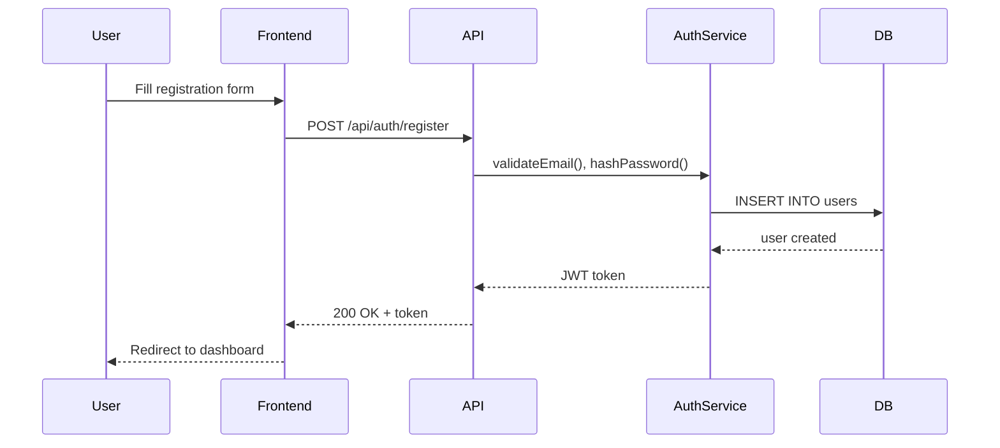
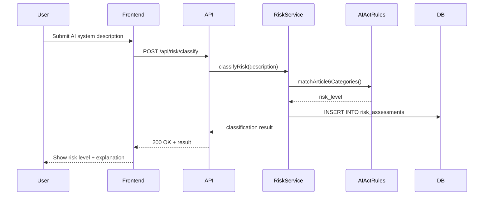

# Phase 0 Sequence — Правильная последовательность создания артефактов

**Для:** Marcus (CTO) — инструкция как создавать артефакты Фазы 0
**Дата:** 2026-02-05

---

## ⚠️ КРИТИЧНО: БЕЗ ФАЗЫ 0 → НЕТ РАЗРАБОТКИ

Перед Sprint 001 Marcus ОБЯЗАН создать все артефакты Фазы 0 в СТРОГОЙ последовательности.

---

## 📋 Правильная последовательность:

### ЭТАП 0: Product Owner предоставляет Product Vision

**Файл:** `/home/openclaw/PROJECT/docs/PRODUCT-VISION.md`

**Содержит:**
- Проблему и решение
- Целевую аудиторию
- MVP scope (Must Have / Should Have / Could Have)
- Ключевые Use Cases
- Технические требования и constraints
- Success metrics

**Статус:** ⛔ **БЕЗ PRODUCT VISION → Marcus НЕ МОЖЕТ начать Фазу 0**

---

### ЭТАП 1: Marcus создаёт PROJECT.md (паспорт проекта)

**Файл:** `/home/openclaw/PROJECT/docs/PROJECT.md`

**Создаёт:** Marcus (или Alex по указанию Marcus)

**Содержит:**
- Суть проекта (из Product Vision)
- Текущая фаза
- Ключевые решения (tech stack)
- Глоссарий терминов (High Risk AI System, Conformity Assessment, etc.)
- Контакты и роли команды

**Зависимости:** PRODUCT-VISION.md → PROJECT.md

**Статус после создания:** Информационный файл, PO approval НЕ требуется

---

### ЭТАП 2: Marcus создаёт ARCHITECTURE.md (DDD/Onion Architecture)

**Файл:** `/home/openclaw/PROJECT/docs/ARCHITECTURE.md`

**Создаёт:** Marcus

**Содержит:**
1. **High-level architecture diagram** (Mermaid)
   - Client → API Gateway → Services → Database
   - Показать все внешние зависимости (OpenAI API, Mistral API, etc.)

2. **DDD / Onion Architecture layers:**
   ```
   Domain Model (центр — чистая бизнес-логика)
   → Domain Services (операции между сущностями)
   → Application Services (use cases, оркестрация)
   → Presentation (API endpoints, controllers)
   → Infrastructure (DB adapters, external APIs, logging)
   ```

3. **Bounded Contexts** (DDD):
   - Auth Context
   - Risk Classification Context
   - Compliance Context
   - User Management Context
   - [ ] Другие контексты?

4. **Module structure:**
   ```
   src/
   ├── domain/
   │   ├── entities/
   │   ├── value-objects/
   │   └── services/
   ├── application/
   │   └── use-cases/
   ├── presentation/
   │   ├── api/
   │   └── ui/
   └── infrastructure/
       ├── database/
       └── external/
   ```

5. **Dependency direction rules:**
   - ⛔ Domain НЕ зависит ни от чего
   - Application зависит только от Domain
   - Presentation зависит от Application + Domain
   - Infrastructure зависит от всех, но никто не зависит от неё

6. **Key design patterns:**
   - Repository pattern
   - Factory pattern
   - Strategy pattern (для risk classification algorithms)
   - [ ] Другие паттерны?

7. **Trade-offs и compromises:**
   - Почему выбрали Next.js API routes вместо FastAPI? (или наоборот)
   - Почему PostgreSQL а не MongoDB?
   - Монолит vs Microservices (почему модульный монолит для MVP?)

**Зависимости:** PRODUCT-VISION.md → ARCHITECTURE.md

**Статус после создания:** ⛔ **PO APPROVAL REQUIRED** — Product Owner ОБЯЗАН утвердить

---

### ЭТАП 3: Marcus создаёт DATABASE.md (ER-диаграммы, схема БД)

**Файл:** `/home/openclaw/PROJECT/docs/DATABASE.md`

**Создаёт:** Marcus (дизайн) → позже Max имплементирует Prisma schema

**Содержит:**
1. **ER-диаграмма** (Mermaid):
   ```mermaid
   erDiagram
     USERS ||--o{ AI_SYSTEMS : owns
     USERS {
       uuid id PK
       string email UK
       string password_hash
       timestamp created_at
     }
     AI_SYSTEMS ||--o{ RISK_ASSESSMENTS : has
     AI_SYSTEMS {
       uuid id PK
       uuid user_id FK
       string name
       text description
       enum use_case
     }
     RISK_ASSESSMENTS {
       uuid id PK
       uuid ai_system_id FK
       enum risk_level
       jsonb classification_data
       timestamp assessed_at
     }
   ```

2. **Все таблицы с полным описанием:**
   - users
   - ai_systems
   - risk_assessments
   - compliance_checklists
   - [ ] Другие таблицы?

3. **Для каждой таблицы:**
   - Все колонки + типы данных
   - Primary keys, foreign keys
   - Indexes (для performance)
   - Constraints (unique, not null, check)
   - Пример данных

4. **Migrations strategy:**
   - Prisma migrations (автоматические)
   - Versioning схемы
   - Rollback стратегия

5. **Data retention policy:**
   - Сколько хранить historical data?
   - GDPR right to be forgotten — как удалять данные?

**Зависимости:** ARCHITECTURE.md → DATABASE.md

**Статус после создания:** Информационный, PO approval НЕ требуется (но PO должен видеть)

---

### ЭТАП 4: Marcus создаёт DATA-FLOWS.md (Sequence diagrams)

**Файл:** `/home/openclaw/PROJECT/docs/DATA-FLOWS.md`

**Создаёт:** Marcus

**Содержит:**

Sequence diagrams (Mermaid) для КАЖДОГО ключевого use case:

#### 1. User Registration Flow


#### 2. Risk Classification Flow


#### 3. [ ] Другие критичные flows:
- OAuth2 login flow
- Compliance checklist generation flow
- Technical documentation generation flow
- [ ] Что ещё?

**Зависимости:** ARCHITECTURE.md + DATABASE.md → DATA-FLOWS.md

**Статус после создания:** Информационный, PO approval НЕ требуется

---

### ЭТАП 5: Marcus создаёт CODING-STANDARDS.md (правила кода)

**Файл:** `/home/openclaw/PROJECT/docs/CODING-STANDARDS.md`

**Создаёт:** Marcus

**Содержит:**

#### 1. Парадигма
- **Функциональное программирование** — НЕ используем классы (кроме Error subclasses)
- Pure functions где возможно
- Immutable data (const, readonly, Object.freeze)
- Composition over inheritance

#### 2. TypeScript
- `strict: true` (ОБЯЗАТЕЛЬНО)
- Явные типы для всех публичных API
- Zod для runtime validation
- Нет `any`, нет `as` (кроме type guards)

#### 3. Backend (Max) — DDD / Onion Architecture
- **Layers:** domain → domain-services → application → presentation → infrastructure
- **Domain Model:** чистая бизнес-логика, никаких зависимостей от фреймворков
- **Domain Services:** операции между сущностями
- **Application Services:** оркестрация use cases
- **Presentation (controllers):** только routing + validation + response
- **Infrastructure:** DB adapters (Prisma), external APIs, logging
- **Dependency Injection:** зависимости направлены ТОЛЬКО внутрь
- **Repository pattern:** domain НЕ знает про Postgres/Prisma
- **Error handling:** custom AppError hierarchy в domain layer
- **Все endpoints:** zod validation input + typed response

#### 4. Frontend (Nina)
- React functional components ONLY
- Hooks: custom hooks для логики
- State: Zustand (global), useState (local)
- Styling: TailwindCSS + shadcn/ui
- Accessibility: WCAG AA minimum
- Responsive: mobile-first

#### 5. Именование
- Файлы: `kebab-case` (risk-classifier.service.ts)
- Функции: `camelCase` (classifyRisk)
- Типы/интерфейсы: `PascalCase` (RiskClassification)
- Константы: `UPPER_SNAKE` (MAX_RISK_SCORE)
- Компоненты React: `PascalCase` (RiskWizard.tsx)

#### 6. Git Commits: Conventional Commits (ОБЯЗАТЕЛЬНО)
```
feat(scope): description
fix(scope): description
test(scope): description
docs(scope): description
refactor(scope): description
```

#### 7. Тестирование
- Unit tests: vitest (backend), jest (frontend)
- Минимум: все public функции в services
- Naming: `describe("functionName")` → `it("should...")`
- Mocking: только внешние зависимости (DB, API)
- Target coverage: 80%+

#### 8. Запрещено
- ❌ Классы (кроме Error subclasses)
- ❌ any, unknown без type guard
- ❌ Мутабельные данные в shared state
- ❌ console.log в production (только logger)
- ❌ Hardcoded strings (используй enums/constants)
- ❌ Бизнес-логика в controllers

**Зависимости:** ARCHITECTURE.md → CODING-STANDARDS.md

**Статус после создания:** ⛔ **PO APPROVAL REQUIRED** — Marcus будет проверять соблюдение при code review

---

### ЭТАП 6: Marcus создаёт PRODUCT-BACKLOG.md (Фичи продукта)

**Файл:** `/home/openclaw/PROJECT/docs/PRODUCT-BACKLOG.md`

**Создаёт:** Marcus

**⚠️ PRODUCT-BACKLOG ≠ SPRINT-BACKLOG:**
- **Product Backlog** = ЧТО делает продукт (фичи/эпики, бизнес-уровень, Phase 0)
- **Sprint Backlog** = КАК реализовать (User Stories, технический уровень, Sprint Planning)
- 1 фича → много User Stories (декомпозиция при Sprint Planning)

**Содержит:**

Все фичи из PRODUCT-VISION.md на бизнес-уровне с приоритетами и MVP scope.

#### Формат Product Backlog (Feature-level):
```markdown
# Product Backlog — AI Act Compliance Platform

## Feature 001: IAM — Аутентификация и управление пользователями
**Приоритет:** P0 (MVP Must Have) | **Размер:** L

### Бизнес-ценность
As a SMB owner, I want to register and manage my team's access,
so that we can securely use the compliance platform.

### Описание
- Регистрация по email (magic link, без паролей)
- Multi-tenant: организация → пользователи → роли
- RBAC: Owner, Admin, Member, Viewer
- Session management (PostgreSQL)

### MVP Scope
- Magic link auth (email)
- Одна организация на пользователя
- Базовые роли (Owner, Member)

### Зависимости
Нет (базовая фича)

---

## Feature 002: Classification Engine — Классификация AI-систем
**Приоритет:** P0 (MVP Must Have) | **Размер:** XL

### Бизнес-ценность
As a CTO, I want to classify my AI systems by EU AI Act risk levels,
so that I know which requirements apply.

### Описание
- 5-step wizard (XState)
- Гибридный движок: rules (Annex III) + LLM (Mistral) + cross-validation
- Confidence scoring + human review при низком confidence
- Requirements mapping по уровню риска

### MVP Scope
- Rule-based classification (Annex III categories)
- LLM second opinion (Mistral Medium)
- Базовый requirements mapping

### Зависимости
Feature 001 (IAM)

---

## Feature 003: Dashboard — Compliance обзор
**Приоритет:** P0 (MVP Must Have) | **Размер:** M
...
```

> 💡 **User Stories** создаются в **SPRINT-BACKLOG.md** при Sprint Planning.
> Marcus декомпозирует фичи → US с Story Points, acceptance criteria, assignees.
> Формат US: см. Marcus SKILL.md → Sprint Task Template.

#### Размер фичи (грубая оценка):
- **S (Small)** — 1-2 спринта, 1-2 разработчика
- **M (Medium)** — 2-3 спринта, 1-2 разработчика
- **L (Large)** — 3-4 спринта, 2+ разработчика
- **XL (Extra Large)** — 4+ спринта, команда (декомпозиция на sub-features)

#### Теги (используются в Sprint Backlog при декомпозиции в US):
- `[BE+QA]` — Backend + тесты (Max)
- `[FE+UX]` — Frontend + дизайн (Nina)
- `[SecOps]` — Security audit (Leo)
- `[Legal]` — AI Act compliance (Elena)
- `[Research]` — Ресёрч (Ava)

**Зависимости:** PRODUCT-VISION.md → PRODUCT-BACKLOG.md

**Статус после создания:** ⛔ **PO APPROVAL REQUIRED** — Product Owner приоритизирует и утверждает

---

### ЭТАП 7: Marcus создаёт ADR-001, ADR-002, ... (Architecture Decision Records)

**Файлы:** `/home/openclaw/PROJECT/adr/ADR-NNN-название.md`

**Создаёт:** Marcus

**Формат ADR:**
```markdown
# ADR-001: Выбор Next.js вместо FastAPI для backend

**Статус:** ✅ Accepted
**Дата:** 2026-02-05
**Автор:** Marcus (CTO)

## Контекст
Нужно выбрать backend фреймворк для MVP.

## Варианты
1. **Next.js API routes** (TypeScript)
2. **FastAPI** (Python)
3. **Express.js** (TypeScript)

## Решение
Выбираем **Next.js API routes**.

## Обоснование
**Плюсы Next.js:**
- Единый codebase (Frontend + Backend) → быстрее разработка
- TypeScript end-to-end
- Vercel deployment (проще для MVP)
- Server Components для performance

**Минусы Next.js:**
- Меньше гибкости чем FastAPI
- Сложнее масштабировать чем микросервисы

**Trade-offs:**
Жертвуем гибкостью Python ради скорости разработки MVP.

## Последствия
- Max и Nina могут переиспользовать типы между FE/BE
- Deployment на Vercel (проще чем k8s для MVP)
- Позже можем мигрировать на микросервисы если нужно
```

**Минимум ADR для Фазы 0:**
- ADR-001: Выбор backend фреймворка
- ADR-002: Выбор БД (PostgreSQL)
- ADR-003: Монолит vs Microservices (почему модульный монолит)
- ADR-004: Deployment strategy (Vercel / Railway / self-hosted)
- [ ] Другие критичные решения

**Зависимости:** ARCHITECTURE.md → ADR-00X

**Статус после создания:** Информационный, PO approval НЕ требуется

---

## ✅ Checklist для Marcus:

После создания ВСЕХ артефактов, Marcus проверяет:

- [ ] ✅ PRODUCT-VISION.md заполнен Product Owner
- [ ] ✅ PROJECT.md создан (паспорт проекта)
- [ ] ✅ ARCHITECTURE.md создан (DDD/Onion + Mermaid diagrams)
- [ ] ✅ DATABASE.md создан (ER-диаграммы + все таблицы)
- [ ] ✅ DATA-FLOWS.md создан (sequence diagrams для всех key flows)
- [ ] ✅ CODING-STANDARDS.md создан (правила кода)
- [ ] ✅ PRODUCT-BACKLOG.md создан (фичи продукта, приоритеты, MVP scope)
- [ ] ✅ ADR-001, ADR-002, ADR-003, ADR-004 созданы
- [ ] ✅ Все Mermaid диаграммы рендерятся корректно
- [ ] ✅ Нет TODO/FIXME в документах
- [ ] ✅ Все зависимости между документами проверены

---

## 🎯 После завершения Фазы 0:

**Marcus → Alex:**
"Фаза 0 завершена. Все артефакты готовы к утверждению Product Owner."

**Alex → Product Owner:**
"🏗️ Фаза 0 готова к утверждению:
- ARCHITECTURE.md (DDD/Onion Architecture)
- CODING-STANDARDS.md (правила кода)
- PRODUCT-BACKLOG.md (N User Stories)
Ссылки: [ссылки на файлы]
Утвердить? ✅/❌"

**Product Owner утверждает → ⛔ APPROVAL GATE пройден**

**Затем:**
→ Marcus + Alex планируют Sprint 001
→ Product Owner утверждает Sprint Backlog
→ Sprint 001 стартует 🚀

---

**Важно:** Marcus, НЕ начинай создавать артефакты пока Product Owner НЕ заполнил PRODUCT-VISION.md!
